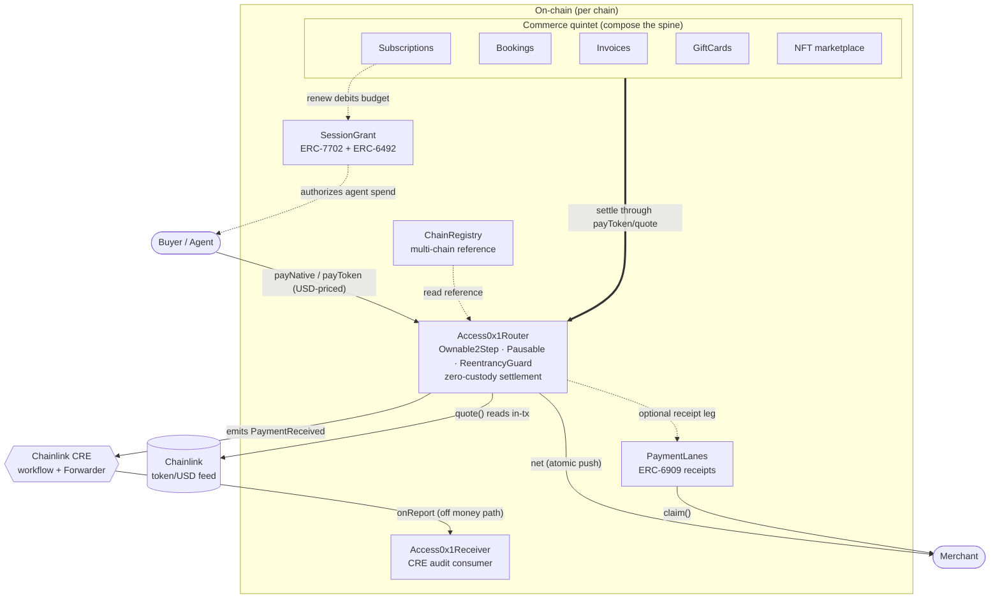

# Access0x1

<div align="center">

**The open-source rail for onchain identity + USD-priced crypto payments. One link, no code, no contract, no gas. Apps build on it.**

Access0x1 is the umbrella layer everything plugs into — non-custodial payments, commerce (subscriptions · bookings · invoices · gift cards), and identity, white-label for non-coders and agent-native. One shared rail per chain; apps build on top, no per-app contract code.

🏆 **Verified ETHGlobal Hacker Pack holder** — the Hacker Pack is an on-chain credential ([`EG-HACKER`](https://optimistic.etherscan.io/token/0x32382a82d9faDc55f971f33DaEeE5841cfbADbE0) · contract `0x32382a82d9faDc55f971f33DaEeE5841cfbADbE0` · balance 1 on Optimism).

**⚡ New here? → [Quickstart — working code in 5 min](docs/QUICKSTART.md)** · [60-second model](docs/GETTING-STARTED.md) · [Architecture](#architecture)

**The stack**


**The proof**

[](https://github.com/Access0x1/Access0x1/actions/workflows/test.yml)
<!-- Tests count is a manual snapshot (shields.io has no live feed for it); the CI badge above is the live green/red signal. Verify the number with `make test` (or `forge test`) — the run prints `<N> tests passed`. -->
[](https://github.com/Access0x1/Access0x1/actions/workflows/test.yml)


**The repo**

[](https://github.com/Access0x1/Access0x1/releases)
[](https://github.com/Access0x1/Access0x1/commits)


**The owned ERCs**


[What it is](#what-it-is) •
[Architecture](#architecture) •
[Contract surface](#the-contract-surface) •
[Quickstart](#quickstart) •
[Deploy](#deploy--multi-chain) •
[Owned ERCs](#the-owned-ercs) •
[Security](SECURITY.md) •
[Audit](audit/REPORT.md) •
[Gas](docs/GAS.md) •
[Integrations](#built-on) •
[License](#license)

</div>

### The whole promise in 30 seconds

```sh
# 1. Register a merchant — one permissionless call, any wallet, no per-merchant contract.
#    Returns a merchantId; the caller owns the config. feeBps = your platform cut (e.g. 100 = 1%).
cast send --account deployer --rpc-url "$ARC_TESTNET_RPC" \
  0xe92244e3368561faf21648146511DeDE3a475EB5 \
  "registerMerchant(address,address,uint16,bytes32)" \
  "$PAYOUT" "$FEE_RECIPIENT" 100 "$NAME_HASH"
```

```tsx
// 2. Pay from any app — USD-priced, settled on-chain (Chainlink feed read in-tx). No Solidity.
<PayButton
  merchantId={42n}
  usdAmount={29.0}                 // human USD — the SDK scales to 8 dp for payToken()
  token={USDC}                     // omit `token` to pay in the chain's native coin
  routerAddress="0xe92244e3368561faf21648146511DeDE3a475EB5"
  client={client}
  onSuccess={(receipt) => console.log('paid', receipt.txHash)}
/>
```

That's the whole loop: register once, then collect USD-priced crypto with a single drop-in — zero
custody, no per-merchant contract. The full walkthrough is the **[Quickstart](docs/QUICKSTART.md)**.

> **ETHGlobal NY 2026 build · testnet only.** The money spine (`router-core`) is complete, green,
> and on a public branch from commit #1. **The CREATE3 mirror (one address `0xe92244e3…` on every chain) is live on eight testnets (Arc 5042002, Base Sepolia 84532, Ethereum Sepolia 11155111, Optimism Sepolia 11155420, Avalanche Fuji 43113, Robinhood 46630, Arbitrum Sepolia 421614, Celo Sepolia 11142220) and source-verified on seven of those eight; three additional earlier chains (Ethereum Hoodi 560048, 0G Galileo 16602, Tempo 42431) carry pre-mirror per-chain deploys — eleven chains deployed in total. Every address is read straight from a committed `broadcast/DeployAll.s.sol/<chainId>/` record (law #4 — an address that isn't on-chain isn't claimed); the `MIRROR-STATUS` table below (regenerated by `make sync`) plus the source-verified table under Deployments are the live source of truth.** More chains (Polygon Amoy, Scroll Sepolia, …) are per-chain ready (`make deploy-<chain>`) but not yet broadcast; zkSync Sepolia needs its dedicated EraVM path (see `docs/ZKSYNC-TESTING.md`). **No mainnet deployments and no mainnet claims.**

> 🚀 **New to Access0x1?** Start with the **[Getting Started guide](docs/GETTING-STARTED.md)** — zero to a working payment in three copy-paste paths — then the **[Architecture deep-dive](docs/ARCHITECTURE.md)** for the money spine, line by line.

---

## What it is

A business registers once and accepts **USD-priced crypto with a single link** — no per-merchant
contract, no custody. One shared, multi-tenant [`Access0x1Router`](src/Access0x1Router.sol) serves
every merchant. Each payment prices USD → token through a Chainlink feed read *inside the settlement
transaction*, splits an exact fee, and pushes the net to the merchant in the same tx. The contract
**never holds merchant funds.**

On top of that money spine sit the auth + agent primitives: ERC-6909 [`PaymentLanes`](src/PaymentLanes.sol)
receipts so a merchant can pull settled value in any coin, ERC-7702/ERC-6492 [`SessionGrant`](src/SessionGrant.sol)
so an agent can be authorized to spend a budget-scoped, time-bounded allowance with one signature,
and a Chainlink-CRE [`Access0x1Receiver`](src/Access0x1Receiver.sol) audit consumer for notified
settlement — all off the money path by construction.

### Why it's different

Unlike a custodial payment router (Stripe Connect, or an on-chain router that escrows then forwards),
Access0x1 takes **zero custody** — settlement is one atomic pull → split → push, so the router's balance
stays at ~0 — and prices every payment in **USD on-chain, inside the settlement tx** via a Chainlink feed,
never from an off-chain quote you have to trust. The buyer pays exactly the USD amount the contract priced,
and no intermediary ever holds the funds.

- **Gas-free USDC checkout on Arc — by default.** The demo checkout connects to **Arc Testnet**
  out of the box (the app's default chain), where **Circle USDC is the native gas token**. A buyer
  pays in USDC and settles in USDC: there is **no separate gas coin to top up and no Paymaster to
  run** — the Arc + Circle stack does that work, so checkout is gas-free with zero extra contract
  code on our side. The same `payToken(USDC)` path also runs on Base Sepolia (live); zkSync Sepolia is
  one-command ready as a bridge target, not yet broadcast.
  > Note: this gas-free experience is Arc-specific because USDC is Arc's native gas token. On other
  > chains (Base Sepolia, zkSync, etc.), buyers pay gas in that chain's native token. An optional
  > ERC-7677 paymaster can sponsor gas on other chains if configured.
- **Zero custody.** Settlement is atomic: pull → split → push, all in one tx. The router's
  steady-state balance is zero; the only native it can hold is value owed back through `claimRescue`
  when a payee contract rejects a push (the receipt still stands — funds are never stuck).
- **USD pricing, on-chain.** `quote()` reads a Chainlink `<token>/USD` feed through a staleness guard
  *in the pay tx* — the price that drives settlement, not a frontend preview. Decimals are read live
  (feed, token), so the Arc trap (native USDC = 18 dp, ERC-20 USDC = 6 dp, feed = 8 dp) is safe.
- **One router, many merchants.** A permissionless `registerMerchant` → `merchantId`; the caller owns
  their config and nobody else's. A payment to merchant A can never mutate merchant B.
- **Exact, capped fees.** A single total fee splits two ways — the platform cut always lands at the
  treasury (a merchant can never redirect it), the merchant surcharge at the merchant's recipient —
  and `net + platformFee + merchantFee == gross` holds exactly. No payment is ever charged more than
  `MAX_FEE_BPS` (10%), even after a fee change under an existing surcharge.

---

## Architecture



The audited, zero-custody money path is `OracleLib` (staleness guard, `internal`/inlined) →
`Access0x1Router`. Everything else is a deliberate sidecar that the router never blocks on:
a `PaymentLanes` credit is an append-only post-settlement leg, the CRE audit write is fire-and-forget,
and `SessionGrant` / `ChainRegistry` hold no value path at all.

```text
src/
├── Access0x1Router.sol           # the shared, zero-custody money spine
├── PaymentLanes.sol              # ERC-6909 non-custodial pull receipts
├── SessionGrant.sol              # ERC-7702 + ERC-6492 agent sessions
├── ChainRegistry.sol             # per-chain reference (sidecar, no value path)
├── Access0x1Receiver.sol         # Chainlink CRE "notified settlement" audit consumer
├── HouseTokenFactory.sol         # non-custodial business-owned ERC-20 factory …
├── HouseToken.sol                #   … and the token it deploys (owner gets supply + key)
├── Access0x1Subscriptions.sol    # recurring USD billing  ┐
├── Access0x1Bookings.sol         # deposit-escrow + refund │ the commerce quintet —
├── Access0x1Invoices.sol         # pay-once payment request │ each COMPOSES the spine
├── Access0x1GiftCards.sol        # prepaid balance + coupons│ (Router + SessionGrant)
├── Access0x1Nft.sol              # USD-priced NFT marketplace┘
├── Access0x1Escrow.sol           # conditional settlement — a deposit HELD until a condition resolves
├── Refunds.sol                   # time-boxed, merchant-authorized refunds / chargebacks by orderId
├── SplitSettler.sol              # one USD payment fans out to N payees by basis points (Σ == gross)
├── Receivables.sol               # tokenized, factorable invoices — an ERC-721 its holder gets paid on
├── GaslessPayIn.sol              # gasless "first-dollar" pay-in from ONE off-chain signature
├── AutomationGateway.sol         # Chainlink Automation front-door that auto-renews subscriptions
├── PriceOracleAdapter.sol        # swappable ERC-7726 price-oracle surface for the spine
├── Access0x1ProvenanceRegistry.sol  # on-chain code provenance — claim repo, anchor each release
├── NameMath.sol                  # ENS namehash → brand color + SVG (internal library)
├── libraries/
│   └── OracleLib.sol             # Chainlink staleness + completed-round guard (internal)
└── interfaces/                   # one per contract above (consumed surfaces)

script/                      # DeployAccess0x1Router · DeployAll · DeployChainRegistry · HelperConfig
test/                        # unit · attack · invariant (1,382 tests)
```

The full first-party surface is **20 production contracts + 2 libraries** (22 `.sol` files in
`src/`, plus 16 interfaces): the money spine (`Access0x1Router`), the receipt
ledger (`PaymentLanes`), the agent-auth ledger (`SessionGrant`), the per-chain reference
(`ChainRegistry`), the CRE audit consumer (`Access0x1Receiver`), the house-token factory +
its `HouseToken`, the five commerce primitives (subscriptions · bookings · invoices · gift cards ·
the `Access0x1Nft` marketplace), the settlement extensions (`Access0x1Escrow` · `Refunds` ·
`SplitSettler` · `Receivables` · `GaslessPayIn` · `AutomationGateway` · `PriceOracleAdapter` ·
`Access0x1ProvenanceRegistry`), and two inlined libraries — the `OracleLib` staleness guard and the
`NameMath` ENS-brand helper. `make deploy-arc`
(or `deploy-base-sepolia` / `deploy-zksync-sepolia`) runs [`script/DeployAll.s.sol`](script/DeployAll.s.sol),
which deploys and wires the whole set in a single broadcast (`ChainRegistry` is the one sidecar
deployed once per chain by `DeployChainRegistry` and carried in as config).

---

## The contract surface

> **Every system contract is UUPS-upgradeable** — one `ERC1967Proxy` per contract (stable address + state), a swappable implementation via `upgradeToAndCall`, and a permanent on-chain freeze via `renounceOwnership()`. Storage is append-only behind a `uint256[50] __gap`; reentrancy uses the storage-less cancun `ReentrancyGuardTransient`.

| Contract | One-liner |
| --- | --- |
| [`Access0x1Router`](src/Access0x1Router.sol) | One shared, multi-tenant, **zero-custody** payments router: `registerMerchant` → `merchantId`, then `payNative` / `payToken` price USD→token via a Chainlink feed *in-tx*, split an exact capped fee, and push net → merchant in the same tx. |
| [`PaymentLanes`](src/PaymentLanes.sol) | A standalone **ERC-6909** ledger whose tokens are non-custodial *receipts* for value the router has settled. A "lane" = `keccak256(chainId, asset, recipient)`; the merchant pulls the underlying with `claim`, and a cross-asset firewall guarantees a lane only ever releases the asset that funded it. |
| [`SessionGrant`](src/SessionGrant.sol) | The **ERC-7702 + ERC-6492** "sign once → budget-scoped, time-bounded agent session" primitive. An owner authorizes a delegate to `spend` up to a budget until an expiry, with no per-spend co-sign; pure authorization ledger, **never holds funds**. |
| [`ChainRegistry`](src/ChainRegistry.sol) | The canonical on-chain hash-map of per-chain facts (native USDC, local router, CCIP selector, flag word) keyed by `chainId`. A read reference for the SDK / frontend / deploy config — a new chain needs no SDK redeploy. |
| [`Access0x1Receiver`](src/Access0x1Receiver.sol) | The on-chain half of **Chainlink CRE** "Notified Settlement": a Forwarder-gated consumer that writes an immutable audit entry per settlement. Off the money path by construction — a revert here can never touch a payment. |
| [`HouseTokenFactory`](src/HouseTokenFactory.sol) / [`HouseToken`](src/HouseToken.sol) | A **non-custodial** factory: a business deploys its OWN ERC-20 (loyalty / credit / closed-loop, settleable through the router) and owns it in its own wallet — ownership AND the full supply are assigned to the business in the same tx, so the factory never holds a key or a balance. It records provenance plus an **on-chain discoverability index** — `tokensOf(owner)`, a global enumeration, and a per-token record (owner · deployedAt · chainId) — so a business's tokens are findable without log-scraping (and a `decimals > 18` deploy reverts). |
| [`AutomationGateway`](src/AutomationGateway.sol) | The permissionless **Chainlink Automation** front-door for recurring billing: a self-driving keeper (`checkUpkeep` / `performUpkeep`) that auto-renews due subscriptions with no centralized cron. **Zero custody, zero privilege** — it only pokes the self-guarding `Access0x1Subscriptions.renew`; bounded scan/batch, and `performUpkeep` re-validates due-ness against live state + `try/catch`-isolates each renew so one failure never blocks the batch. |
| [`Access0x1ProvenanceRegistry`](src/Access0x1ProvenanceRegistry.sol) | On-chain **code provenance**: a developer claims a repo, anchors a Merkle snapshot of the tree, then anchors each release — with EIP-712 delegated variants and 2-step repo-ownership transfer. The "it deploys from my GitHub, provably" registry. |
| [`GaslessPayIn`](src/GaslessPayIn.sol) | **Gasless "first-dollar" pay-in**: a buyer pays a merchant in ONE tx from an off-chain signature — no prior approve, no opened session — via **EIP-2612** permit, **ERC-7597** (smart-account permit), or **EIP-3009** `transferWithAuthorization` (USDC-native). The pulled token is routed through `Router.payToken` (USD-priced, fee-split); the contract retains ZERO balance (asserted inline). |
| [`PriceOracleAdapter`](src/PriceOracleAdapter.sol) | A thin **swappable price oracle** behind the **ERC-7726** `getQuote(baseAmount, base, quote)` surface, so the router (and every primitive) can stop hard-binding `AggregatorV3Interface`. Wraps a Chainlink feed through OracleLib's staleness guard today; a future TWAP / Data-Streams source is a new impl behind the same interface — zero churn at the call site. Pure infra, no custody. |

**The commerce set** — vertical-agnostic primitives that **compose** the spine above (Router + SessionGrant) rather than re-implementing it. Each owns lifecycle/eligibility ONLY; every money leg routes through `Access0x1Router.payToken`/`payNative` (so `net + fee == gross` is the router's audited invariant, never re-derived) and every USD→token price is read in-tx through `Access0x1Router.quote` (the OracleLib staleness guard). They need NO router-side registration — the router's merchant registry is their single source of truth for owner-authorization. (`Access0x1Nft`, the newest of the five, is built and tested and wired into `DeployAll`; the formal audit pass in [`audit/`](audit/) currently scopes the original four — it is reviewed there before any mainnet claim.)

| Contract | One-liner |
| --- | --- |
| [`Access0x1Subscriptions`](src/Access0x1Subscriptions.sol) | Recurring, USD-priced, **tiered** billing — the on-chain never-negative AI-spend meter. A subscription IS a budget-scoped [`SessionGrant`](src/SessionGrant.sol): the subscriber signs once; every `renew` debits that budget (hard-reverting past the cap) and pulls the period charge through the router fee-split. Tier entitlement is a read-time view of stored state — no cron, no money path ever writes a tier. |
| [`Access0x1Bookings`](src/Access0x1Bookings.sol) | A deposit-escrow primitive with a **never-blockable refund**. A payer escrows a USD-priced deposit against an opaque `slotKey`; the booking resolves through one lifecycle transition (confirm / expire / cancel / no-show) under an IMMUTABLE policy snapshot. A failed refund push lands in a per-token pull-map; a stale/dead oracle on a resolution leg yields a zero fee and refunds everything — the refund is unconditional (money-safety invariant #5). |
| [`Access0x1Invoices`](src/Access0x1Invoices.sol) | The simplest commerce primitive: a USD-priced, **pay-once** payment request. An operator issues a request for `amountUsd8` (optionally locked to one payer / stamped with a `dueBy`); it is priced USD→token in-tx and settled through the router fee-split. `OPEN → {PAID \| VOID}` is one-way and absorbing, so a replayed `pay` reverts — the on-chain unique-index. |
| [`Access0x1GiftCards`](src/Access0x1GiftCards.sol) | A USD-priced **prepaid-balance** primitive (gift cards / credit packs) plus a merchant-scoped coupon registry. A card balance is a non-custodial USD receipt the holder controls; a debit can NEVER drive it negative (`balance >= applied`, a hard revert). No ERC-20 ever enters the contract — the chargeable remainder is settled by the caller straight through the router in the same tx. |
| [`Access0x1Nft`](src/Access0x1Nft.sol) | A USD-priced **zero-custody NFT marketplace** primitive: a seller lists an ERC-721 at a USD price; a buyer pays an allowlisted token and the NFT transfers **atomically** in the same tx. The payment is priced + fee-split by the router (`payToken`); the contract never holds a payment token — it only escrows the listed NFT between `list` and `buy` / `cancelListing`. |
| [`SplitSettler`](src/SplitSettler.sol) | **N-payee revenue split**: one USD-priced payment fans out to N payees by basis points (seller + platform + affiliate + creator + tax), `Σ shares == gross` exactly. The gross routes through the router fee-split (platform fee once); the net is pull-credited per payee (**ERC-6909** lanes, never-blockable). **ERC-2981** share-shape; conservation invariant `balance == Σ unclaimed`. |
| [`Refunds`](src/Refunds.sol) | **Time-boxed, merchant-authorized refunds / chargebacks** keyed by `orderId`: a merchant funds + authorizes a refund (gasless via **EIP-3009/2612**) and the buyer claims it as a **per-position ERC-6909** receipt — a non-fungible 1:1 ticket, never-blockable pull. Unifies the codebase's ad-hoc rescue maps into one **ERC-7540**-style request→claim surface. |
| [`Receivables`](src/Receivables.sol) | **Tokenized, factorable invoices**: an open invoice mints a transferable **ERC-721** (+ **ERC-4906** / **ERC-2981**) — whoever HOLDS the NFT is the on-chain creditor and receives the router settlement when the invoice is paid. Sell the receivable to factor it; paying settles to the current holder. One creditor per open receivable, no double-pay. |
| [`Access0x1Escrow`](src/Access0x1Escrow.sol) | The **conditional-settlement** leg the instant-push router can't do: a buyer's deposit is HELD until a condition resolves, then RELEASED to the seller through the router's live fee-split or REFUNDED in full. Resolution = buyer `confirm`, permissionless `claimAfterTimeout` (anti-lock), seller `cancel`, optional `arbitrate`, or an EIP-712 + ERC-1271 relayed `releaseWithSig`. CEI + `nonReentrant` + a **never-blockable** pull-on-failure payout; conservation invariant `balance == Σ open + Σ withdrawable`. |

### Router functions

| Function | What it does |
| --- | --- |
| `registerMerchant(payout, feeRecipient, feeBps, nameHash)` | Permissionless onboarding → `merchantId`. Caller becomes the merchant owner. |
| `updateMerchant(id, …)` | Merchant-owner-only config update. `owner` + `nameHash` are immutable. |
| `quote(id, token, usdAmount8)` | USD (8 dp) → token amount via the Chainlink feed + staleness guard. |
| `payNative(id, usdAmount8, orderId)` | Pay in the chain's native coin. Refunds excess; queues failed pushes to `rescue`. |
| `payToken(id, token, usdAmount8, orderId)` | Pay in an allowlisted ERC-20. Rejects fee-on-transfer via the balance delta. |
| `claimRescue()` | Pull-pattern withdrawal of value queued when a push failed. Open even while paused. |
| `setPlatformFee` · `setTreasury` · `setTokenAllowed` · `setPriceFeed` · `setPaymentLanes` · `pause` · `unpause` | `Ownable2Step` admin. |

---

## Quickstart

**Prerequisites:** [Git](https://git-scm.com/) · [Foundry](https://book.getfoundry.sh/getting-started/installation) ·
[Node.js](https://nodejs.org/) 18+. Foundry resolves `@chainlink/contracts` from `node_modules` via a
remapping, so **`npm install` must run before `forge build`**. `make install` does it all in the right
order — git submodules (OpenZeppelin + forge-std) + npm (`@chainlink`) + the web app + the SDK:

```sh
git clone https://github.com/Access0x1/Access0x1.git
cd Access0x1
make install           # forge submodules + npm (@chainlink) + web + SDK — one command
make build             # forge build
make test              # 1,382 tests, all green
```

> Manual equivalent of `make install`: `git submodule update --init --recursive && npm install`.
> More: `make coverage` (98% lines · 100% functions on the router) · `make snapshot` (gas) · `make gate` (the full pre-commit gate) · `make audit`.

### Run it locally — no keys, no keystore

A fresh Anvil node ships unlocked dev accounts, so the local deploy needs **no private key and no
keystore**. It deploys mock price feeds + a mock USDC, then the whole wired surface:

```sh
make anvil             # terminal 1 — local node on http://localhost:8545
make deploy-local      # terminal 2 — deploys the full wired surface to the local node
```

Want to *see money move*? `make drive-local` runs a full coffee-shop payment on the local node
(register a merchant → quote in USD → pay in USDC → `net + fee == gross`, zero custody). Copy-paste
`cast` walkthroughs for every contract are in [`docs/MANUAL-TESTING.md`](docs/MANUAL-TESTING.md).

### Deploy + verify a real testnet — the whole flow

```sh
cp .env.example .env        # then set: DEPLOYER_ACCOUNT (keystore name) · DEPLOYER (its address) ·
                            #           ETHERSCAN_API_KEY (one V2 key, all Etherscan-family chains) ·
                            #           <CHAIN>_PLATFORM_TREASURY (required) — RPCs already default
cast wallet import deployer # once; the keystore the deploy signs with
make deploy-base-sepolia    # broadcasts the full stack AND writes deployments/<chainId>.json
make verify-base-sepolia    # verifies EVERY contract by address (re-runnable, idempotent)
```

Deploy and verify are split on purpose: the broadcast always lands first (so a flaky explorer never
costs a redeploy), then `make verify-<chain>` submits sources from the recorded
`deployments/<chainId>.json` (or the broadcast). It works regardless of CREATE3 — verification reads
the on-chain runtime bytecode, so the factory-CALL deploy shape is irrelevant. Per-explorer routing is
automatic: Etherscan V2 (one key) for Base/Sepolia/Optimism/Arbitrum/Polygon, Blockscout for
Arc/Robinhood/0G (`make verify-galileo`), Routescan for Avalanche Fuji.

### Run the web app

```sh
make web-dev           # cd web && npm run dev  →  http://localhost:3000
```

### Build on it — no contracts to write

Don't want the monorepo, just the stack in your own app? Scaffold a pre-wired starter — checkout +
one-tag embed + your own Foundry contracts. Fetch the starter directly with `degit`:

```sh
npx degit Access0x1/Access0x1/templates/starter my-checkout
cd my-checkout
npm run setup          # installs Foundry, packs @access0x1/react locally, builds the contracts
npm run dev            # http://localhost:3000 — point it at a router in .env.local
```

> **`@access0x1/react` is git-distributed (no npm registry) — by design.** `npm run setup` handles it
> automatically: it finds the `packages/react` source in the Access0x1 repo checkout, runs `npm pack`,
> and wires a local `file:` reference into `app/package.json`. In your own app you can instead reference
> it as a git dependency: `"@access0x1/react": "github:Access0x1/Access0x1#main"`. No registry involved.

No Solidity required: set your name, logo, and a router address in `access0x1.config.ts` / `.env.local`
(it ships **no** default address — LAW #4: never a guessed address). Deploying your own router is
optional; the starter's `contracts/DEPLOY.md` is the runbook.

---

## 🛠 Make commands

Every workflow is a single `make` target, each documented with a trailing `##` comment in the
[`Makefile`](Makefile) — run `make help` to print this list at the terminal. Below is the full
reference, grouped by what you're doing.

### Setup & build

| Command | What it does |
| --- | --- |
| `make install` | Install all deps: forge submodules + npm (`@chainlink`) + web + sdk. |
| `make build` | Compile the contracts (`forge build`). |
| `make fmt` | Format the Solidity (`forge fmt`). |
| `make fmt-check` | Check formatting without writing (CI). |
| `make clean` | Remove build artifacts (`forge clean`). |
| `make sizes` | `forge build --sizes` — EIP-170 24KB runtime-size check (fails if any contract is over). |
| `make snapshot` | Regenerate the gas snapshot (`.gas-snapshot`). |
| `make storage-layout` | Regenerate `docs/STORAGE-LAYOUT.md` from `forge inspect <C> storage-layout`. |
| `make sdk-build` | Typecheck the `@access0x1/react` SDK. |
| `make all` | Install everything, then run the full green gate. |

### Green gate, test & audit

| Command | What it does |
| --- | --- |
| `make gate` | FULL GREEN GATE: contracts build+test+fmt AND web typecheck+test. |
| `make test` | Run all tests: unit + invariant + attack + integration + scenario. |
| `make test-gas` | Run tests with the per-function gas report. |
| `make test-scenario` | Run ONLY the human-style end-to-end scenario suite (`test/scenario/**`). |
| `make coverage` | Test coverage over `src/`. |
| `make coverage-lcov` | Coverage as `lcov.info` (gitignored) + summary — documented floor: 90% lines on money paths. |
| `make aderyn` | Static analysis (aderyn — auto-skips on the foundry-zksync fork, which aderyn 0.1.9 can't parse). |
| `make slither` | Static analysis (slither). |
| `make analyze` | Umbrella static pass: 4naly3er (npx, best-effort) + aderyn + slither. |
| `make mutation` | Mutation testing (gambit or vertigo-rs); no-op with install hint if neither installed. |
| `make halmos` | Symbolic execution (Halmos) over `test/symbolic/`; installs via uv/pip if absent. |
| `make audit` | Full audit pass — then see `audit/REPORT.md` + `FINDINGS.md` + `CHECKLIST.md`. |
| `make web-typecheck` | Web typecheck (`tsc --noEmit`). |
| `make web-test` | Web unit tests (vitest, integration excluded). |
| `make web-gate` | Web gate: embed check + typecheck + unit tests. |

### Local development

| Command | What it does |
| --- | --- |
| `make anvil` | Run a local anvil node. |
| `make deploy-dry` | Deploy DRY-RUN — simulation only, no broadcast, no keys. |
| `make deploy-local` | Deploy to a local anvil (anvil's default unlocked account[0]; no keystore needed). |
| `make drive-local` | Deploy + DRIVE the coffee-shop money flow on a local anvil (run `make anvil` first). |

### Web app & SDK · CRE / Vyper / zkSync

| Command | What it does |
| --- | --- |
| `make web-install` | Install the web app deps. |
| `make web-dev` | Run the web app locally (`next dev`). |
| `make web-build` | Production build of the web app (`next build`). |
| `make cre-build` | Build the CRE workflow (needs the CRE CLI). |
| `make cre-sim` | Simulate the CRE workflow (the demoable artifact; deploy is Early-Access). |
| `make vyper-build` | Compile the Vyper `NameMath` + `NameDie` demonstrators (cancun); no-op if vyper not installed. |
| `make vyper-test` | Run the Vyper==Solidity byte-for-byte conformance test; no-op if mox not installed. |
| `make zksync-build` | `forge build --zksync` (zksolc) — zkEVM build check; see `docs/ZKSYNC-TESTING.md`. |
| `make deploy-usd-mock-feed` | Deploy a $1 USDC/USD mock feed to a chain that lacks one — `make deploy-usd-mock-feed RPC=<url>`. |

### Deploy — testnets

One chain-aware `script/DeployAll.s.sol` behind every target; signing is keystore-only (`--account`),
addresses read from `.env`. These are deploy *capabilities* — see [Deployments](#deployments) for which
chains are actually broadcast.

| Command | What it does |
| --- | --- |
| `make deploy-arc` | Deploy to Arc testnet (keystore `deployer`). |
| `make deploy-base-sepolia` | Deploy to Base Sepolia (keystore `deployer`, verified). |
| `make deploy-zksync-sepolia` | Deploy to zkSync Sepolia (keystore `deployer`). |
| `make deploy-ethereum-sepolia` | Deploy to Ethereum Sepolia (etherscan verify). |
| `make deploy-arbitrum-sepolia` | Deploy to Arbitrum Sepolia (arbiscan verify). |
| `make deploy-optimism-sepolia` | Deploy to Optimism Sepolia (etherscan verify). |
| `make deploy-polygon-amoy` | Deploy to Polygon Amoy (polygonscan verify). |
| `make deploy-avalanche-fuji` | Deploy to Avalanche Fuji (snowtrace verify). |
| `make deploy-bnb-testnet` | Deploy to BNB Smart Chain testnet (bscscan verify). |
| `make deploy-scroll-sepolia` | Deploy to Scroll Sepolia (scrollscan verify). |
| `make deploy-robinhood-testnet` | Deploy to Robinhood Chain testnet (CCIP-lane endpoint; no price feed yet). |
| `make deploy-linea-sepolia` | Deploy to Linea Sepolia (lineascan verify). |
| `make deploy-mantle-sepolia` | Deploy to Mantle Sepolia (blockscout verify). |
| `make deploy-blast-sepolia` | Deploy to Blast Sepolia (blastscan verify). |
| `make deploy-unichain-sepolia` | Deploy to Unichain Sepolia (uniscan verify). |
| `make deploy-zora-sepolia` | Deploy to Zora Sepolia (chainId 999999999, ETH; blockscout verify). |
| `make deploy-filecoin-calibration` | Deploy to Filecoin Calibration (chainId 314159, tFIL; blockscout verify). |
| `make deploy-gnosis-chiado` | Deploy to Gnosis Chiado (chainId 10200, XDAI; blockscout verify). |
| `make deploy-apechain-curtis` | Deploy to ApeChain Curtis (chainId 33111, APE; blockscout verify). |
| `make deploy-worldchain-sepolia` | Deploy to World Chain Sepolia (chainId 4801, ETH; worldscan/etherscan verify). |
| `make deploy-zircuit-garfield` | Deploy to Zircuit Garfield testnet (chainId 48898, ETH; sourcify verify). |
| `make deploy-citrea-testnet` | Deploy to Citrea testnet (chainId 5115, cBTC; blockscout verify). |
| `make deploy-flow-evm-testnet` | Deploy to Flow EVM testnet (chainId 545, FLOW; blockscout verify). |
| `make deploy-celo-sepolia` | Deploy to Celo Sepolia (chainId 11142220, CELO; celoscan/etherscan-v2 verify). |

### Verify deployed contracts

Standalone source-verification targets — they upload the already-deployed source to each explorer,
need **no keystore** (read-only against the committed broadcast log), and are idempotent (re-running a
verified chain is a clean no-op).

| Command | What it does |
| --- | --- |
| `make verify-arc` | Verify deployed Arc testnet contracts (Blockscout / arcscan). |
| `make verify-ethereum-sepolia` | Verify deployed Ethereum Sepolia contracts (Etherscan V2). |
| `make verify-base-sepolia` | Verify deployed Base Sepolia contracts (Etherscan V2 / Basescan). |
| `make verify-optimism-sepolia` | Verify deployed Optimism Sepolia contracts (Etherscan V2). |
| `make verify-avalanche-fuji` | Verify deployed Avalanche Fuji contracts (Etherscan V2 / Snowtrace). |
| `make verify-robinhood-testnet` | Verify deployed RH Chain contracts on Blockscout (standalone; no keystore). |
| `make verify-all-testnets` | Verify all deployed testnet contracts (best-effort across explorers). |

### Deploy — mainnet (⛔ audit-gated · not deployed)

> **There is NO mainnet deployment, and none is claimed.** Every target below is **config/readiness
> only** — blocked behind a `MAINNET_AUDITED=yes` gate that refuses to broadcast until a third-party
> security audit is complete (real funds, law #5). Each reads its addresses from `<CHAIN>_MAINNET_*`
> env (default `address(0)` ⇒ skipped); no mainnet USDC/feed address is hardcoded. `deploy-arc-mainnet`
> is additionally gated as **NOT LAUNCHED** — Arc mainnet does not exist yet, so its chain id is never
> invented.

| Command | What it does |
| --- | --- |
| `make deploy-ethereum-mainnet` | ⛔ AUDIT-GATED: deploy to Ethereum mainnet (etherscan verify) — real funds. |
| `make deploy-base-mainnet` | ⛔ AUDIT-GATED: deploy to Base mainnet (basescan verify) — real funds. |
| `make deploy-arbitrum-mainnet` | ⛔ AUDIT-GATED: deploy to Arbitrum One (arbiscan verify) — real funds. |
| `make deploy-optimism-mainnet` | ⛔ AUDIT-GATED: deploy to OP Mainnet (etherscan verify) — real funds. |
| `make deploy-polygon-mainnet` | ⛔ AUDIT-GATED: deploy to Polygon mainnet (polygonscan verify) — real funds. |
| `make deploy-avalanche-mainnet` | ⛔ AUDIT-GATED: deploy to Avalanche C-Chain (snowtrace verify) — real funds. |
| `make deploy-bnb-mainnet` | ⛔ AUDIT-GATED: deploy to BNB Smart Chain (bscscan verify) — real funds. |
| `make deploy-scroll-mainnet` | ⛔ AUDIT-GATED: deploy to Scroll mainnet (scrollscan verify) — real funds. |
| `make deploy-linea-mainnet` | ⛔ AUDIT-GATED: deploy to Linea mainnet (lineascan verify) — real funds. |
| `make deploy-mantle-mainnet` | ⛔ AUDIT-GATED: deploy to Mantle mainnet (blockscout verify) — real funds. |
| `make deploy-blast-mainnet` | ⛔ AUDIT-GATED: deploy to Blast mainnet (blastscan verify) — real funds. |
| `make deploy-unichain-mainnet` | ⛔ AUDIT-GATED: deploy to Unichain mainnet (uniscan verify) — real funds. |
| `make deploy-zksync-mainnet` | ⛔ AUDIT-GATED: deploy to zkSync Era mainnet (zksync verify, `--zksync`) — real funds. |
| `make deploy-zora-mainnet` | ⛔ AUDIT-GATED: deploy to Zora mainnet (chainId 7777777, ETH; blockscout verify) — real funds. |
| `make deploy-filecoin-mainnet` | ⛔ AUDIT-GATED: deploy to Filecoin mainnet (chainId 314, FIL; blockscout verify) — real funds. |
| `make deploy-gnosis-mainnet` | ⛔ AUDIT-GATED: deploy to Gnosis Chain (chainId 100, XDAI; gnosisscan verify) — real funds. |
| `make deploy-apechain-mainnet` | ⛔ AUDIT-GATED: deploy to ApeChain (chainId 33139, APE; apescan verify) — real funds. |
| `make deploy-worldchain-mainnet` | ⛔ AUDIT-GATED: deploy to World Chain (chainId 480, ETH; worldscan verify) — real funds. |
| `make deploy-zircuit-mainnet` | ⛔ AUDIT-GATED: deploy to Zircuit mainnet (chainId 48900, ETH; sourcify verify) — real funds. |
| `make deploy-citrea-mainnet` | ⛔ AUDIT-GATED: deploy to Citrea mainnet (chainId 4114, cBTC; blockscout verify) — real funds. |
| `make deploy-flow-evm-mainnet` | ⛔ AUDIT-GATED: deploy to Flow EVM mainnet (chainId 747, FLOW; blockscout verify) — real funds. |
| `make deploy-celo-mainnet` | ⛔ AUDIT-GATED: deploy to Celo mainnet (chainId 42220, CELO; celoscan verify) — real funds. |
| `make deploy-arc-mainnet` | ⛔ AUDIT-GATED + NOT LAUNCHED: deploy to Arc mainnet (set `ARC_MAINNET_CHAIN_ID` first). |

---

## Deploy · multi-chain

`script/DeployAll.s.sol` is the chain-aware **one-command** entrypoint: a single `make deploy-arc`
(or `deploy-base-sepolia` / `deploy-zksync-sepolia`) deploys the **whole first-party surface, wired together**, in
the same broadcast — the `Access0x1Router` money spine, the `SessionGrant` agent-auth ledger, the
`HouseTokenFactory`, the five commerce primitives (`Subscriptions` / `Bookings` / `Invoices` /
`GiftCards` / `Access0x1Nft`, each constructed against the freshly deployed Router + SessionGrant so they compose the
audited spine), and the price-feed + USDC allowlist wiring — plus, when configured,
the optional `PaymentLanes` ledger (`DEPLOY_PAYMENT_LANES=true`) and the off-money-path
`Access0x1Receiver` CRE consumer (`<chain>_CRE_FORWARDER`). `HelperConfig` reads the right env block
from a `block.chainid` ladder, so the same script targets every chain just by switching `--rpc-url`,
and any address that is not yet booth-confirmed resolves to `address(0)` and is *skipped*, never wired.
`ChainRegistry` is the one sidecar deployed once per chain by `DeployChainRegistry` and carried in as
config so the SDK keeps a single reference.

> **Mirror-deployer guard (opt-in).** The CREATE3 mirror addresses in `script/mirror-manifest.json` are
> derived from the *signer*, so a deploy signed by a different keystore EOA lands cleanly at a DIFFERENT
> address set — with no revert — silently diverging from the published manifest. For a real mirror
> deploy, set `ENFORCE_MIRROR_DEPLOYER=true` to require the broadcaster to be the canonical mirror EOA
> (override the expected address with `MIRROR_DEPLOYER`); a wrong signer then fails loud with
> `DeployAll: signer != canonical mirror EOA`. Left **off by default**, so local/test runs and ad-hoc
> testnet experiments deploy under any signer.

```sh
# Arc Testnet (Blockscout verify)
forge script script/DeployAll.s.sol \
  --rpc-url $ARC_TESTNET_RPC_URL \
  --account deployer --sender $DEPLOYER \
  --broadcast --verify --verifier blockscout --verifier-url $ARC_SCAN_VERIFIER_URL -vvvv

# Base Sepolia (Basescan verify)
forge script script/DeployAll.s.sol \
  --rpc-url $BASE_SEPOLIA_RPC_URL \
  --account deployer --sender $DEPLOYER \
  --broadcast --verify --etherscan-api-key $BASESCAN_API_KEY -vvvv

# zkSync Sepolia — needs foundry-zksync + the --zksync flag
# (a plain EVM build is NOT the zkEVM — see docs/ZKSYNC-TESTING.md)
forge script script/DeployAll.s.sol --zksync \
  --rpc-url $ZKSYNC_SEPOLIA_RPC_URL --account deployer --sender $DEPLOYER --broadcast -vvvv
```

**Or just `make`** (keystore + per-chain RPC read from `.env`):

```sh
make deploy-arc              # Arc Testnet — gas-free USDC, the lead chain
make deploy-base-sepolia             # Base Sepolia
make deploy-zksync-sepolia           # zkSync Sepolia (adds --zksync)
make deploy-ethereum-sepolia          # Ethereum Sepolia
make deploy-arbitrum-sepolia # Arbitrum Sepolia
make deploy-optimism-sepolia # Optimism Sepolia
make deploy-polygon-amoy     # Polygon Amoy
make deploy-avalanche-fuji   # Avalanche Fuji
make deploy-bnb-testnet      # BNB Smart Chain testnet
make deploy-scroll-sepolia   # Scroll Sepolia
make deploy-linea-sepolia    # Linea Sepolia
make deploy-mantle-sepolia   # Mantle Sepolia (Blockscout verify)
make deploy-blast-sepolia    # Blast Sepolia
make deploy-unichain-sepolia # Unichain Sepolia
```

> Live deploys read **every** address from the environment (`PLATFORM_TREASURY`, `NATIVE_USD_FEED`,
> `USDC_ADDRESS`, `USDC_USD_FEED`, …) — never a hardcoded address. Signing is **keystore-only**
> (`--account`, never `--private-key`). Any feed/USDC address that is not yet confirmed resolves to
> `address(0)` and is *skipped*, never wired. See [`.env.example`](.env.example) for the full key set.

> **⛔ Mainnet is STAGED and AUDIT-GATED — there is NO mainnet deployment, and none is claimed.**
> This repo is **testnet-only** today and **unaudited**; testnet is the only live target. Every chain
> above now carries a *mainnet config profile* alongside its testnet one (Ethereum, Base, Arbitrum One,
> Optimism, Polygon, Avalanche, BNB, Scroll, Linea, Mantle, Blast, Unichain, zkSync Era — plus a dormant
> Arc-mainnet branch keyed on `ARC_MAINNET_CHAIN_ID`, since Arc mainnet is **not launched** and its id is
> never invented). This is **config/readiness only**: each mainnet branch reads its addresses from
> `<CHAIN>_MAINNET_*` env (default `address(0)` ⇒ skipped) — **no mainnet USDC/feed address is hardcoded**
> anywhere (law #4: a guessed address would imply a deployment we have not made). The
> `make deploy-<chain>-mainnet` targets that reach these branches are **blocked behind a `MAINNET_AUDITED=yes`
> gate**: they refuse to broadcast until a **third-party security audit** is complete (real funds, law #5).
> See the loud `⛔ MAINNET` banners in the [`Makefile`](Makefile) and [`.env.example`](.env.example).

### Deployments

Access0x1 deploys as **one mirrored address set on every chain** via CREATE3 (the
[CreateX](https://github.com/pcaversaccio/createx) factory): the salt is derived from the deployer + a
per-contract label, never the `block.chainid`, so the `Access0x1Router` an integrator points at is the
**same address everywhere the mirror is live**. The canonical set is published once in
[`script/mirror-manifest.json`](script/mirror-manifest.json) (self-checked by
[`script/mirror-manifest.sh`](script/mirror-manifest.sh)) and shown below; every per-chain address is
read straight from the committed broadcast log (`broadcast/DeployAll.s.sol/<chainId>/run-latest.json`),
**never** hand-entered (law #4: an address that isn't on-chain isn't claimed). The mirror is **live on
eight testnets** and the `Access0x1Router` proxy is **source-verified on seven of them** (confirmed on
each chain's own block explorer — all but Avalanche Fuji, whose source-verification is pending):

| Chain | Chain ID | `Access0x1Router` proxy — source-verified |
| --- | --- | --- |
| Arc Testnet | `5042002` | [✅ verified](https://testnet.arcscan.app/address/0xe92244e3368561faf21648146511DeDE3a475EB5) |
| Base Sepolia | `84532` | [✅ verified](https://sepolia.basescan.org/address/0xe92244e3368561faf21648146511DeDE3a475EB5) |
| Ethereum Sepolia | `11155111` | [✅ verified](https://sepolia.etherscan.io/address/0xe92244e3368561faf21648146511DeDE3a475EB5) |
| Optimism Sepolia | `11155420` | [✅ verified](https://sepolia-optimism.etherscan.io/address/0xe92244e3368561faf21648146511DeDE3a475EB5) |
| Arbitrum Sepolia | `421614` | [✅ verified](https://sepolia.arbiscan.io/address/0xe92244e3368561faf21648146511DeDE3a475EB5) |
| Celo Sepolia | `11142220` | [✅ verified](https://sepolia.celoscan.io/address/0xe92244e3368561faf21648146511DeDE3a475EB5) |
| Robinhood Chain | `46630` | [✅ verified](https://explorer.testnet.chain.robinhood.com/address/0xe92244e3368561faf21648146511DeDE3a475EB5) |
| Avalanche Fuji | `43113` | deployed — source-verification pending |

Three earlier chains (0G Galileo `16602`, Tempo Moderato `42431`, Ethereum Hoodi `560048`) carry
**pre-mirror, per-chain** deploys at the older address and are being cut over. **zkSync Sepolia** needs
its own EraVM path — `forge script --zksync` can't read env inside `HelperConfig`'s constructor (a
foundry-zksync cheatcode-in-CREATE limit), so a dedicated `DeployAllZkSync` that reads env at the script
root is required, and the zkEVM CREATE3 address diverges from the mirror (see
[`docs/ZKSYNC-TESTING.md`](docs/ZKSYNC-TESTING.md)). See [`docs/DEPLOY-TESTNETS.md`](docs/DEPLOY-TESTNETS.md)
and [`docs/MIRROR-CUTOVER.md`](docs/MIRROR-CUTOVER.md) for the full operator guide.

> **Gas:** on Arc, USDC is the native gas token, so checkout needs no separate gas coin — there is
> nothing to top up. On other chains an optional, generic [ERC-7677](https://eips.ethereum.org/EIPS/eip-7677)
> paymaster seam ([`web/lib/paymaster`](web/lib/paymaster)) can sponsor gas wherever a provider is
> configured (env-gated; blank ⇒ off). Neither path changes the contract code — the router is
> gas-model agnostic.

#### CREATE3 mirror address set — one address on every chain

These are the proxy addresses an integrator points at — **identical on every chain the mirror is live
on** (links go to Base Sepolia, one of the mirrored chains). Each proxy's implementation is pinned under
the matching `.impl` key in [`script/mirror-manifest.json`](script/mirror-manifest.json).

| Contract | Mirror address (every mirrored chain) |
| --- | --- |
| `Access0x1Router` | [`0xe92244e3368561faf21648146511DeDE3a475EB5`](https://sepolia.basescan.org/address/0xe92244e3368561faf21648146511DeDE3a475EB5) |
| `PaymentLanes` | [`0x49bb2c3d3aAE0ad260F3Ce76FA78e0323Aae2510`](https://sepolia.basescan.org/address/0x49bb2c3d3aAE0ad260F3Ce76FA78e0323Aae2510) |
| `SessionGrant` | [`0xf84fEA541939f3683893530101Fe77d05c390C9d`](https://sepolia.basescan.org/address/0xf84fEA541939f3683893530101Fe77d05c390C9d) |
| `HouseTokenFactory` | [`0x5a7F065f675779d76a376c15be496D799b1469Db`](https://sepolia.basescan.org/address/0x5a7F065f675779d76a376c15be496D799b1469Db) |
| `Access0x1Subscriptions` | [`0x787D2d97F7b0B0A7aFE1eCD97032912fefE8e0ba`](https://sepolia.basescan.org/address/0x787D2d97F7b0B0A7aFE1eCD97032912fefE8e0ba) |
| `Access0x1Bookings` | [`0xA7230DDD55c6bfC3479636FA320E46889a8B1863`](https://sepolia.basescan.org/address/0xA7230DDD55c6bfC3479636FA320E46889a8B1863) |
| `Access0x1Invoices` | [`0x902382D472aaf6bD90e000c315A861f6b493BCea`](https://sepolia.basescan.org/address/0x902382D472aaf6bD90e000c315A861f6b493BCea) |
| `Access0x1GiftCards` | [`0xf94Df7293e48E69f91A1e2C4F48580C6901d6C2C`](https://sepolia.basescan.org/address/0xf94Df7293e48E69f91A1e2C4F48580C6901d6C2C) |
| `Access0x1Escrow` | [`0x3459E890516A29d406fCbDc9B4CD99CE8114Da0D`](https://sepolia.basescan.org/address/0x3459E890516A29d406fCbDc9B4CD99CE8114Da0D) |
| `AutomationGateway` | [`0x2b664Ca5A28498cC62B475576fEe6835DD51060b`](https://sepolia.basescan.org/address/0x2b664Ca5A28498cC62B475576fEe6835DD51060b) |
| `Access0x1ProvenanceRegistry` | [`0x899b9E0b633BC46f56D7EC34ad667147D8e68ceb`](https://sepolia.basescan.org/address/0x899b9E0b633BC46f56D7EC34ad667147D8e68ceb) |
| `Access0x1Nft` | [`0x9625bEc5e2eD53B48e4CbcbBbe9287C00db31178`](https://sepolia.basescan.org/address/0x9625bEc5e2eD53B48e4CbcbBbe9287C00db31178) |
| `Access0x1Receiver` | [`0xA365aEC97a582e521e5d5444C2930E96B59AD215`](https://sepolia.basescan.org/address/0xA365aEC97a582e521e5d5444C2930E96B59AD215) |

**Per-chain cutover status** — a chain shows the set above only once its `broadcast/` record proves it
carries those addresses (no chain is claimed mirrored otherwise). The table below is generated from the
committed broadcasts by `make sync`, and CI re-derives it (`sync-readme-status.mjs --check`) and fails if
the committed table has drifted — so it can never go stale by hand:

<!-- MIRROR-STATUS:START (generated by `make sync` — do not edit by hand) -->

| Chain | Chain ID | CREATE3 mirror |
| --- | --- | --- |
| 0G Galileo Testnet | `16602` | ⏳ pre-mirror |
| Tempo Testnet (Moderato) | `42431` | ⏳ pre-mirror |
| Avalanche Fuji | `43113` | ✅ mirror |
| Chain 46630 | `46630` | ✅ mirror |
| Base Sepolia | `84532` | ✅ mirror |
| Arbitrum Sepolia | `421614` | ✅ mirror |
| Hoodi | `560048` | ⏳ pre-mirror |
| Arc Testnet | `5042002` | ✅ mirror |
| Celo Sepolia Testnet | `11142220` | ✅ mirror |
| Sepolia | `11155111` | ✅ mirror |
| OP Sepolia | `11155420` | ✅ mirror |

<!-- MIRROR-STATUS:END -->

**Pre-mirror per-chain deploys** — each chain's own pre-mirror address set, until it is cut over to the
mirror above. These predate the mirror and may reflect an interim redeploy; the mirror set above is the
canonical one, and [`web/lib/deployments.ts`](web/lib/deployments.ts) (regenerated from each chain's
`broadcast/` record) is the authoritative per-chain source — confirm a legacy chain's live feed/merchant
on-chain before relying on its row here.

| Chain | Contract | Address | Tx |
| --- | --- | --- | --- |
| Arc Testnet (5042002) | `Access0x1Router` | [`0x5ac1bc66d5073b0f84bb4f240dc2dda95cc46a6e`](https://testnet.arcscan.app/address/0x5ac1bc66d5073b0f84bb4f240dc2dda95cc46a6e) | — |
| Arc Testnet (5042002) | `SessionGrant` | [`0x065311fa0170422ee6025c2c4baa5724a5886bf0`](https://testnet.arcscan.app/address/0x065311fa0170422ee6025c2c4baa5724a5886bf0) | — |
| Arc Testnet (5042002) | `PaymentLanes` | [`0x1fecfe4781e9a38b4291b681751e048cc6d1eac5`](https://testnet.arcscan.app/address/0x1fecfe4781e9a38b4291b681751e048cc6d1eac5) | — |
| Arc Testnet (5042002) | `HouseTokenFactory` | [`0x5b2c1857c65c7daa672985fc9c3aaf2050b42288`](https://testnet.arcscan.app/address/0x5b2c1857c65c7daa672985fc9c3aaf2050b42288) | — |
| Arc Testnet (5042002) | `Access0x1ProvenanceRegistry` | [`0xd682f77d0ae016838d89b4f673f17acd93102231`](https://testnet.arcscan.app/address/0xd682f77d0ae016838d89b4f673f17acd93102231) | — |
| Arc Testnet (5042002) | `Access0x1Escrow` | [`0xec89c9ee28af42ae2b917bb0bae245eaad6e8e57`](https://testnet.arcscan.app/address/0xec89c9ee28af42ae2b917bb0bae245eaad6e8e57) | — |
| Arc Testnet (5042002) | `Access0x1Subscriptions` | [`0x5578929702b0158682286982e3f82d04a08f3b92`](https://testnet.arcscan.app/address/0x5578929702b0158682286982e3f82d04a08f3b92) | — |
| Arc Testnet (5042002) | `AutomationGateway` | [`0x41e63263a6d78f85458dc50c9a9ea4298ed1cdfe`](https://testnet.arcscan.app/address/0x41e63263a6d78f85458dc50c9a9ea4298ed1cdfe) | — |
| Arc Testnet (5042002) | `Access0x1Bookings` | [`0xd3ac71914d01a8229d00c2cf9abc7f93237a253d`](https://testnet.arcscan.app/address/0xd3ac71914d01a8229d00c2cf9abc7f93237a253d) | — |
| Arc Testnet (5042002) | `Access0x1Invoices` | [`0x3ea759f15e7edefcbfa6b55c1d3bf8a40e596909`](https://testnet.arcscan.app/address/0x3ea759f15e7edefcbfa6b55c1d3bf8a40e596909) | — |
| Arc Testnet (5042002) | `Access0x1GiftCards` | [`0x70606850d07fe7257805e8533594494dca02dcd2`](https://testnet.arcscan.app/address/0x70606850d07fe7257805e8533594494dca02dcd2) | — |
| Arc Testnet (5042002) | `Access0x1Nft` | [`0xc93bd2808fadfe87ea40a90db8fded3e09d266a4`](https://testnet.arcscan.app/address/0xc93bd2808fadfe87ea40a90db8fded3e09d266a4) | — |
| 0G Galileo (16602) | `Access0x1Router` | [`0xA5982ea8842Eea97C6e313A5f75FD8CF72C69Aad`](https://chainscan-galileo.0g.ai/address/0xA5982ea8842Eea97C6e313A5f75FD8CF72C69Aad) | — |
| 0G Galileo (16602) | `SessionGrant` | [`0x89f904a7328eaB1Fd8Ea422A5e635344766fBF4d`](https://chainscan-galileo.0g.ai/address/0x89f904a7328eaB1Fd8Ea422A5e635344766fBF4d) | — |
| 0G Galileo (16602) | `PaymentLanes` | [`0x3D5247B4D5d1947c7b9c82b27f20246da9923238`](https://chainscan-galileo.0g.ai/address/0x3D5247B4D5d1947c7b9c82b27f20246da9923238) | — |
| 0G Galileo (16602) | `HouseTokenFactory` | [`0x1001dc04da8706D53b24389c3348Ca512A5bA6b7`](https://chainscan-galileo.0g.ai/address/0x1001dc04da8706D53b24389c3348Ca512A5bA6b7) | — |
| 0G Galileo (16602) | `Access0x1ProvenanceRegistry` | [`0xF0056B52Df2CC2Aa3e80e607a0770b062Ba737D5`](https://chainscan-galileo.0g.ai/address/0xF0056B52Df2CC2Aa3e80e607a0770b062Ba737D5) | — |
| 0G Galileo (16602) | `Access0x1Escrow` | [`0xc7Ed3886Ec8995531531cb2659d6B4bC4519C231`](https://chainscan-galileo.0g.ai/address/0xc7Ed3886Ec8995531531cb2659d6B4bC4519C231) | — |
| 0G Galileo (16602) | `Access0x1Subscriptions` | [`0x5aC1bC66D5073B0f84BB4f240dc2dDA95CC46a6e`](https://chainscan-galileo.0g.ai/address/0x5aC1bC66D5073B0f84BB4f240dc2dDA95CC46a6e) | — |
| 0G Galileo (16602) | `AutomationGateway` | [`0x065311Fa0170422Ee6025c2c4BAA5724a5886Bf0`](https://chainscan-galileo.0g.ai/address/0x065311Fa0170422Ee6025c2c4BAA5724a5886Bf0) | — |
| 0G Galileo (16602) | `Access0x1Bookings` | [`0x1fECfe4781E9a38B4291b681751E048cc6d1eAc5`](https://chainscan-galileo.0g.ai/address/0x1fECfe4781E9a38B4291b681751E048cc6d1eAc5) | — |
| 0G Galileo (16602) | `Access0x1Invoices` | [`0xB90f34e22683D24b622a8CA32FB8cCEB8aB1d505`](https://chainscan-galileo.0g.ai/address/0xB90f34e22683D24b622a8CA32FB8cCEB8aB1d505) | — |
| 0G Galileo (16602) | `Access0x1GiftCards` | [`0x5b2C1857C65c7daa672985Fc9C3AAF2050b42288`](https://chainscan-galileo.0g.ai/address/0x5b2C1857C65c7daa672985Fc9C3AAF2050b42288) | — |
| 0G Galileo (16602) | `Access0x1Nft` | [`0xD682F77D0aE016838D89b4F673f17Acd93102231`](https://chainscan-galileo.0g.ai/address/0xD682F77D0aE016838D89b4F673f17Acd93102231) | — |
| Ethereum Sepolia (11155111) | `Access0x1Router` | [`0x81815209cc36dbd83662bd502694386e7024ba85`](https://sepolia.etherscan.io/address/0x81815209cc36dbd83662bd502694386e7024ba85) | — |
| Ethereum Sepolia (11155111) | `SessionGrant` | [`0xaba9017da86c7b0610efb0351457ff1a198ddea1`](https://sepolia.etherscan.io/address/0xaba9017da86c7b0610efb0351457ff1a198ddea1) | — |
| Ethereum Sepolia (11155111) | `PaymentLanes` | [`0x7ce8b5a101080a1d7c9bb79f73e8934feebdab0b`](https://sepolia.etherscan.io/address/0x7ce8b5a101080a1d7c9bb79f73e8934feebdab0b) | — |
| Ethereum Sepolia (11155111) | `HouseTokenFactory` | [`0x4844024f3c1d0c288b4001cef114fb50c5170046`](https://sepolia.etherscan.io/address/0x4844024f3c1d0c288b4001cef114fb50c5170046) | — |
| Ethereum Sepolia (11155111) | `Access0x1ProvenanceRegistry` | [`0x11b00bdb2c954d39ab0bdf954bb3da9ea03dd509`](https://sepolia.etherscan.io/address/0x11b00bdb2c954d39ab0bdf954bb3da9ea03dd509) | — |
| Ethereum Sepolia (11155111) | `Access0x1Escrow` | [`0x599076634c3d8e08e4b8376ed160436cee71dca5`](https://sepolia.etherscan.io/address/0x599076634c3d8e08e4b8376ed160436cee71dca5) | — |
| Ethereum Sepolia (11155111) | `Access0x1Subscriptions` | [`0xddb88dcb413eceacc5532bcc1eee9e1592467206`](https://sepolia.etherscan.io/address/0xddb88dcb413eceacc5532bcc1eee9e1592467206) | — |
| Ethereum Sepolia (11155111) | `AutomationGateway` | [`0x6619e3a9c27173821cc44ce6a431ccf6cd65360f`](https://sepolia.etherscan.io/address/0x6619e3a9c27173821cc44ce6a431ccf6cd65360f) | — |
| Ethereum Sepolia (11155111) | `Access0x1Bookings` | [`0xa8c60ad074ce9df014736a55f3f85f09d67859a5`](https://sepolia.etherscan.io/address/0xa8c60ad074ce9df014736a55f3f85f09d67859a5) | — |
| Ethereum Sepolia (11155111) | `Access0x1Invoices` | [`0x308e0ce27726ccd5064c5746925938f4e41ee895`](https://sepolia.etherscan.io/address/0x308e0ce27726ccd5064c5746925938f4e41ee895) | — |
| Ethereum Sepolia (11155111) | `Access0x1GiftCards` | [`0x9ae47ff9c18898c1c58ef47ceef2c29fa593f9f0`](https://sepolia.etherscan.io/address/0x9ae47ff9c18898c1c58ef47ceef2c29fa593f9f0) | — |
| Ethereum Sepolia (11155111) | `Access0x1Nft` | [`0x67072815258ebfd5b99c21140a3816e368d1e855`](https://sepolia.etherscan.io/address/0x67072815258ebfd5b99c21140a3816e368d1e855) | — |
| Optimism Sepolia (11155420) | `Access0x1Router` | [`0xba90ca4c50eb571c855a1b8a1eb6bae3bcb9129d`](https://sepolia-optimism.etherscan.io/address/0xba90ca4c50eb571c855a1b8a1eb6bae3bcb9129d) | — |
| Optimism Sepolia (11155420) | `SessionGrant` | [`0x545c2d5a8170b8a34b85fe4e24cbaa200398b373`](https://sepolia-optimism.etherscan.io/address/0x545c2d5a8170b8a34b85fe4e24cbaa200398b373) | — |
| Optimism Sepolia (11155420) | `PaymentLanes` | [`0xcd59d70551e438cc0ef859f86c8c12c5e6007728`](https://sepolia-optimism.etherscan.io/address/0xcd59d70551e438cc0ef859f86c8c12c5e6007728) | — |
| Optimism Sepolia (11155420) | `HouseTokenFactory` | [`0x06dcae57da4e774748865d734097c69bf484b788`](https://sepolia-optimism.etherscan.io/address/0x06dcae57da4e774748865d734097c69bf484b788) | — |
| Optimism Sepolia (11155420) | `Access0x1ProvenanceRegistry` | [`0xb2764d719364b4abc8bf22ef1015e95545ab963c`](https://sepolia-optimism.etherscan.io/address/0xb2764d719364b4abc8bf22ef1015e95545ab963c) | — |
| Optimism Sepolia (11155420) | `Access0x1Escrow` | [`0x60a4d48a982a28b288522e899669024f33f03314`](https://sepolia-optimism.etherscan.io/address/0x60a4d48a982a28b288522e899669024f33f03314) | — |
| Optimism Sepolia (11155420) | `Access0x1Subscriptions` | [`0x5e23ca4299a4728ae8e55ffe9b707046d38eb19d`](https://sepolia-optimism.etherscan.io/address/0x5e23ca4299a4728ae8e55ffe9b707046d38eb19d) | — |
| Optimism Sepolia (11155420) | `AutomationGateway` | [`0x51cebbf9ab3ee6effd3b67e3972af58c7d04df89`](https://sepolia-optimism.etherscan.io/address/0x51cebbf9ab3ee6effd3b67e3972af58c7d04df89) | — |
| Optimism Sepolia (11155420) | `Access0x1Bookings` | [`0xa0c5cc4fc6a6446a6f532942ecb6eeef91ae8901`](https://sepolia-optimism.etherscan.io/address/0xa0c5cc4fc6a6446a6f532942ecb6eeef91ae8901) | — |
| Optimism Sepolia (11155420) | `Access0x1Invoices` | [`0xca3f99fff5fb0b53766d2a0c14f989c8d6bc087f`](https://sepolia-optimism.etherscan.io/address/0xca3f99fff5fb0b53766d2a0c14f989c8d6bc087f) | — |
| Optimism Sepolia (11155420) | `Access0x1GiftCards` | [`0x84e567892074518770f40a34fb7994c34e3614c8`](https://sepolia-optimism.etherscan.io/address/0x84e567892074518770f40a34fb7994c34e3614c8) | — |
| Optimism Sepolia (11155420) | `Access0x1Nft` | [`0x8cdddf8a426ac79a2accc83e6b63fb16eb7580e2`](https://sepolia-optimism.etherscan.io/address/0x8cdddf8a426ac79a2accc83e6b63fb16eb7580e2) | — |
| Avalanche Fuji (43113) | `Access0x1Router` | [`0xd37634efeee3bc5ba16790345e7d5e15f06da69f`](https://testnet.snowtrace.io/address/0xd37634efeee3bc5ba16790345e7d5e15f06da69f) | — |
| Avalanche Fuji (43113) | `SessionGrant` | [`0x59257f3dd227a3861ab117b13a6027280490be50`](https://testnet.snowtrace.io/address/0x59257f3dd227a3861ab117b13a6027280490be50) | — |
| Avalanche Fuji (43113) | `PaymentLanes` | [`0x9ec3984b224057e495175aa0a6e21c1a38a7da92`](https://testnet.snowtrace.io/address/0x9ec3984b224057e495175aa0a6e21c1a38a7da92) | — |
| Avalanche Fuji (43113) | `HouseTokenFactory` | [`0x8e933669a24fa6bf05206a1c17e67d5822231c6a`](https://testnet.snowtrace.io/address/0x8e933669a24fa6bf05206a1c17e67d5822231c6a) | — |
| Avalanche Fuji (43113) | `Access0x1ProvenanceRegistry` | [`0x3af71b68612bc3facb0172eb6dcd980f50b51e86`](https://testnet.snowtrace.io/address/0x3af71b68612bc3facb0172eb6dcd980f50b51e86) | — |
| Avalanche Fuji (43113) | `Access0x1Escrow` | [`0x41f671f29ebd14fca6d8355e97f48d92ab4573a9`](https://testnet.snowtrace.io/address/0x41f671f29ebd14fca6d8355e97f48d92ab4573a9) | — |
| Avalanche Fuji (43113) | `Access0x1Subscriptions` | [`0xf5d9eefb2e3abbfb9ae2b4e6a26d170de7ad12c6`](https://testnet.snowtrace.io/address/0xf5d9eefb2e3abbfb9ae2b4e6a26d170de7ad12c6) | — |
| Avalanche Fuji (43113) | `AutomationGateway` | [`0xa888a802826b08c307a252fe8b948e411dcbf835`](https://testnet.snowtrace.io/address/0xa888a802826b08c307a252fe8b948e411dcbf835) | — |
| Avalanche Fuji (43113) | `Access0x1Bookings` | [`0x2067238186ee13d9c543742e1bb6be9fe4a1b20b`](https://testnet.snowtrace.io/address/0x2067238186ee13d9c543742e1bb6be9fe4a1b20b) | — |
| Avalanche Fuji (43113) | `Access0x1Invoices` | [`0xbcb59e981662d26769ff1fe5d75f66e38c68c99b`](https://testnet.snowtrace.io/address/0xbcb59e981662d26769ff1fe5d75f66e38c68c99b) | — |
| Avalanche Fuji (43113) | `Access0x1GiftCards` | [`0x2ba5411803bc7734652afa292bc97f39ae409f76`](https://testnet.snowtrace.io/address/0x2ba5411803bc7734652afa292bc97f39ae409f76) | — |
| Avalanche Fuji (43113) | `Access0x1Nft` | [`0x6602e07658214f0eaa83e857ae6f848add86a6d5`](https://testnet.snowtrace.io/address/0x6602e07658214f0eaa83e857ae6f848add86a6d5) | — |
| Robinhood Chain (46630) | `Access0x1Router` | [`0x93f00097e13de25090a8431d69f1cd89e1df1cf1`](https://explorer.testnet.chain.robinhood.com/address/0x93f00097e13de25090a8431d69f1cd89e1df1cf1) | — |
| Robinhood Chain (46630) | `SessionGrant` | [`0xd37634efeee3bc5ba16790345e7d5e15f06da69f`](https://explorer.testnet.chain.robinhood.com/address/0xd37634efeee3bc5ba16790345e7d5e15f06da69f) | — |
| Robinhood Chain (46630) | `PaymentLanes` | [`0x59257f3dd227a3861ab117b13a6027280490be50`](https://explorer.testnet.chain.robinhood.com/address/0x59257f3dd227a3861ab117b13a6027280490be50) | — |
| Robinhood Chain (46630) | `HouseTokenFactory` | [`0xfd567edc7abed6e9e2cfdc8d40c4af5c8b20f4bb`](https://explorer.testnet.chain.robinhood.com/address/0xfd567edc7abed6e9e2cfdc8d40c4af5c8b20f4bb) | — |
| Robinhood Chain (46630) | `Access0x1ProvenanceRegistry` | [`0x8e933669a24fa6bf05206a1c17e67d5822231c6a`](https://explorer.testnet.chain.robinhood.com/address/0x8e933669a24fa6bf05206a1c17e67d5822231c6a) | — |
| Robinhood Chain (46630) | `Access0x1Escrow` | [`0x3af71b68612bc3facb0172eb6dcd980f50b51e86`](https://explorer.testnet.chain.robinhood.com/address/0x3af71b68612bc3facb0172eb6dcd980f50b51e86) | — |
| Robinhood Chain (46630) | `Access0x1Subscriptions` | [`0x41f671f29ebd14fca6d8355e97f48d92ab4573a9`](https://explorer.testnet.chain.robinhood.com/address/0x41f671f29ebd14fca6d8355e97f48d92ab4573a9) | — |
| Robinhood Chain (46630) | `AutomationGateway` | [`0xf5d9eefb2e3abbfb9ae2b4e6a26d170de7ad12c6`](https://explorer.testnet.chain.robinhood.com/address/0xf5d9eefb2e3abbfb9ae2b4e6a26d170de7ad12c6) | — |
| Robinhood Chain (46630) | `Access0x1Bookings` | [`0xa888a802826b08c307a252fe8b948e411dcbf835`](https://explorer.testnet.chain.robinhood.com/address/0xa888a802826b08c307a252fe8b948e411dcbf835) | — |
| Robinhood Chain (46630) | `Access0x1Invoices` | [`0x2067238186ee13d9c543742e1bb6be9fe4a1b20b`](https://explorer.testnet.chain.robinhood.com/address/0x2067238186ee13d9c543742e1bb6be9fe4a1b20b) | — |
| Robinhood Chain (46630) | `Access0x1GiftCards` | [`0xbcb59e981662d26769ff1fe5d75f66e38c68c99b`](https://explorer.testnet.chain.robinhood.com/address/0xbcb59e981662d26769ff1fe5d75f66e38c68c99b) | — |
| Robinhood Chain (46630) | `Access0x1Nft` | [`0x2ba5411803bc7734652afa292bc97f39ae409f76`](https://explorer.testnet.chain.robinhood.com/address/0x2ba5411803bc7734652afa292bc97f39ae409f76) | — |
| zkSync Sepolia (300) | `Access0x1Router` | — | — |
| zkSync Sepolia (300) | `SessionGrant` | — | — |
| zkSync Sepolia (300) | `HouseTokenFactory` | — | — |
| zkSync Sepolia (300) | `Access0x1Subscriptions` | — | — |
| zkSync Sepolia (300) | `Access0x1Bookings` | — | — |
| zkSync Sepolia (300) | `Access0x1Invoices` | — | — |
| zkSync Sepolia (300) | `Access0x1GiftCards` | — | — |
| zkSync Sepolia (300) | `ChainRegistry` | — | — |

> **Multi-tenant, on-chain.** The Base Sepolia router (`platformFeeBps = 100`, i.e. 1%) already carries
> a registered merchant (`#1`) — registered with its own payout wallet, fee config, and name hash. A
> second business joins the exact same way: one permissionless `registerMerchant` call with its own
> payout wallet and surcharge — no contract code, no redeploy. That self-serve, one-router-for-everyone
> path *is* the thesis, proven on-chain.

---

## The owned ERCs

Access0x1 doesn't just *use* the standards — it ships its own minimal, audited implementations of three
that compose into the payments + auth + agents story:

- **ERC-6909 — multi-token receipts** ([`PaymentLanes`](src/PaymentLanes.sol)). A lane is a
  deterministic token id `keccak256(chainId, asset, recipient)`. The router credits a lane after it
  settles, minting the merchant a fully-backed, non-custodial *receipt* it pulls later — the
  "receive in any coin" seam — with a cross-asset firewall (a lane can only ever pay out the asset
  that funded it) and CEI + `nonReentrant` on every value path.
- **ERC-7702 — account delegation** ([`SessionGrant`](src/SessionGrant.sol)). An EOA that has set its
  code to an Access0x1 delegate can `openSession` directly: one 7702 signing act lets it "act as a
  contract" and authorize a budget-scoped, time-bounded agent session — no per-spend co-sign.
- **ERC-6492 — predeploy signatures** ([`SessionGrant`](src/SessionGrant.sol)). `openSessionFor`
  validates a relayed EIP-712 grant against EOA / ERC-1271 / ERC-6492, so a brand-new counterfactual
  smart account can authorize a session *before it has any code* — the "zero wallet deploy" property.

---

## Security posture

`SafeERC20` · `nonReentrant` on every pay path · **CEI** ordering everywhere · custom errors · events
on every state change · Chainlink staleness guard · fee-on-transfer rejection (balance-delta check) ·
no unbounded loops · `Ownable2Step` admin. **Money paths roll back rather than swallow; refunds and
rescues are never blocked.** Secrets never enter the repo (env + `cast wallet` keystore only); the
deployer is a burner key.

**Clear signing (What-You-See-Is-What-You-Sign).** Access0x1 ships an [ERC-7730 descriptor](clear-signing/README.md)
for the router — a hardware-wallet customer sees **"Pay $29.00 to merchant #7 (order 0x…)"** instead of
the blind hex that, unread, drained Bybit (~$1.5B) and Radiant (~$50M). One descriptor covers all eight
mirror chains; an ERC-8213 calldata digest is the cross-device fallback for not-yet-described contracts.

**Readable insight inside MetaMask.** The same clear-signing intent, wallet-side: the
[Access0x1 MetaMask Snap](snap/README.md) renders a human-readable payment panel
(**"Pay $29.00 to merchant #7"** with merchant branding) before a customer approves a router
transaction. It holds no keys and no funds, and never hardcodes the router address — the dapp sets it
via `configure` and it persists in encrypted Snap state.

### The proof

| | |
| --- | --- |
| Tests | **1,382 green** — unit · attack · invariant suites |
| Router coverage | **100% functions, ~98% lines, ~97% branches** (per [`audit/FINDINGS.md`](audit/FINDINGS.md)); Bookings now 100% lines |
| Invariants | **13 headline money-safety invariants** (45 total properties) across 3 suites hold at 4,096 calls each, 0 reverts |
| Static analysis | **slither: 34 results / 13 detectors, all triaged (0 exploitable)** · aderyn triaged → [`audit/FINDINGS.md`](audit/FINDINGS.md) |

The 13 invariants: **6 router money invariants** — native conservation · token conservation ·
platform cut always to treasury · zero-custody residual · merchant isolation · effective fee ≤
`MAX_FEE_BPS`; **3 PaymentLanes conservation** invariants; and a **4-property cross-asset firewall** —
all proved under handlers in [`test/invariant`](test/invariant/) and [`test/attack`](test/attack/).
Gas hot-paths are documented in [`docs/GAS.md`](docs/GAS.md).

---

## Stack

Foundry · Solidity 0.8.28 (EVM cancun, `via_ir`, optimizer 200 runs) · OpenZeppelin 5.x ·
Chainlink contracts 1.5.0 (Data Feeds + CRE). **Deployed on eight testnets via the CREATE3 mirror (one address `0xe92244e3…` on every chain); source-verified on seven — Arc, Base Sepolia, Ethereum Sepolia, Optimism Sepolia, Arbitrum Sepolia, Celo Sepolia, and Robinhood Chain** (Avalanche Fuji deployed, verification pending); zkSync Sepolia is one-command ready — all **testnets, no mainnet deployments**.

---

## Partners & Integrations

Every integration below is real, lives in this repo, and is env-gated + fail-soft (blank config ⇒ a clean
no-op, never a blocked payment). The detail for each — file paths and exact behaviour — is in
[Built on](#built-on) right after this table.

| Partner | What they provided | Why it mattered |
| --- | --- | --- |
| **Circle + Arc** | USDC as the native gas token (Arc) + the Gateway / x402 settlement seam | Gas-free checkout with **zero Paymaster code** — the payer pays gas in USDC, so we wrote a chain config and a pay button |
| **Chainlink** | `<token>/USD` Data Feeds read in-transaction (+ CRE for the audit consumer) | The settled price is trusted **on-chain**, not a frontend guess — one in-tx call gave us USD→USDC pricing |
| **Dynamic** | Email sign-in backed by an embedded wallet | A buyer who has never held crypto completes a USDC checkout — no seed phrase, no extension |
| **Unlink** | Confidential-withdrawal seam (`@unlink-xyz/sdk`) | A merchant can shield a settled-USDC payout off the public ledger; absent the SDK it degrades to a standard payout |
| **World ID** | One-tap proof-of-personhood gate before pay | Verified-human checkout that sits **in front of** settlement — a misconfigured gate degrades, never blocks |
| **OIDC (e.g. Sign in with Google)** | Server-side ID-token verification via `jose` | "Verify for all" — any app from this template inherits an `oidc` method by setting one env var; blank ⇒ OFF |
| **ENS** | Name → payout-address resolution, ENSIP-19 verified identity, Namestone gasless subnames | Brand and payout destination can be a name, not a hex string — identity shown only on forward==reverse, off the money path |
| **Walrus** | Content-addressed publishing of the checkout page + receipts (Sui) | An un-takedownable checkout — no single origin to pin or take down |

---

## Built on

Access0x1 is a thin layer of our own code on top of partner infrastructure that did the hard parts.
Each integration below is real and lives in this repo — this is an honest account of what each
integration let us *not* build, not a marketing wall.

- **Circle + Arc — gas-free USDC settlement, and the easiest win of the build.** On
  [Arc](web/lib/chains.ts), **USDC is the native gas token** (the `0x3600…0000` system contract in
  [`web/lib/arc-constants.ts`](web/lib/arc-constants.ts)). Because the buyer pays in USDC *and* pays
  gas in USDC, our gas-free checkout needed **zero Paymaster code** — Arc's Circle Nanopayments layer
  already makes the payer gas-free, so we just defaulted the app to Arc and called `payToken(USDC)`.
  The Circle Gateway / x402 seam ([`web/app/api/gateway/*`](web/app/api/gateway)) lets a seller read
  and withdraw their settled USDC balance. The Arc + Circle stack did the hard part; we wrote a chain
  config and a pay button.
- **Chainlink — USD pricing in one in-tx call.** `quote()` reads a Chainlink `<token>/USD` Data Feed
  *inside the settlement transaction* (through [`OracleLib`](src/libraries/OracleLib.sol)'s staleness
  guard), so the price that settles is the price on-chain, not a frontend guess. One call gave us
  trustworthy USD→USDC pricing for free. (Chainlink CRE also backs the off-money-path audit consumer,
  [`Access0x1Receiver`](src/Access0x1Receiver.sol).)
- **Dynamic — an email login became an invisible wallet.** [`web/lib/dynamic.ts`](web/lib/dynamic.ts)
  and the [providers](web/app/providers.tsx) turn a normal email sign-in into an embedded wallet, so a
  buyer who has never held crypto can still complete a USDC checkout — no seed phrase, no extension.
- **Unlink — confidential payouts (integration seam).** [`web/lib/unlink`](web/lib/unlink) is a private-
  withdrawal seam: with the `@unlink-xyz/sdk` installed it lets a merchant shield and move their settled
  USDC without exposing the amount on a public ledger; absent the SDK it degrades to a standard USDC
  payout. Off the money path by construction.
- **World ID — verified-human checkout.** [`web/components/WorldIdGate.tsx`](web/components/WorldIdGate.tsx)
  lets a merchant require a one-tap proof-of-personhood before pay. The gate sits *in front of*
  settlement and never touches the money path — a misconfigured gate degrades to standard checkout
  rather than blocking a payment.
- **OIDC verify-for-all — "Sign in with Google" (or any OIDC provider).**
  [`web/lib/oidc`](web/lib/oidc) + [`web/app/api/oidc/verify`](web/app/api/oidc/verify) verify a
  provider-signed ID token server-side (signature + issuer + audience via `jose`) and record an `oidc`
  method that stacks into Standard → Verified → Super Verified next to World ID / ENS / Dynamic /
  on-chain. **Install → verify for all:** any app built from this template inherits the method by setting
  `NEXT_PUBLIC_OIDC_CLIENT_ID` (audience) — blank ⇒ OIDC is OFF (fail-soft). The defaults verify
  Sign-in-with-Google ID tokens; override `OIDC_ISSUER` / `OIDC_JWKS_URL` / `OIDC_AUDIENCE` to point at
  *any* OIDC provider or your own auth backend with no code change. A verified token identifies a USER
  and, when it carries an agent claim, a verified AGENT — verify for all.
- **ENS — verified merchant identity + gasless subnames.** [`web/lib/ens.ts`](web/lib/ens.ts) resolves
  an ENS name to the merchant's payout address *on the settlement chain* (always passing the chain's
  `coinType`), so both the brand and the payout destination can be a name instead of a hex string. On
  top of that, two env-gated seams:
  - **READ — ENSIP-19 verified identity at checkout.** `verifiedPrimaryName(address, chainId)` calls
    the ENS **Universal Resolver**'s ENSIP-19 `reverse(address, coinType)` (coinType derived via
    ENSIP-11) and returns the primary name **only when it forward-resolves back to that exact address**
    (forward == reverse). The checkout badge ([`web/components/MerchantIdentity.tsx`](web/components/MerchantIdentity.tsx))
    then shows e.g. *"Paying acme.eth ✓"* — otherwise the truncated address. It never fabricates a name,
    never throws, and sits off the money path. The Universal Resolver address has a built-in default and
    is overridable via `NEXT_PUBLIC_ENS_UNIVERSAL_RESOLVER` (confirm on Etherscan).
  - **WRITE — Namestone gasless subnames.** [`web/lib/ens-subnames.ts`](web/lib/ens-subnames.ts) +
    [`web/app/api/ens/subname`](web/app/api/ens/subname) issue `merchant-<id>.<parent>.eth` with **zero
    gas** via Namestone and write the merchant's USD-pricing / settlement config into ENS **text records**
    (`com.access0x1.*`). The subname **parent is your own ENS name**, read only from `ENS_SUBNAME_PARENT`
    (never hardcoded); with `NAMESTONE_API_KEY` it's live. **Blank ⇒ the whole seam is a clean no-op**
    (no fabricated name, no network call) — fail-soft, like OIDC degrading when unconfigured.
- **Walrus — an un-takedownable checkout.** [`web/lib/walrus.ts`](web/lib/walrus.ts) publishes the
  checkout page and receipt blobs to Walrus (Sui decentralized storage). Because a blob is
  content-addressed and served by any aggregator on the network, the checkout isn't pinned to one
  origin — there is no single host to take down.

> Honest scope: this is a testnet build. Partner addresses and endpoints carry a "confirm from official docs"
> note and are read from env, never hardcoded ([law #4](#security-posture)) — see
> [`.env.example`](.env.example).

## Changelog

Release notes live in [`CHANGELOG.md`](CHANGELOG.md) (Keep a Changelog format).

## License

[MIT](LICENSE).
