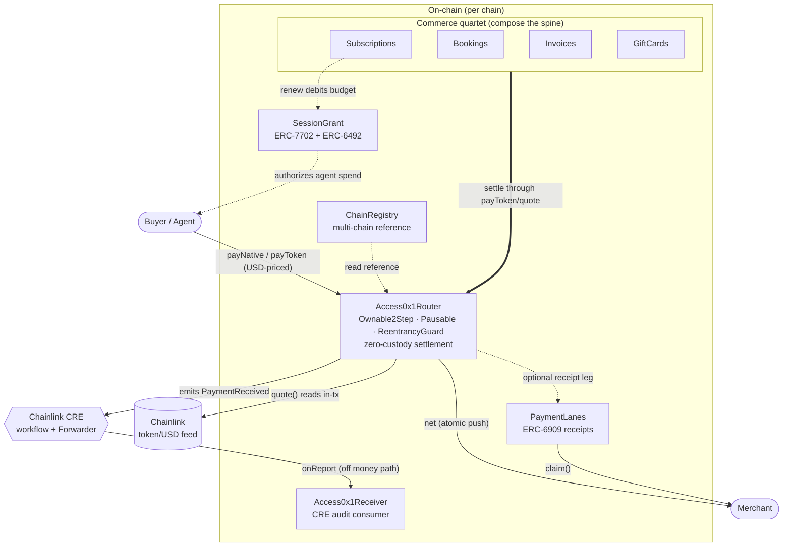

# Access0x1

<div align="center">

**A do-it-all center to get you and your business onchain** — non-custodial payments, commerce (subscriptions · bookings · invoices · gift cards · NFTs), and identity, white-label for non-coders and agent-native. One drop-in, no contract code.

**The stack**


**The proof**

[](https://github.com/Access0x1/Access0x1/actions/workflows/test.yml)


**The owned ERCs**


[What it is](#what-it-is) •
[Architecture](#architecture) •
[Contract surface](#the-contract-surface) •
[Quickstart](#quickstart) •
[Deploy](#deploy--multi-chain) •
[Owned ERCs](#the-owned-ercs) •
[Security](#security-posture) •
[Gas](docs/GAS.md) •
[Sponsors](#built-with-our-sponsors) •
[License](#license)

</div>

> **ETHGlobal NY 2026 build · testnet only.** The money spine (`router-core`) is complete, green,
> and on a public branch from commit #1. **Arc (Circle) is the lead settlement chain**, with
> Base Sepolia and zkSync Sepolia as bridge targets — there are **no mainnet deployments and no
> mainnet claims** here.

---

## What it is

A business registers once and accepts **USD-priced crypto with a single link** — no per-merchant
contract, no custody. One shared, multi-tenant [`Access0x1Router`](src/Access0x1Router.sol) serves
every merchant. Each payment prices USD → token through a Chainlink feed read *inside the settlement
transaction*, splits an exact fee, and pushes the net to the merchant in the same tx. The contract
**never holds merchant funds.**

On top of that money spine sit the auth + agent primitives: ERC-6909 [`PaymentLanes`](src/PaymentLanes.sol)
receipts so a merchant can pull settled value in any coin, ERC-7702/ERC-6492 [`SessionGrant`](src/SessionGrant.sol)
so an agent can be authorized to spend a budget-scoped, time-bounded allowance with one signature,
and a Chainlink-CRE [`Access0x1Receiver`](src/Access0x1Receiver.sol) audit consumer for notified
settlement — all off the money path by construction.

### Why it's different

- **Gas-free USDC checkout on Arc — by default.** The demo checkout connects to **Arc Testnet**
  out of the box (the app's default chain), where **Circle USDC is the native gas token**. A buyer
  pays in USDC and settles in USDC: there is **no separate gas coin to top up and no Paymaster to
  run** — the Arc + Circle stack does that work, so checkout is gas-free with zero extra contract
  code on our side. The same `payToken(USDC)` path also runs on Base Sepolia and zkSync Sepolia as
  bridge targets.
- **Zero custody.** Settlement is atomic: pull → split → push, all in one tx. The router's
  steady-state balance is zero; the only native it can hold is value owed back through `claimRescue`
  when a payee contract rejects a push (the receipt still stands — funds are never stuck).
- **USD pricing, on-chain.** `quote()` reads a Chainlink `<token>/USD` feed through a staleness guard
  *in the pay tx* — the price that drives settlement, not a frontend preview. Decimals are read live
  (feed, token), so the Arc trap (native USDC = 18 dp, ERC-20 USDC = 6 dp, feed = 8 dp) is safe.
- **One router, many merchants.** A permissionless `registerMerchant` → `merchantId`; the caller owns
  their config and nobody else's. A payment to merchant A can never mutate merchant B.
- **Exact, capped fees.** A single total fee splits two ways — the platform cut always lands at the
  treasury (a merchant can never redirect it), the merchant surcharge at the merchant's recipient —
  and `net + platformFee + merchantFee == gross` holds exactly. No payment is ever charged more than
  `MAX_FEE_BPS` (10%), even after a fee change under an existing surcharge.

---

## Architecture



The audited, zero-custody money path is `OracleLib` (staleness guard, `internal`/inlined) →
`Access0x1Router`. Everything else is a deliberate sidecar that the router never blocks on:
a `PaymentLanes` credit is an append-only post-settlement leg, the CRE audit write is fire-and-forget,
and `SessionGrant` / `ChainRegistry` hold no value path at all.

```text
src/
├── Access0x1Router.sol           # the shared, zero-custody money spine
├── PaymentLanes.sol              # ERC-6909 non-custodial pull receipts
├── SessionGrant.sol              # ERC-7702 + ERC-6492 agent sessions
├── ChainRegistry.sol             # per-chain reference (sidecar, no value path)
├── Access0x1Receiver.sol         # Chainlink CRE "notified settlement" audit consumer
├── HouseTokenFactory.sol         # non-custodial business-owned ERC-20 factory …
├── HouseToken.sol                #   … and the token it deploys (owner gets supply + key)
├── Access0x1Subscriptions.sol    # recurring USD billing  ┐
├── Access0x1Bookings.sol         # deposit-escrow + refund │ the commerce quartet —
├── Access0x1Invoices.sol         # pay-once payment request │ each COMPOSES the spine
├── Access0x1GiftCards.sol        # prepaid balance + coupons┘ (Router + SessionGrant)
├── libraries/
│   └── OracleLib.sol             # Chainlink staleness + completed-round guard (internal)
└── interfaces/                   # one per contract above (consumed surfaces)

script/                      # DeployAccess0x1Router · DeployAll · DeployChainRegistry · HelperConfig
test/                        # unit · attack · invariant (550 tests)
```

The full first-party surface is **12 contracts**: the money spine (`Access0x1Router`), the receipt
ledger (`PaymentLanes`), the agent-auth ledger (`SessionGrant`), the per-chain reference
(`ChainRegistry`), the CRE audit consumer (`Access0x1Receiver`), the house-token factory +
its `HouseToken`, the four commerce primitives, and the internal `OracleLib`. `make deploy-arc`
(or `deploy-base` / `deploy-zksync`) runs [`script/DeployAll.s.sol`](script/DeployAll.s.sol),
which deploys and wires the whole set in a single broadcast (`ChainRegistry` is the one sidecar
deployed once per chain by `DeployChainRegistry` and carried in as config).

---

## The contract surface

| Contract | One-liner |
| --- | --- |
| [`Access0x1Router`](src/Access0x1Router.sol) | One shared, multi-tenant, **zero-custody** payments router: `registerMerchant` → `merchantId`, then `payNative` / `payToken` price USD→token via a Chainlink feed *in-tx*, split an exact capped fee, and push net → merchant in the same tx. |
| [`PaymentLanes`](src/PaymentLanes.sol) | A standalone **ERC-6909** ledger whose tokens are non-custodial *receipts* for value the router has settled. A "lane" = `keccak256(chainId, asset, recipient)`; the merchant pulls the underlying with `claim`, and a cross-asset firewall guarantees a lane only ever releases the asset that funded it. |
| [`SessionGrant`](src/SessionGrant.sol) | The **ERC-7702 + ERC-6492** "sign once → budget-scoped, time-bounded agent session" primitive. An owner authorizes a delegate to `spend` up to a budget until an expiry, with no per-spend co-sign; pure authorization ledger, **never holds funds**. |
| [`ChainRegistry`](src/ChainRegistry.sol) | The canonical on-chain hash-map of per-chain facts (native USDC, local router, CCIP selector, flag word) keyed by `chainId`. A read reference for the SDK / frontend / deploy config — a new chain needs no SDK redeploy. |
| [`Access0x1Receiver`](src/Access0x1Receiver.sol) | The on-chain half of **Chainlink CRE** "Notified Settlement": a Forwarder-gated consumer that writes an immutable audit entry per settlement. Off the money path by construction — a revert here can never touch a payment. |
| [`HouseTokenFactory`](src/HouseTokenFactory.sol) / [`HouseToken`](src/HouseToken.sol) | A **non-custodial** factory: a business deploys its OWN ERC-20 (loyalty / credit / closed-loop, settleable through the router) and owns it in its own wallet — ownership AND the full supply are assigned to the business in the same tx, so the factory never holds a key or a balance. It only records provenance. |

**The commerce quartet** — vertical-agnostic primitives that **compose** the spine above (Router + SessionGrant) rather than re-implementing it. Each owns lifecycle/eligibility ONLY; every money leg routes through `Access0x1Router.payToken`/`payNative` (so `net + fee == gross` is the router's audited invariant, never re-derived) and every USD→token price is read in-tx through `Access0x1Router.quote` (the OracleLib staleness guard). They need NO router-side registration — the router's merchant registry is their single source of truth for owner-authorization.

| Contract | One-liner |
| --- | --- |
| [`Access0x1Subscriptions`](src/Access0x1Subscriptions.sol) | Recurring, USD-priced, **tiered** billing — the on-chain never-negative AI-spend meter. A subscription IS a budget-scoped [`SessionGrant`](src/SessionGrant.sol): the subscriber signs once; every `renew` debits that budget (hard-reverting past the cap) and pulls the period charge through the router fee-split. Tier entitlement is a read-time view of stored state — no cron, no money path ever writes a tier. |
| [`Access0x1Bookings`](src/Access0x1Bookings.sol) | A deposit-escrow primitive with a **never-blockable refund**. A payer escrows a USD-priced deposit against an opaque `slotKey`; the booking resolves through one lifecycle transition (confirm / expire / cancel / no-show) under an IMMUTABLE policy snapshot. A failed refund push lands in a per-token pull-map; a stale/dead oracle on a resolution leg yields a zero fee and refunds everything — the refund is unconditional (estate law #5). |
| [`Access0x1Invoices`](src/Access0x1Invoices.sol) | The simplest commerce primitive: a USD-priced, **pay-once** payment request. An operator issues a request for `amountUsd8` (optionally locked to one payer / stamped with a `dueBy`); it is priced USD→token in-tx and settled through the router fee-split. `OPEN → {PAID \| VOID}` is one-way and absorbing, so a replayed `pay` reverts — the on-chain unique-index. |
| [`Access0x1GiftCards`](src/Access0x1GiftCards.sol) | A USD-priced **prepaid-balance** primitive (gift cards / credit packs) plus a merchant-scoped coupon registry. A card balance is a non-custodial USD receipt the holder controls; a debit can NEVER drive it negative (`balance >= applied`, a hard revert). No ERC-20 ever enters the contract — the chargeable remainder is settled by the caller straight through the router in the same tx. |

### Router functions

| Function | What it does |
| --- | --- |
| `registerMerchant(payout, feeRecipient, feeBps, nameHash)` | Permissionless onboarding → `merchantId`. Caller becomes the merchant owner. |
| `updateMerchant(id, …)` | Merchant-owner-only config update. `owner` + `nameHash` are immutable. |
| `quote(id, token, usdAmount8)` | USD (8 dp) → token amount via the Chainlink feed + staleness guard. |
| `payNative(id, usdAmount8, orderId)` | Pay in the chain's native coin. Refunds excess; queues failed pushes to `rescue`. |
| `payToken(id, token, usdAmount8, orderId)` | Pay in an allowlisted ERC-20. Rejects fee-on-transfer via the balance delta. |
| `claimRescue()` | Pull-pattern withdrawal of value queued when a push failed. Open even while paused. |
| `setPlatformFee` · `setTreasury` · `setTokenAllowed` · `setPriceFeed` · `setPaymentLanes` · `pause` · `unpause` | `Ownable2Step` admin. |

---

## Quickstart

**Prerequisites:** [Git](https://git-scm.com/) · [Foundry](https://book.getfoundry.sh/getting-started/installation) ·
[Node.js](https://nodejs.org/) 18+. Foundry resolves `@chainlink/contracts` from `node_modules` via a
remapping, so **`npm install` must run before `forge build`**. `make install` does it all in the right
order — git submodules (OpenZeppelin + forge-std) + npm (`@chainlink`) + the web app + the SDK:

```sh
git clone https://github.com/Access0x1/Access0x1.git
cd Access0x1
make install           # forge submodules + npm (@chainlink) + web + SDK — one command
make build             # forge build
make test              # 846 tests, all green
```

> Manual equivalent of `make install`: `git submodule update --init --recursive && npm install`.
> More: `make coverage` (100% on the router) · `make snapshot` (gas) · `make gate` (the full pre-commit gate) · `make audit`.

### Run it locally — no keys, no keystore

A fresh Anvil node ships unlocked dev accounts, so the local deploy needs **no private key and no
keystore**. It deploys mock price feeds + a mock USDC, then the whole wired surface:

```sh
make anvil             # terminal 1 — local node on http://localhost:8545
make deploy-local      # terminal 2 — deploys the full wired surface to the local node
```

Want to *see money move*? `make drive-local` runs a full coffee-shop payment on the local node
(register a merchant → quote in USD → pay in USDC → `net + fee == gross`, zero custody). Copy-paste
`cast` walkthroughs for every contract are in [`docs/MANUAL-TESTING.md`](docs/MANUAL-TESTING.md).

### Run the web app

```sh
make web-dev           # cd web && npm run dev  →  http://localhost:3000
```

### Build on it — no contracts to write

Don't want the monorepo, just the stack in your own app? Scaffold a pre-wired starter — checkout +
one-tag embed + your own Foundry contracts. `@access0x1/react` is the only published package, so you
fetch the starter directly with `degit`:

```sh
npx degit Access0x1/Access0x1/templates/starter my-checkout
cd my-checkout
npm run setup          # detects/installs Foundry, installs deps, builds the contracts (never deploys)
npm run dev            # http://localhost:3000 — point it at a router in .env.local
```

No Solidity required: set your name, logo, and a router address in `access0x1.config.ts` / `.env.local`
(it ships **no** default address — LAW #4: never a guessed address). Deploying your own router is
optional; the starter's `contracts/DEPLOY.md` is the runbook.

---

## Deploy · multi-chain

`script/DeployAll.s.sol` is the chain-aware **one-command** entrypoint: a single `make deploy-arc`
(or `deploy-base` / `deploy-zksync`) deploys the **whole first-party surface, wired together**, in
the same broadcast — the `Access0x1Router` money spine, the `SessionGrant` agent-auth ledger, the
`HouseTokenFactory`, the four commerce primitives (`Subscriptions` / `Bookings` / `Invoices` /
`GiftCards`, each constructed against the freshly deployed Router + SessionGrant so they compose the
audited spine), and the price-feed + USDC allowlist wiring — plus, when configured,
the optional `PaymentLanes` ledger (`DEPLOY_PAYMENT_LANES=true`) and the off-money-path
`Access0x1Receiver` CRE consumer (`<chain>_CRE_FORWARDER`). `HelperConfig` reads the right env block
from a `block.chainid` ladder, so the same script targets every chain just by switching `--rpc-url`,
and any address that is not yet booth-confirmed resolves to `address(0)` and is *skipped*, never wired.
`ChainRegistry` is the one sidecar deployed once per chain by `DeployChainRegistry` and carried in as
config so the SDK keeps a single reference.

```sh
# Arc Testnet (Blockscout verify)
forge script script/DeployAll.s.sol \
  --rpc-url $ARC_TESTNET_RPC_URL \
  --account deployer --sender $DEPLOYER \
  --broadcast --verify --verifier blockscout --verifier-url $ARC_SCAN_VERIFIER_URL -vvvv

# Base Sepolia (Basescan verify)
forge script script/DeployAll.s.sol \
  --rpc-url $BASE_SEPOLIA_RPC_URL \
  --account deployer --sender $DEPLOYER \
  --broadcast --verify --etherscan-api-key $BASESCAN_API_KEY -vvvv

# zkSync Sepolia — needs foundry-zksync + the --zksync flag
# (a plain EVM build is NOT the zkEVM — see docs/ZKSYNC-TESTING.md)
forge script script/DeployAll.s.sol --zksync \
  --rpc-url $ZKSYNC_SEPOLIA_RPC_URL --account deployer --sender $DEPLOYER --broadcast -vvvv
```

**Or just `make`** (keystore + per-chain RPC read from `.env`):

```sh
make deploy-arc              # Arc Testnet — gas-free USDC, the lead chain
make deploy-base             # Base Sepolia
make deploy-zksync           # zkSync Sepolia (adds --zksync)
make deploy-sepolia          # Ethereum Sepolia
make deploy-arbitrum-sepolia # Arbitrum Sepolia
make deploy-optimism-sepolia # Optimism Sepolia
make deploy-polygon-amoy     # Polygon Amoy
make deploy-avalanche-fuji   # Avalanche Fuji
make deploy-bnb-testnet      # BNB Smart Chain testnet
make deploy-scroll-sepolia   # Scroll Sepolia
make deploy-linea-sepolia    # Linea Sepolia
make deploy-mantle-sepolia   # Mantle Sepolia (Blockscout verify)
make deploy-blast-sepolia    # Blast Sepolia
make deploy-unichain-sepolia # Unichain Sepolia
```

> Live deploys read **every** address from the environment (`PLATFORM_TREASURY`, `NATIVE_USD_FEED`,
> `USDC_ADDRESS`, `USDC_USD_FEED`, …) — never a hardcoded address. Signing is **keystore-only**
> (`--account`, never `--private-key`). Any feed/USDC address that is not yet confirmed resolves to
> `address(0)` and is *skipped*, never wired. See [`.env.example`](.env.example) for the full key set.

### Deployments

Filled at deploy time from the broadcast log (`broadcast/<chainId>/run-latest.json`) — **never**
hand-entered (law #4: an address that isn't on-chain isn't claimed). Empty until the owner runs
`make deploy-<chain>`; `Access0x1Router` is the address an integrator points at.

| Chain | Contract | Address | Tx |
| --- | --- | --- | --- |
| Arc Testnet (5042002) | `Access0x1Router` | — | — |
| Arc Testnet (5042002) | `SessionGrant` | — | — |
| Arc Testnet (5042002) | `Access0x1Subscriptions` | — | — |
| Arc Testnet (5042002) | `Access0x1Bookings` | — | — |
| Arc Testnet (5042002) | `Access0x1Invoices` | — | — |
| Arc Testnet (5042002) | `Access0x1GiftCards` | — | — |
| Arc Testnet (5042002) | `HouseTokenFactory` | — | — |
| Arc Testnet (5042002) | `ChainRegistry` | — | — |
| Base Sepolia (84532) | `Access0x1Router` | — | — |
| zkSync Sepolia (300) | `Access0x1Router` | — | — |

---

## The owned ERCs

Access0x1 doesn't just *use* the standards — it ships its own minimal, audited implementations of three
that compose into the payments + auth + agents story:

- **ERC-6909 — multi-token receipts** ([`PaymentLanes`](src/PaymentLanes.sol)). A lane is a
  deterministic token id `keccak256(chainId, asset, recipient)`. The router credits a lane after it
  settles, minting the merchant a fully-backed, non-custodial *receipt* it pulls later — the
  "receive in any coin" seam — with a cross-asset firewall (a lane can only ever pay out the asset
  that funded it) and CEI + `nonReentrant` on every value path.
- **ERC-7702 — account delegation** ([`SessionGrant`](src/SessionGrant.sol)). An EOA that has set its
  code to an Access0x1 delegate can `openSession` directly: one 7702 signing act lets it "act as a
  contract" and authorize a budget-scoped, time-bounded agent session — no per-spend co-sign.
- **ERC-6492 — predeploy signatures** ([`SessionGrant`](src/SessionGrant.sol)). `openSessionFor`
  validates a relayed EIP-712 grant against EOA / ERC-1271 / ERC-6492, so a brand-new counterfactual
  smart account can authorize a session *before it has any code* — the "zero wallet deploy" property.

---

## Security posture

`SafeERC20` · `nonReentrant` on every pay path · **CEI** ordering everywhere · custom errors · events
on every state change · Chainlink staleness guard · fee-on-transfer rejection (balance-delta check) ·
no unbounded loops · `Ownable2Step` admin. **Money paths roll back rather than swallow; refunds and
rescues are never blocked.** Secrets never enter the repo (env + `cast wallet` keystore only); the
deployer is a burner key.

### The proof

| | |
| --- | --- |
| Tests | **846 green** — unit · attack · invariant suites |
| Router coverage | **100%** lines · 100% statements · 100% branches · 100% functions |
| Invariants | **13 fuzz invariants** across 3 suites hold at 4,096 calls each, 0 reverts |
| Static analysis | **slither: 16 results, all triaged (0 exploitable)** · aderyn triaged → [`audit/FINDINGS.md`](audit/FINDINGS.md) |

The 13 invariants: **6 router money invariants** — native conservation · token conservation ·
platform cut always to treasury · zero-custody residual · merchant isolation · effective fee ≤
`MAX_FEE_BPS`; **3 PaymentLanes conservation** invariants; and a **4-property cross-asset firewall** —
all proved under handlers in [`test/invariant`](test/invariant/) and [`test/attack`](test/attack/).
Gas hot-paths are documented in [`docs/GAS.md`](docs/GAS.md).

---

## Stack

Foundry · Solidity 0.8.28 (EVM cancun, `via_ir`, optimizer 200 runs) · OpenZeppelin 5.x ·
Chainlink contracts 1.5.0 (Data Feeds + CRE). **Arc (Circle) is the lead settlement chain**;
Base Sepolia and zkSync Sepolia are bridge targets — all **testnets**.

---

## Built with our sponsors

Access0x1 is a thin layer of our own code on top of sponsor infrastructure that did the hard parts.
Each integration below is real and lives in this repo — this is an honest account of what each
sponsor let us *not* build, not a sponsor wall.

- **Circle + Arc — gas-free USDC settlement, and the easiest win of the build.** On
  [Arc](web/lib/chains.ts), **USDC is the native gas token** (the `0x3600…0000` system contract in
  [`web/lib/arc-constants.ts`](web/lib/arc-constants.ts)). Because the buyer pays in USDC *and* pays
  gas in USDC, our gas-free checkout needed **zero Paymaster code** — Arc's Circle Nanopayments layer
  already makes the payer gas-free, so we just defaulted the app to Arc and called `payToken(USDC)`.
  The Circle Gateway / x402 seam ([`web/app/api/gateway/*`](web/app/api/gateway)) lets a seller read
  and withdraw their settled USDC balance. The sponsor stack did the hard part; we wrote a chain
  config and a pay button.
- **Chainlink — USD pricing in one in-tx call.** `quote()` reads a Chainlink `<token>/USD` Data Feed
  *inside the settlement transaction* (through [`OracleLib`](src/libraries/OracleLib.sol)'s staleness
  guard), so the price that settles is the price on-chain, not a frontend guess. One call gave us
  trustworthy USD→USDC pricing for free. (Chainlink CRE also backs the off-money-path audit consumer,
  [`Access0x1Receiver`](src/Access0x1Receiver.sol).)
- **Dynamic — an email login became an invisible wallet.** [`web/lib/dynamic.ts`](web/lib/dynamic.ts)
  and the [providers](web/app/providers.tsx) turn a normal email sign-in into an embedded wallet, so a
  buyer who has never held crypto can still complete a USDC checkout — no seed phrase, no extension.
- **Unlink — confidential payouts.** [`web/lib/unlink`](web/lib/unlink) adds a private withdrawal leg
  so a merchant can shield and move their settled USDC without exposing the amount on a public ledger,
  off the money path by construction.
- **World ID — verified-human checkout.** [`web/components/WorldIdGate.tsx`](web/components/WorldIdGate.tsx)
  lets a merchant require a one-tap proof-of-personhood before pay. The gate sits *in front of*
  settlement and never touches the money path — a misconfigured gate degrades to standard checkout
  rather than blocking a payment.
- **OIDC verify-for-all — "Sign in with Google" (or any OIDC provider).**
  [`web/lib/oidc`](web/lib/oidc) + [`web/app/api/oidc/verify`](web/app/api/oidc/verify) verify a
  provider-signed ID token server-side (signature + issuer + audience via `jose`) and record an `oidc`
  method that stacks into Standard → Verified → Super Verified next to World ID / ENS / Dynamic /
  on-chain. **Install → verify for all:** any app built from this template inherits the method by setting
  `NEXT_PUBLIC_OIDC_CLIENT_ID` (audience) — blank ⇒ OIDC is OFF (fail-soft). The defaults verify
  Sign-in-with-Google ID tokens; override `OIDC_ISSUER` / `OIDC_JWKS_URL` / `OIDC_AUDIENCE` to point at
  *any* OIDC provider or your own auth backend with no code change. A verified token identifies a USER
  and, when it carries an agent claim, a verified AGENT — verify for all.
- **ENS — human-readable names on both ends.** [`web/lib/ens.ts`](web/lib/ens.ts) resolves an ENS name
  to the merchant's payout address *on the settlement chain* (always passing the chain's `coinType`),
  so both the brand and the payout destination can be a name instead of a hex string.
- **Walrus — an un-takedownable checkout.** [`web/lib/walrus.ts`](web/lib/walrus.ts) publishes the
  checkout page and receipt blobs to Walrus (Sui decentralized storage). Because a blob is
  content-addressed and served by any aggregator on the network, the checkout isn't pinned to one
  origin — there is no single host to take down.

> Honest scope: this is a testnet build. Sponsor addresses and endpoints carry a "confirm at booth"
> note and are read from env, never hardcoded ([law #4](#security-posture)) — see
> [`.env.example`](.env.example).

## License

[MIT](LICENSE).
