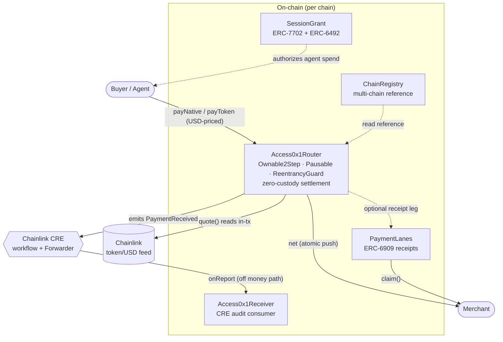

# Access0x1

<div align="center">

**An open-source, on-chain layer for payments + auth + agents that any developer integrates with one link and no contract code.**

**The stack**


**The proof**

[](https://github.com/Access0x1/Access0x1/actions/workflows/test.yml)


**The owned ERCs**


[What it is](#what-it-is) •
[Architecture](#architecture) •
[Contract surface](#the-contract-surface) •
[Quickstart](#quickstart) •
[Deploy](#deploy--multi-chain) •
[Owned ERCs](#the-owned-ercs) •
[Security](#security-posture) •
[Gas](docs/GAS.md) •
[License](#license)

</div>

> **ETHGlobal NY 2026 build · testnet only.** The money spine (`router-core`) is complete, green,
> and on a public branch from commit #1. Targets the **Arc, Base Sepolia, and zkSync Sepolia**
> testnets — there are **no mainnet deployments and no mainnet claims** here.

---

## What it is

A business registers once and accepts **USD-priced crypto with a single link** — no per-merchant
contract, no custody. One shared, multi-tenant [`Access0x1Router`](src/Access0x1Router.sol) serves
every merchant. Each payment prices USD → token through a Chainlink feed read *inside the settlement
transaction*, splits an exact fee, and pushes the net to the merchant in the same tx. The contract
**never holds merchant funds.**

On top of that money spine sit the auth + agent primitives: ERC-6909 [`PaymentLanes`](src/PaymentLanes.sol)
receipts so a merchant can pull settled value in any coin, ERC-7702/ERC-6492 [`SessionGrant`](src/SessionGrant.sol)
so an agent can be authorized to spend a budget-scoped, time-bounded allowance with one signature,
and a Chainlink-CRE [`Access0x1Receiver`](src/Access0x1Receiver.sol) audit consumer for notified
settlement — all off the money path by construction.

### Why it's different

- **Zero custody.** Settlement is atomic: pull → split → push, all in one tx. The router's
  steady-state balance is zero; the only native it can hold is value owed back through `claimRescue`
  when a payee contract rejects a push (the receipt still stands — funds are never stuck).
- **USD pricing, on-chain.** `quote()` reads a Chainlink `<token>/USD` feed through a staleness guard
  *in the pay tx* — the price that drives settlement, not a frontend preview. Decimals are read live
  (feed, token), so the Arc trap (native USDC = 18 dp, ERC-20 USDC = 6 dp, feed = 8 dp) is safe.
- **One router, many merchants.** A permissionless `registerMerchant` → `merchantId`; the caller owns
  their config and nobody else's. A payment to merchant A can never mutate merchant B.
- **Exact, capped fees.** A single total fee splits two ways — the platform cut always lands at the
  treasury (a merchant can never redirect it), the merchant surcharge at the merchant's recipient —
  and `net + platformFee + merchantFee == gross` holds exactly. No payment is ever charged more than
  `MAX_FEE_BPS` (10%), even after a fee change under an existing surcharge.

---

## Architecture



The audited, zero-custody money path is `OracleLib` (staleness guard, `internal`/inlined) →
`Access0x1Router`. Everything else is a deliberate sidecar that the router never blocks on:
a `PaymentLanes` credit is an append-only post-settlement leg, the CRE audit write is fire-and-forget,
and `SessionGrant` / `ChainRegistry` hold no value path at all.

```text
src/
├── Access0x1Router.sol      # the shared, zero-custody money spine
├── PaymentLanes.sol         # ERC-6909 non-custodial pull receipts
├── SessionGrant.sol         # ERC-7702 + ERC-6492 agent sessions
├── ChainRegistry.sol        # per-chain reference (sidecar, no value path)
├── Access0x1Receiver.sol    # Chainlink CRE "notified settlement" audit consumer
├── libraries/
│   └── OracleLib.sol        # Chainlink staleness + completed-round guard (internal)
└── interfaces/
    ├── IPaymentLanes.sol
    ├── ISessionGrant.sol
    └── IReceiver.sol

script/                      # DeployAccess0x1Router · DeployAll · DeployChainRegistry · HelperConfig
test/                        # unit · attack · invariant (299 tests)
```

---

## The contract surface

| Contract | One-liner |
| --- | --- |
| [`Access0x1Router`](src/Access0x1Router.sol) | One shared, multi-tenant, **zero-custody** payments router: `registerMerchant` → `merchantId`, then `payNative` / `payToken` price USD→token via a Chainlink feed *in-tx*, split an exact capped fee, and push net → merchant in the same tx. |
| [`PaymentLanes`](src/PaymentLanes.sol) | A standalone **ERC-6909** ledger whose tokens are non-custodial *receipts* for value the router has settled. A "lane" = `keccak256(chainId, asset, recipient)`; the merchant pulls the underlying with `claim`, and a cross-asset firewall guarantees a lane only ever releases the asset that funded it. |
| [`SessionGrant`](src/SessionGrant.sol) | The **ERC-7702 + ERC-6492** "sign once → budget-scoped, time-bounded agent session" primitive. An owner authorizes a delegate to `spend` up to a budget until an expiry, with no per-spend co-sign; pure authorization ledger, **never holds funds**. |
| [`ChainRegistry`](src/ChainRegistry.sol) | The canonical on-chain hash-map of per-chain facts (native USDC, local router, CCIP selector, flag word) keyed by `chainId`. A read reference for the SDK / frontend / deploy config — a new chain needs no SDK redeploy. |
| [`Access0x1Receiver`](src/Access0x1Receiver.sol) | The on-chain half of **Chainlink CRE** "Notified Settlement": a Forwarder-gated consumer that writes an immutable audit entry per settlement. Off the money path by construction — a revert here can never touch a payment. |

### Router functions

| Function | What it does |
| --- | --- |
| `registerMerchant(payout, feeRecipient, feeBps, nameHash)` | Permissionless onboarding → `merchantId`. Caller becomes the merchant owner. |
| `updateMerchant(id, …)` | Merchant-owner-only config update. `owner` + `nameHash` are immutable. |
| `quote(id, token, usdAmount8)` | USD (8 dp) → token amount via the Chainlink feed + staleness guard. |
| `payNative(id, usdAmount8, orderId)` | Pay in the chain's native coin. Refunds excess; queues failed pushes to `rescue`. |
| `payToken(id, token, usdAmount8, orderId)` | Pay in an allowlisted ERC-20. Rejects fee-on-transfer via the balance delta. |
| `claimRescue()` | Pull-pattern withdrawal of value queued when a push failed. Open even while paused. |
| `setPlatformFee` · `setTreasury` · `setTokenAllowed` · `setPriceFeed` · `setPaymentLanes` · `pause` · `unpause` | `Ownable2Step` admin. |

---

## Quickstart

```sh
git clone https://github.com/Access0x1/Access0x1.git
cd Access0x1
forge install          # OpenZeppelin + forge-std (git submodules)
npm install            # @chainlink/contracts (npm, pinned 1.5.0) — run BEFORE forge build
forge build
forge test             # 299 green
forge coverage         # 100% on the router
forge snapshot         # regenerate .gas-snapshot (see docs/GAS.md)
```

**Prerequisites:** [Git](https://git-scm.com/) · [Foundry](https://book.getfoundry.sh/getting-started/installation) ·
[Node.js](https://nodejs.org/) (for the `@chainlink/contracts` npm dependency, which Foundry resolves
into `node_modules` via a remapping).

Deploy to a local Anvil (deploys mock feeds + a mock USDC, then the router):

```sh
anvil &
forge script script/DeployAccess0x1Router.s.sol --rpc-url http://localhost:8545 \
  --account <keystore> --broadcast
```

---

## Deploy · multi-chain

`script/DeployAll.s.sol` is the chain-aware entrypoint: it deploys the router (and, with
`DEPLOY_PAYMENT_LANES=true`, the `PaymentLanes` ledger), then wires the price feeds + USDC allowlist in
the **same broadcast** so each chain has one replayable path. `HelperConfig` reads the right env block
from a `block.chainid` ladder, so the same script targets every chain just by switching `--rpc-url`.

```sh
# Arc Testnet (Blockscout verify)
forge script script/DeployAll.s.sol \
  --rpc-url $ARC_TESTNET_RPC_URL \
  --account deployer --sender $DEPLOYER \
  --broadcast --verify --verifier blockscout --verifier-url $ARC_SCAN_VERIFIER_URL -vvvv

# Base Sepolia (Basescan verify)
forge script script/DeployAll.s.sol \
  --rpc-url $BASE_SEPOLIA_RPC_URL \
  --account deployer --sender $DEPLOYER \
  --broadcast --verify --etherscan-api-key $BASESCAN_API_KEY -vvvv

# zkSync Sepolia
forge script script/DeployAll.s.sol --profile zksync \
  --rpc-url $ZKSYNC_SEPOLIA_RPC_URL --account deployer --sender $DEPLOYER --broadcast -vvvv
```

> Live deploys read **every** address from the environment (`PLATFORM_TREASURY`, `NATIVE_USD_FEED`,
> `USDC_ADDRESS`, `USDC_USD_FEED`, …) — never a hardcoded address. Signing is **keystore-only**
> (`--account`, never `--private-key`). Any feed/USDC address that is not yet confirmed resolves to
> `address(0)` and is *skipped*, never wired. See [`.env.example`](.env.example) for the full key set.

---

## The owned ERCs

Access0x1 doesn't just *use* the standards — it ships its own minimal, audited implementations of three
that compose into the payments + auth + agents story:

- **ERC-6909 — multi-token receipts** ([`PaymentLanes`](src/PaymentLanes.sol)). A lane is a
  deterministic token id `keccak256(chainId, asset, recipient)`. The router credits a lane after it
  settles, minting the merchant a fully-backed, non-custodial *receipt* it pulls later — the
  "receive in any coin" seam — with a cross-asset firewall (a lane can only ever pay out the asset
  that funded it) and CEI + `nonReentrant` on every value path.
- **ERC-7702 — account delegation** ([`SessionGrant`](src/SessionGrant.sol)). An EOA that has set its
  code to an Access0x1 delegate can `openSession` directly: one 7702 signing act lets it "act as a
  contract" and authorize a budget-scoped, time-bounded agent session — no per-spend co-sign.
- **ERC-6492 — predeploy signatures** ([`SessionGrant`](src/SessionGrant.sol)). `openSessionFor`
  validates a relayed EIP-712 grant against EOA / ERC-1271 / ERC-6492, so a brand-new counterfactual
  smart account can authorize a session *before it has any code* — the "zero wallet deploy" property.

---

## Security posture

`SafeERC20` · `nonReentrant` on every pay path · **CEI** ordering everywhere · custom errors · events
on every state change · Chainlink staleness guard · fee-on-transfer rejection (balance-delta check) ·
no unbounded loops · `Ownable2Step` admin. **Money paths roll back rather than swallow; refunds and
rescues are never blocked.** Secrets never enter the repo (env + `cast wallet` keystore only); the
deployer is a burner key.

### The proof

| | |
| --- | --- |
| Tests | **299 green** — unit · attack · invariant suites |
| Router coverage | **100%** lines · 100% statements · 100% branches · 100% functions |
| Invariants | **13 fuzz invariants** across 3 suites hold at 4,096 calls each, 0 reverts |
| Static analysis | **slither: 16 results, all triaged (0 exploitable)** · aderyn triaged → [`audit/FINDINGS.md`](audit/FINDINGS.md) |

The 13 invariants: **6 router money invariants** — native conservation · token conservation ·
platform cut always to treasury · zero-custody residual · merchant isolation · effective fee ≤
`MAX_FEE_BPS`; **3 PaymentLanes conservation** invariants; and a **4-property cross-asset firewall** —
all proved under handlers in [`test/invariant`](test/invariant/) and [`test/attack`](test/attack/).
Gas hot-paths are documented in [`docs/GAS.md`](docs/GAS.md).

---

## Stack

Foundry · Solidity 0.8.28 (EVM cancun, `via_ir`, optimizer 200 runs) · OpenZeppelin 5.x ·
Chainlink contracts 1.5.0 (Data Feeds + CRE). Targets the Arc, Base Sepolia, and zkSync Sepolia
**testnets**.

## License

[MIT](LICENSE).
