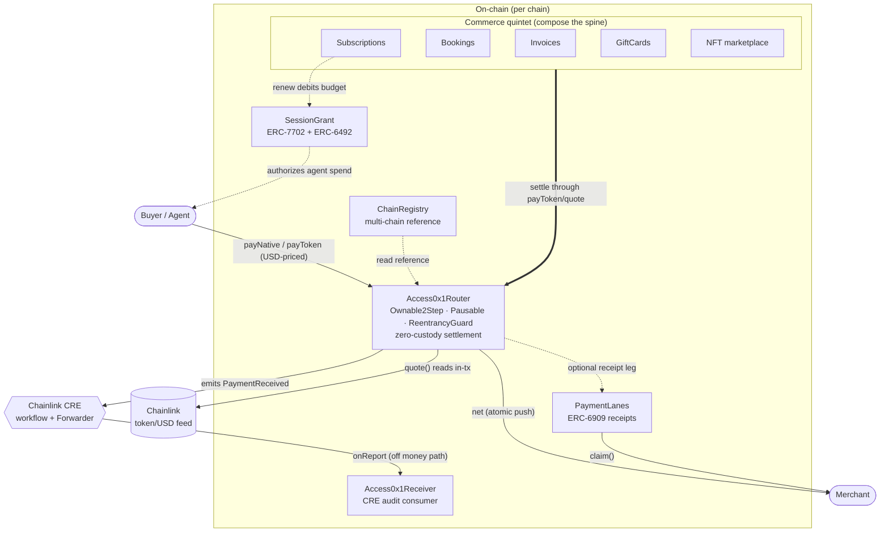

# Access0x1

<div align="center">


**The open-source rail for onchain identity + USD-priced payments in USDC. One link, no code, no contract, no gas. Apps build on it.**

Access0x1 is a thin, non-custodial layer over infrastructure other people built. Chainlink prices every payment inside the settlement transaction; Circle's USDC is the unit of account, and on Arc it is the gas token too; ENS is the front door a business arrives through; CreateX is why one router address answers on every chain here. What this repo adds on top is the merchant rail — payments, commerce (subscriptions · bookings · invoices · gift cards), tokenization ([ERC-7943 uRWA compliant assets · ERC-6551 token bound accounts](docs/TOKENIZATION-KIT.md) — built and unit-tested, deployed on no chain), and identity, white-label for non-coders and agent-native. One shared rail per chain; apps build on top, no per-app contract code.

**Working at one of the protocols above? → [docs/FOR-PROTOCOLS.md](docs/FOR-PROTOCOLS.md)** — one page per protocol: what we call, what we learned by calling it that your docs do not say, and what we would change. Every finding cites the file that proves it.

> **Where we are, honestly.** Access0x1 is a real startup — early, just starting up. What exists today is **the code**: this open-source repo, live on **testnets**, MIT-licensed. **No token. No outside funding claimed. No mainnet deployment.** Everything documented here is what's actually built and tested; nothing is promised that isn't. Built in the open, code first — the repo *is* the pitch.
>
> **Security review — first-party self-audit by the founder.** The contracts are reviewed by the project's own maintainer against [`audit/CHECKLIST.md`](audit/CHECKLIST.md): static analysis (Slither + Aderyn, all triaged), the full test + fuzz-invariant + symbolic suite, and manual review — the [`audit/`](audit/) package is the record. This is a **self-audit (first-party)**, **not** an independent third-party audit, and **no external audit has been performed**. We say "self-audit," never "audited."

🏆 **Verified ETHGlobal Hacker Pack holder** — the Hacker Pack is an on-chain credential ([`EG-HACKER`](https://optimistic.etherscan.io/token/0x32382a82d9faDc55f971f33DaEeE5841cfbADbE0) · contract `0x32382a82d9faDc55f971f33DaEeE5841cfbADbE0` · balance 1 on Optimism).

**⚡ New here? → [Quickstart — working code in 5 min](docs/QUICKSTART.md)** · [60-second model](docs/GETTING-STARTED.md) · [Architecture](#architecture)

**The stack**


**The proof**

[](https://github.com/Access0x1/Access0x1/actions/workflows/test.yml)
<!-- The test count is bound to `forge test --list` and CI-ENFORCED: scripts/sync-test-badge.mjs fails CI if this number drifts from the real suite, so it can't go stale silently. The CI badge above is the live green/red "they pass" signal. Update after adding tests: `node scripts/sync-test-badge.mjs --write`. -->
[](https://github.com/Access0x1/Access0x1/actions/workflows/test.yml)


**The repo**

[](https://github.com/Access0x1/Access0x1/releases)
[](https://github.com/Access0x1/Access0x1/commits)


**Standards we implement**


[What it is](#what-it-is) •
[Architecture](#architecture) •
[Contract surface](#the-contract-surface) •
[Quickstart](#quickstart) •
[Deploy](#deploy--multi-chain) •
[Standards](#standards-we-implement) •
[Security](SECURITY.md) •
[Audit](audit/REPORT.md) •
[Gas](docs/GAS.md) •
[For protocols](docs/FOR-PROTOCOLS.md) •
[Integrations](#built-on) •
[License](#license)

</div>

### The whole promise in 30 seconds

```sh
# 1. Register a merchant — one permissionless call, any wallet, no per-merchant contract.
#    Returns a merchantId; the caller owns the config. feeBps = your platform cut (e.g. 100 = 1%).
cast send --account deployer --rpc-url "$ARC_TESTNET_RPC" \
  0xe92244e3368561faf21648146511DeDE3a475EB5 \
  "registerMerchant(address,address,uint16,bytes32)" \
  "$PAYOUT" "$FEE_RECIPIENT" 100 "$NAME_HASH"
```

```tsx
// 2. Pay from any app — USD-priced, settled on-chain (Chainlink feed read in-tx). No Solidity.
<PayButton
  merchantId={42n}
  usdAmount={29.0}                 // human USD — the SDK scales to 8 dp for payToken()
  token={USDC}                     // omit `token` to pay in the chain's native coin
  routerAddress="0xe92244e3368561faf21648146511DeDE3a475EB5"
  client={client}
  onSuccess={(receipt) => console.log('paid', receipt.txHash)}
/>
```

That's the whole loop: register once, then collect USD-priced payments in USDC with a single drop-in — zero
custody, no per-merchant contract. The full walkthrough is the **[Quickstart](docs/QUICKSTART.md)**.

> **ETHGlobal NY 2026 build · testnet only.** The money spine (`router-core`) is complete, green,
> and on a public branch from commit #1. **The CREATE3 mirror (one address `0xe92244e3…` on every chain) is live on eleven testnets (Arc 5042002, Base Sepolia 84532, Unichain Sepolia 1301, Ethereum Sepolia 11155111, Optimism Sepolia 11155420, Avalanche Fuji 43113, Robinhood 46630, Arbitrum Sepolia 421614, Celo Sepolia 11142220, ZKsync Sepolia 300 via the dedicated EraVM path, 0G Galileo 16602) and source-verified on all eleven; one additional earlier chain (Ethereum Hoodi 560048) carries a pre-mirror per-chain deploy — twelve chains deployed in total. Every address is read straight from a committed `broadcast/DeployAll.s.sol/<chainId>/` record (law #4 — an address that isn't on-chain isn't claimed); the `MIRROR-STATUS` table below (regenerated by `make sync`) plus the source-verified table under Deployments are the live source of truth.** More chains (Polygon Amoy, Scroll Sepolia, …) are per-chain ready (`make deploy-<chain>`) but not yet broadcast. **No mainnet deployments and no mainnet claims.**

> 🚀 **New to Access0x1?** Start with the **[Getting Started guide](docs/GETTING-STARTED.md)** — zero to a working payment in three copy-paste paths — then the **[Architecture deep-dive](docs/ARCHITECTURE.md)** for the money spine, line by line.

---

## What it is

A business registers once and accepts **USD-priced payments in USDC with a single link** — no per-merchant
contract, no custody. One shared, multi-tenant [`Access0x1Router`](src/Access0x1Router.sol) serves
every merchant. Each payment prices USD → token through a Chainlink feed read *inside the settlement
transaction*, splits an exact fee, and pushes the net to the merchant in the same tx. The contract
**never holds merchant funds.**

On top of that money spine sit the auth + agent primitives: ERC-6909 [`PaymentLanes`](src/PaymentLanes.sol)
receipts so a merchant can pull settled value in any coin, ERC-7702/ERC-6492 [`SessionGrant`](src/SessionGrant.sol)
so an agent can be authorized to spend a budget-scoped, time-bounded allowance with one signature,
and a Chainlink-CRE [`Access0x1Receiver`](src/Access0x1Receiver.sol) audit consumer for notified
settlement — all off the money path by construction.

### Why it's different

Unlike a custodial payment router (Stripe Connect, or an on-chain router that escrows then forwards),
Access0x1 takes **zero custody** — settlement is one atomic pull → split → push, so the router's balance
stays at ~0 — and prices every payment in **USD on-chain, inside the settlement tx** via a Chainlink feed,
never from an off-chain quote you have to trust. The buyer pays exactly the USD amount the contract priced,
and no intermediary ever holds the funds.

- **USDC is Arc's native gas token.** Arc Testnet is one of the supported chains, and on it
  **Circle USDC is the native gas token**. A buyer paying in USDC there is also paying gas in
  USDC: there is **no separate gas coin to top up and no Paymaster to run** for that leg — it's a
  property of Arc's own gas model, with zero extra contract code on our side. The same
  `payToken(USDC)` path also runs on Base Sepolia (live); zkSync Sepolia (300) is deployed at the
  mirror address (see `broadcast/…/300`), source-verification pending.
  > Note: USDC-as-gas is Arc-specific because it's Arc's native gas token, not something we built.
  > On other chains (Base Sepolia, zkSync, etc.), buyers pay gas in that chain's native token. An
  > optional ERC-7677 paymaster can sponsor gas on other chains if configured.
- **Zero custody.** Settlement is atomic: pull → split → push, all in one tx. The router's
  steady-state balance is zero; the only native it can hold is value owed back through `claimRescue`
  when a payee contract rejects a push (the receipt still stands — funds are never stuck).
- **USD pricing, on-chain.** `quote()` reads a Chainlink `<token>/USD` feed through a staleness guard
  *in the pay tx* — the price that drives settlement, not a frontend preview. Decimals are read live
  (feed, token), so the Arc trap (native USDC = 18 dp, ERC-20 USDC = 6 dp, feed = 8 dp) is safe.
- **One router, many merchants.** A permissionless `registerMerchant` → `merchantId`; the caller owns
  their config and nobody else's. A payment to merchant A can never mutate merchant B.
- **Exact, capped fees.** A single total fee splits two ways — the platform cut always lands at the
  treasury (a merchant can never redirect it), the merchant surcharge at the merchant's recipient —
  and `net + platformFee + merchantFee == gross` holds exactly. No payment is ever charged more than
  `MAX_FEE_BPS` (10%), even after a fee change under an existing surcharge.

---

## Everything you can do today

All shipped, all testnet-live or one env var from it — nothing on this list is a roadmap item.

| You can… | Powered by | Where |
| --- | --- | --- |
| **Get paid in USDC with one link** — USD-priced on-chain, zero custody, exact fee split | `Access0x1Router` + Chainlink in-tx quote | `/onboard` → `/c/<slug>` |
| **Pay in any allowlisted coin** — WETH, LINK, DAI… priced by that token's feed in the same tx | `payToken` + per-token feeds | the checkout picker |
| **Sell subscriptions, bookings, invoices, gift cards** | the commerce quartet composing the router | `/journey` |
| **Authorize an AI agent to spend** — budget-scoped, time-bounded, one signature | `SessionGrant` (ERC-7702/6492) | agent APIs |
| **Let an agent earn → store → own** — x402 micro-earnings, Walrus-anchored memory, on-chain provenance | x402 + `stateAnchor` + `ProvenanceRegistry` | the agent spine |
| **Run every AI feature on decentralized inference** — one setting flips Anthropic ↔ 0G Compute, answers badge who served them | `lib/ai/inference.ts` | `/ask`, `/api/ai/infer` |
| **Buy a real .eth name in-app** — commit → 60s → register, signed by your own wallet | `lib/ens/registrar` + `ownName` step engine | `/name` |
| **Resolve payments to live names** — `pay.<business>.eth` answers from current router state, not a static record | `Access0x1PaymentResolver` + CCIP-Read gateway | ENS resolution |
| **Climb the verification ladder** — signed-in → verified human (World ID) → verified name, one chip | Dynamic + World ID + ENSIP-19 | `/verify` |
| **Receive in any coin** — post-settlement swaps, zero added fee | Uniswap (Trading API / classic) · 1inch (dormant — no testnet) | payout settings |
| **Prove a payment landed** — the last settlement with its verifiable tx hash, read from logs | `lib/proof/lastPayment` | Proof of Payment |
| **Verify the deployment yourself** — live bytecode diffed against this repo, per chain, in your browser | `/deployments` + `currentBytecode` | [access0x1.click/deployments](https://access0x1.click/deployments) |
| **Send a payment link in chat** — Telegram link mode (bot never holds a key) | `/api/chat/telegram` | chat payments |
| **Drive the whole rail headless** — the 1 tx/sec x402 settlement loop | `mvp-presentation.mts` | `npm run mvp-presentation` |

### Check the claims on this page yourself

Three reads, no trust required. Each one hits a contract whose address comes from a committed
`broadcast/` record:

```sh
# the Uniswap v4 receipt hook's PoolManager — live, source-verified, Ethereum Sepolia
cast call 0x4d6cF3e12C331393880df02b53017A478A6ec040 "POOL_MANAGER()(address)" --rpc-url "$SEPOLIA_RPC_URL"
# the ENS payment resolver's chain coinType — live, source-verified, Ethereum Sepolia
cast call 0x9c9ADe797451309925Ef400e99b289Ee1EA1d237 "chainCoinType()(uint256)" --rpc-url "$SEPOLIA_RPC_URL"
# the CREATE3 mirror router's platform fee — any mirrored chain, same address
cast call 0xe92244e3368561faf21648146511DeDE3a475EB5 "platformFeeBps()(uint16)" --rpc-url "$BASE_SEPOLIA_RPC_URL"
```

The [deployments dashboard](https://access0x1.click/deployments) does the heavier version in a
browser: it reads live bytecode off each chain and diffs it against this source. The assistant at
**[access0x1.click/ask](https://access0x1.click/ask)** answers from this repo's docs corpus and says
*"not in the docs"* rather than invent — a search surface over [`AUDIT.md`](AUDIT.md) and
[`audit/`](audit/), never a substitute for the three commands above.

---

## Architecture


```mermaid
flowchart TB
    Buyer([Buyer / Agent])
    Merchant([Merchant])

    subgraph onchain["On-chain (per chain)"]
        Router["Access0x1Router<br/>Ownable2Step · Pausable · ReentrancyGuard<br/>zero-custody settlement"]
        Lanes["PaymentLanes<br/>ERC-6909 receipts"]
        Session["SessionGrant<br/>ERC-7702 + ERC-6492"]
        Registry["ChainRegistry<br/>multi-chain reference"]
        Receiver["Access0x1Receiver<br/>CRE audit consumer"]
        subgraph commerce["Commerce quintet (compose the spine)"]
            Subs["Subscriptions"]
            Book["Bookings"]
            Inv["Invoices"]
            Gift["GiftCards"]
            Nft["NFT marketplace"]
        end
    end

    Feed[("Chainlink<br/>token/USD feed")]
    CRE{{"Chainlink CRE<br/>workflow + Forwarder"}}

    Buyer -->|"payNative / payToken (USD-priced)"| Router
    Router -->|"quote() reads in-tx"| Feed
    Router -->|"net (atomic push)"| Merchant
    Router -. "optional receipt leg" .-> Lanes
    Lanes -->|"claim()"| Merchant
    Router -->|"emits PaymentReceived"| CRE
    CRE -->|"onReport (off money path)"| Receiver
    Session -.->|"authorizes agent spend"| Buyer
    Registry -.->|"read reference"| Router
    commerce ==>|"settle through payToken/quote"| Router
    Subs -.->|"renew debits budget"| Session
```

The self-audited, zero-custody money path is `OracleLib` (staleness guard, `internal`/inlined) →
`Access0x1Router`. Everything else is a deliberate sidecar that the router never blocks on:
a `PaymentLanes` credit is an append-only post-settlement leg, the CRE audit write is fire-and-forget,
and `SessionGrant` / `ChainRegistry` hold no value path at all.

```text
src/
├── Access0x1Router.sol           # the shared, zero-custody money spine
├── PaymentLanes.sol              # ERC-6909 non-custodial pull receipts
├── SessionGrant.sol              # ERC-7702 + ERC-6492 agent sessions
├── ChainRegistry.sol             # per-chain reference (sidecar, no value path)
├── Access0x1Receiver.sol         # Chainlink CRE "notified settlement" audit consumer
├── HouseTokenFactory.sol         # non-custodial business-owned ERC-20 factory …
├── HouseToken.sol                #   … and the token it deploys (owner gets supply + key)
├── Access0x1Subscriptions.sol    # recurring USD billing  ┐
├── Access0x1Bookings.sol         # deposit-escrow + refund │ the commerce quintet —
├── Access0x1Invoices.sol         # pay-once payment request │ each COMPOSES the spine
├── Access0x1GiftCards.sol        # prepaid balance + coupons│ (Router + SessionGrant)
├── Access0x1Nft.sol              # USD-priced NFT marketplace┘
├── Access0x1Escrow.sol           # conditional settlement — a deposit HELD until a condition resolves
├── Refunds.sol                   # time-boxed, merchant-authorized refunds / chargebacks by orderId
├── SplitSettler.sol              # one USD payment fans out to N payees by basis points (Σ == gross)
├── Receivables.sol               # tokenized, factorable invoices — an ERC-721 its holder gets paid on
├── GaslessPayIn.sol              # gasless "first-dollar" pay-in from ONE off-chain signature
├── AutomationGateway.sol         # Chainlink Automation front-door that auto-renews subscriptions
├── PriceOracleAdapter.sol        # swappable ERC-7726 price-oracle surface for the spine
├── OperatorFeed.sol              # access-controlled, band-limited price stand-in (NOT Chainlink)
├── PriceRelaySender.sol          # reads a REAL Chainlink feed  ┐ carry a Chainlink price to a
├── PriceRelayReceiver.sol        # lands it as an aggregator     ┘ chain Chainlink does not serve
├── Access0x1ProvenanceRegistry.sol  # on-chain code provenance — claim repo, anchor each release
├── NameMath.sol                  # ENS namehash → brand color + SVG (internal library)
├── libraries/
│   └── OracleLib.sol             # Chainlink staleness + completed-round guard (internal)
└── interfaces/                   # one per contract above (consumed surfaces)

script/                      # DeployAccess0x1Router · DeployAll · DeployChainRegistry · HelperConfig
test/                        # unit · attack · invariant (2,134 tests)
```

The full first-party surface is **42 production contracts + 2 libraries** (44 `.sol` files in
`src/` excluding interfaces, plus 29 interface-only files — 73 in `src/` altogether): the money spine (`Access0x1Router`), the receipt
ledger (`PaymentLanes`), the agent-auth ledger (`SessionGrant`), the per-chain reference
(`ChainRegistry`), the CRE audit consumer (`Access0x1Receiver`), the house-token factory +
its `HouseToken`, the five commerce primitives (subscriptions · bookings · invoices · gift cards ·
the `Access0x1Nft` marketplace), the settlement extensions (`Access0x1Escrow` · `Refunds` ·
`SplitSettler` · `Receivables` · `GaslessPayIn` · `AutomationGateway` · `PriceOracleAdapter` ·
`Access0x1ProvenanceRegistry`), the Arc pricing pair (`OperatorFeed` and the
`PriceRelaySender` / `PriceRelayReceiver` CCIP relay), and two inlined libraries — the `OracleLib` staleness guard and the
`NameMath` ENS-brand helper. `make deploy-arc`
(or `deploy-base-sepolia` / `deploy-zksync-sepolia`) runs [`script/DeployAll.s.sol`](script/DeployAll.s.sol),
which deploys and wires the whole set in a single broadcast (`ChainRegistry` is the one sidecar
deployed once per chain by `DeployChainRegistry` and carried in as config).

---

## The contract surface

> **Every system contract is UUPS-upgradeable** — one `ERC1967Proxy` per contract (stable address + state), a swappable implementation via `upgradeToAndCall`, and a permanent on-chain freeze via `renounceOwnership()`. Storage is append-only behind a `uint256[50] __gap`; reentrancy uses the storage-less cancun `ReentrancyGuardTransient`.

| Contract | One-liner |
| --- | --- |
| [`Access0x1Router`](src/Access0x1Router.sol) | One shared, multi-tenant, **zero-custody** payments router: `registerMerchant` → `merchantId`, then `payNative` / `payToken` price USD→token via a Chainlink feed *in-tx*, split an exact capped fee, and push net → merchant in the same tx. |
| [`PaymentLanes`](src/PaymentLanes.sol) | A standalone **ERC-6909** ledger whose tokens are non-custodial *receipts* for value the router has settled. A "lane" = `keccak256(chainId, asset, recipient)`; the merchant pulls the underlying with `claim`, and a cross-asset firewall guarantees a lane only ever releases the asset that funded it. |
| [`SessionGrant`](src/SessionGrant.sol) | The **ERC-7702 + ERC-6492** "sign once → budget-scoped, time-bounded agent session" primitive. An owner authorizes a delegate to `spend` up to a budget until an expiry, with no per-spend co-sign; pure authorization ledger, **never holds funds**. |
| [`ChainRegistry`](src/ChainRegistry.sol) | The canonical on-chain hash-map of per-chain facts (native USDC, local router, CCIP selector, flag word) keyed by `chainId`. A read reference for the SDK / frontend / deploy config — a new chain needs no SDK redeploy. |
| [`Access0x1Receiver`](src/Access0x1Receiver.sol) | The on-chain half of **Chainlink CRE** "Notified Settlement": a Forwarder-gated consumer that writes an immutable audit entry per settlement. Off the money path by construction — a revert here can never touch a payment. |
| [`HouseTokenFactory`](src/HouseTokenFactory.sol) / [`HouseToken`](src/HouseToken.sol) | A **non-custodial** factory: a business deploys its OWN ERC-20 (loyalty / credit / closed-loop, settleable through the router) and owns it in its own wallet — ownership AND the full supply are assigned to the business in the same tx, so the factory never holds a key or a balance. It records provenance plus an **on-chain discoverability index** — `tokensOf(owner)`, a global enumeration, and a per-token record (owner · deployedAt · chainId) — so a business's tokens are findable without log-scraping (and a `decimals > 18` deploy reverts). |
| [`AutomationGateway`](src/AutomationGateway.sol) | The permissionless **Chainlink Automation** front-door for recurring billing: a self-driving keeper (`checkUpkeep` / `performUpkeep`) that auto-renews due subscriptions with no centralized cron. **Zero custody, zero privilege** — it only pokes the self-guarding `Access0x1Subscriptions.renew`; bounded scan/batch, and `performUpkeep` re-validates due-ness against live state + `try/catch`-isolates each renew so one failure never blocks the batch. |
| [`Access0x1ProvenanceRegistry`](src/Access0x1ProvenanceRegistry.sol) | On-chain **code provenance**: a developer claims a repo, anchors a Merkle snapshot of the tree, then anchors each release — with EIP-712 delegated variants and 2-step repo-ownership transfer. The "it deploys from my GitHub, provably" registry. |
| [`GaslessPayIn`](src/GaslessPayIn.sol) | **Gasless "first-dollar" pay-in**: a buyer pays a merchant in ONE tx from an off-chain signature — no prior approve, no opened session — via **EIP-2612** permit, **ERC-7597** (smart-account permit), or **EIP-3009** `transferWithAuthorization` (USDC-native). The pulled token is routed through `Router.payToken` (USD-priced, fee-split); the contract retains ZERO balance (asserted inline). |
| [`PriceOracleAdapter`](src/PriceOracleAdapter.sol) | A thin **swappable price oracle** behind the **ERC-7726** `getQuote(baseAmount, base, quote)` surface, so the router (and every primitive) can stop hard-binding `AggregatorV3Interface`. Wraps a Chainlink feed through OracleLib's staleness guard today; a future TWAP / Data-Streams source is a new impl behind the same interface — zero churn at the call site. Pure infra, no custody. |
| [`OperatorFeed`](src/OperatorFeed.sol) | An **access-controlled, band-limited price stand-in** for a chain Chainlink does not serve (Arc: no USDC/USD Data Feed, no Data Streams verifier — registry checked 2026-08-23). Writes admit only the owner and one named operator; an **immutable** deploy-time band caps what even an authorized key can post; the heartbeat is published on-chain so the keeper reads its own cadence. **Honestly labelled — this is NOT a Chainlink product**, and `version()` returns `0` so a consumer gating on a real aggregator rejects it. A stopped keeper fails **closed**: `updatedAt` ages out, `OracleLib` reverts, and `quote()` aborts the payment before value moves. That guarantee covers the UNATTENDED case only — a RUNNING keeper that posts an unmeasured number keeps `updatedAt` fresh while the answer drifts, which is the one failure this design cannot catch on-chain, so [`RefreshOperatorFeed`](script/RefreshOperatorFeed.s.sol) carries **no default answer** and refuses to run without a real price source. |
| [`PriceRelaySender`](src/PriceRelaySender.sol) / [`PriceRelayReceiver`](src/PriceRelayReceiver.sol) | The **Chainlink-backed** answer to the same gap: the sender reads a REAL Chainlink Data Feed on a chain that has one (Ethereum Sepolia USDC/USD) through the same OracleLib guard and forwards it as a **data-only CCIP message**; the receiver lands it on Arc **as an `AggregatorV3Interface`**, so wiring it is the ordinary `setPriceFeed` call and the router needs no change at all. Four independent receiver guards — lane · scale · monotonicity · age+band — because CCIP guarantees authenticated delivery, never that the number inside is a correct price. It reports the **source** timestamp, not the arrival time, so relay latency can never masquerade as freshness — which is why wiring it takes the **3-arg** `setPriceFeed(token, feed, maxStaleness)`: a 24h-heartbeat source under `OracleLib`'s 1h default would revert `StalePrice` almost always. **Built + tested, never broadcast.** See [ARC-PRICING.md](docs/ARC-PRICING.md). |

**The commerce set** — vertical-agnostic primitives that **compose** the spine above (Router + SessionGrant) rather than re-implementing it. Each owns lifecycle/eligibility ONLY; every money leg routes through `Access0x1Router.payToken`/`payNative` (so `net + fee == gross` is the router's fuzz-proven invariant, never re-derived) and every USD→token price is read in-tx through `Access0x1Router.quote` (the OracleLib staleness guard). They need NO router-side registration — the router's merchant registry is their single source of truth for owner-authorization. (`Access0x1Nft`, the newest of the five, is built and tested and wired into `DeployAll`; the formal audit pass in [`audit/`](audit/) currently scopes the original four — it is reviewed there before any mainnet claim.)

| Contract | One-liner |
| --- | --- |
| [`Access0x1Subscriptions`](src/Access0x1Subscriptions.sol) | Recurring, USD-priced, **tiered** billing — the on-chain never-negative AI-spend meter. A subscription IS a budget-scoped [`SessionGrant`](src/SessionGrant.sol): the subscriber signs once; every `renew` debits that budget (hard-reverting past the cap) and pulls the period charge through the router fee-split. Tier entitlement is a read-time view of stored state — no cron, no money path ever writes a tier. |
| [`Access0x1Bookings`](src/Access0x1Bookings.sol) | A deposit-escrow primitive with a **never-blockable refund**. A payer escrows a USD-priced deposit against an opaque `slotKey`; the booking resolves through one lifecycle transition (confirm / expire / cancel / no-show) under an IMMUTABLE policy snapshot. A failed refund push lands in a per-token pull-map; a stale/dead oracle on a resolution leg yields a zero fee and refunds everything — the refund is unconditional (money-safety invariant #5). |
| [`Access0x1Invoices`](src/Access0x1Invoices.sol) | The simplest commerce primitive: a USD-priced, **pay-once** payment request. An operator issues a request for `amountUsd8` (optionally locked to one payer / stamped with a `dueBy`); it is priced USD→token in-tx and settled through the router fee-split. `OPEN → {PAID \| VOID}` is one-way and absorbing, so a replayed `pay` reverts — the on-chain unique-index. |
| [`Access0x1GiftCards`](src/Access0x1GiftCards.sol) | A USD-priced **prepaid-balance** primitive (gift cards / credit packs) plus a merchant-scoped coupon registry. A card balance is a non-custodial USD receipt the holder controls; a debit can NEVER drive it negative (`balance >= applied`, a hard revert). No ERC-20 ever enters the contract — the chargeable remainder is settled by the caller straight through the router in the same tx. |
| [`Access0x1Nft`](src/Access0x1Nft.sol) | A USD-priced **zero-custody NFT marketplace** primitive: a seller lists an ERC-721 at a USD price; a buyer pays an allowlisted token and the NFT transfers **atomically** in the same tx. The payment is priced + fee-split by the router (`payToken`); the contract never holds a payment token — it only escrows the listed NFT between `list` and `buy` / `cancelListing`. |
| [`SplitSettler`](src/SplitSettler.sol) | **N-payee revenue split**: one USD-priced payment fans out to N payees by basis points (seller + platform + affiliate + creator + tax), `Σ shares == gross` exactly. The gross routes through the router fee-split (platform fee once); the net is pull-credited per payee (**ERC-6909** lanes, never-blockable). **ERC-2981** share-shape; conservation invariant `balance == Σ unclaimed`. |
| [`Refunds`](src/Refunds.sol) | **Time-boxed, merchant-authorized refunds / chargebacks** keyed by `orderId`: a merchant funds + authorizes a refund (gasless via **EIP-3009/2612**) and the buyer claims it as a **per-position ERC-6909** receipt — a non-fungible 1:1 ticket, never-blockable pull. Unifies the codebase's ad-hoc rescue maps into one **ERC-7540**-style request→claim surface. |
| [`Receivables`](src/Receivables.sol) | **Tokenized, factorable invoices**: an open invoice mints a transferable **ERC-721** (+ **ERC-4906** / **ERC-2981**) — whoever HOLDS the NFT is the on-chain creditor and receives the router settlement when the invoice is paid. Sell the receivable to factor it; paying settles to the current holder. One creditor per open receivable, no double-pay. |
| [`Access0x1Escrow`](src/Access0x1Escrow.sol) | The **conditional-settlement** leg the instant-push router can't do: a buyer's deposit is HELD until a condition resolves, then RELEASED to the seller through the router's live fee-split or REFUNDED in full. Resolution = buyer `confirm`, permissionless `claimAfterTimeout` (anti-lock), seller `cancel`, optional `arbitrate`, or an EIP-712 + ERC-1271 relayed `releaseWithSig`. CEI + `nonReentrant` + a **never-blockable** pull-on-failure payout; conservation invariant `balance == Σ open + Σ withdrawable`. |

### Router functions

| Function | What it does |
| --- | --- |
| `registerMerchant(payout, feeRecipient, feeBps, nameHash)` | Permissionless onboarding → `merchantId`. Caller becomes the merchant owner. |
| `updateMerchant(id, …)` | Merchant-owner-only config update. `owner` + `nameHash` are immutable. |
| `quote(id, token, usdAmount8)` | USD (8 dp) → token amount via the Chainlink feed + staleness guard. |
| `payNative(id, usdAmount8, orderId)` | Pay in the chain's native coin. Refunds excess; queues failed pushes to `rescue`. |
| `payToken(id, token, usdAmount8, orderId)` | Pay in an allowlisted ERC-20. Rejects fee-on-transfer via the balance delta. |
| `claimRescue()` | Pull-pattern withdrawal of value queued when a push failed. Open even while paused. |
| `setPlatformFee` · `setTreasury` · `setTokenAllowed` · `setPriceFeed` · `setPaymentLanes` · `pause` · `unpause` | `Ownable2Step` admin. |

---

## Quickstart

**Prerequisites:** [Git](https://git-scm.com/) · [Foundry](https://book.getfoundry.sh/getting-started/installation) ·
[Node.js](https://nodejs.org/) 18+. Foundry resolves `@chainlink/contracts` from `node_modules` via a
remapping, so **`npm install` must run before `forge build`**. `make install` does it all in the right
order — git submodules (OpenZeppelin + forge-std) + npm (`@chainlink`) + the web app + the SDK:

```sh
git clone https://github.com/Access0x1/Access0x1.git
cd Access0x1
make install           # forge submodules + npm (@chainlink) + web + SDK — one command
make build             # forge build
make test              # 2,134 tests, all green
```

> Manual equivalent of `make install`: `git submodule update --init --recursive && npm install`.
> More: `make coverage` (98% lines · 100% functions on the router) · `make snapshot` (gas) · `make gate` (the full pre-commit gate) · `make audit`.

### Run it locally — no keys, no keystore

A fresh Anvil node ships unlocked dev accounts, so the local deploy needs **no private key and no
keystore**. It deploys mock price feeds + a mock USDC, then the whole wired surface:

```sh
make anvil             # terminal 1 — local node on http://localhost:8545
make deploy-local      # terminal 2 — deploys the full wired surface to the local node
```

Want to *see money move*? `make drive-local` runs a full coffee-shop payment on the local node
(register a merchant → quote in USD → pay in USDC → `net + fee == gross`, zero custody). Copy-paste
`cast` walkthroughs for every contract are in [`docs/MANUAL-TESTING.md`](docs/MANUAL-TESTING.md).

### Deploy + verify a real testnet — the whole flow

```sh
cp .env.example .env        # then set: DEPLOYER_ACCOUNT (keystore name) · DEPLOYER (its address) ·
                            #           ETHERSCAN_API_KEY (one V2 key, all Etherscan-family chains) ·
                            #           <CHAIN>_PLATFORM_TREASURY (required) — RPCs already default
cast wallet import deployer # once; the keystore the deploy signs with
make deploy-base-sepolia    # broadcasts the full stack AND writes deployments/<chainId>.json
make verify-base-sepolia    # verifies EVERY contract by address (re-runnable, idempotent)
```

Deploy and verify are split on purpose: the broadcast always lands first (so a flaky explorer never
costs a redeploy), then `make verify-<chain>` submits sources from the recorded
`deployments/<chainId>.json` (or the broadcast). It works regardless of CREATE3 — verification reads
the on-chain runtime bytecode, so the factory-CALL deploy shape is irrelevant. Per-explorer routing is
automatic: Etherscan V2 (one key) for Base/Sepolia/Optimism/Arbitrum/Polygon, Blockscout for
Arc/Robinhood, Routescan for Avalanche Fuji, and the Etherscan module/action protocol at
`/open/api` for 0G Galileo (`make verify-galileo`, no key needed — 0G's explorer is a Conflux-scan
fork that rejects Blockscout-shaped calls).

Some explorer forks return the submit GUID in a field `forge` does not read, so `--watch` polls
`guid=undefined` and reports failure for a contract that has **already verified**. Those chains set
`VERIFY_NO_WATCH=1` (Galileo does) and confirm out-of-band against the explorer itself:

```sh
make verify-status CHAIN=16602     # one line per contract + a verified/total tally
```

Trust that tally over the verify run's own output — the explorer is the only authority.

### Run the web app

```sh
make web-dev           # cd web && npm run dev  →  http://localhost:3000
```

### Configure API keys — one command tells you what's missing

Every external API is **env-gated and fail-soft**: blank ⇒ that seam is dormant and the app runs
normally. To see what's on, what's off, and exactly what to fill next:

```sh
cd web
npm run env:core       # only what going live needs (+ what's missing)
npm run env:doctor     # everything, grouped by impact
npm run env:set        # add a key, interactively, without it touching your screen
```

The doctor reads `web/.env.local` and reports each integration as **configured / partial / off**,
naming the exact variables still missing and **where to get** each credential. `partial` is the one
to watch — half-set config that silently stays OFF. It prints **variable names and set/unset booleans
only, never a value**, so its output is safe to paste into an issue or a chat.

It also flags **unreplaced scaffolding** (`⟨PASTE …⟩`, `<your-key>`, `TODO`) as ⛔ rather than
counting it as configured. A `.env.local` straight off the scaffold is *present but not real*, and a
green check over a call that will 401 is the worst possible answer — that failure surfaces on stage,
not at setup time.

`env:set` is the intake path. It prompts for each variable an integration needs and writes
`web/.env.local` (gitignored, mode `0600`, atomic). **Secret input is read with echo off**, so a key
never renders on screen, and it is never printed back or logged. Use it instead of pasting
credentials into an editor, a chat, or a terminal that keeps history.

`GET /api/integrations` exposes the same state as JSON for a dashboard — names and booleans only, a
value can never enter the payload.

**Adding a new API is one entry**, not a code hunt: append it to
[`web/lib/config/integrations.ts`](web/lib/config/integrations.ts) — id, label, what it unlocks, its
variables (`required` / `secret`), and where the key comes from. The doctor, the intake prompt, the
status route, the readiness count, and the operator docs all derive from that single declaration.

#### Deploying: one sealed file instead of N console pastes

Pasting 20+ credentials into a hosting provider's UI is slow and easy to get wrong. Seal them once:

```sh
npm run env:seal     # .env.local  -> .env.sealed  (AES-256-GCM, scrypt N=2^17)
npm run env:check    # verify it opens; writes nothing, prints names only
npm run env:open     # .env.sealed -> .env.local   (at deploy time)
```

At deploy: `ACCESS0X1_ENV_PASSPHRASE=… npm run env:open && npm start`.

**What this does and does not do.** It turns **N secrets into 1** — the sealed file rides along with
the deploy and only the passphrase is supplied out of band. It does **not** remove the last secret;
the passphrase still has to reach the process somehow. Anything claiming otherwise has moved the
secret, not deleted it.

Because of that, three rules are not optional:

- **Never commit `.env.sealed` to a public repo.** Encrypted-at-rest is not encrypted against someone
  who has your file and time — it's an offline target with no rate limit and nothing to alert on.
  (`.env.*` is gitignored, and both scripts refuse to run if that ever stops being true.)
- **Use a generated passphrase**, never a memorable one — `openssl rand -base64 32`. Sealing rejects
  anything under 16 characters. There is no recovery if you lose it.
- **It is not a substitute for a managed store.** No rotation, no revocation, no audit log. For
  testnet keys that tradeoff is fine; for anything guarding real money, that audit trail is the point
  — use AWS Secrets Manager / 1Password / Doppler and let it write the env.

A real environment variable always beats a sealed value, so a deploy can override or rotate one key
without re-sealing everything. Tampering fails loudly (GCM authentication), and a wrong passphrase
and a modified file produce the *same* error — telling them apart would leak which half was right.

#### It can't go stale

That table is hand-written because meaning can't be scraped from code — no scanner knows what a key
unlocks or which console issues it. Its **coverage** is enforced, though:
[`registry-coverage.test.ts`](web/lib/config/__tests__/registry-coverage.test.ts) closes all three
places a variable can drift, and fails CI on each:

| Drift | What the test does |
| --- | --- |
| Code reads a credential nobody declared | Scans every `process.env` read; fails if a credential-shaped name is undeclared |
| Registry names a variable the code doesn't read | Fails on declared-but-unused (a typo, or a removed feature) |
| `.env.example` missing a declared variable | Fails if an operator copying the example would never see the key |

Plus a scan that fails if `.env.example` ever ships a real-looking secret next to a `*_KEY` name.

Check it yourself rather than taking the paragraph above on trust:

```sh
cd web && npx vitest run lib/config/__tests__/registry-coverage.test.ts
```

The failure mode it exists to stop is real and this repo hit it: a variable documented in
`.env.example` but undeclared in the registry gets dropped by the deploy silently, and a locally
flipped setting never reaches the live site — which is exactly how the World ID environment switch
went missing (see [`docs/FOR-PROTOCOLS.md`](docs/FOR-PROTOCOLS.md#world--idkit--developer-portal-verify)).

### Build on it — no contracts to write

Don't want the monorepo, just the stack in your own app? Scaffold a pre-wired starter — checkout +
one-tag embed + your own Foundry contracts. Fetch the starter directly with `degit`:

```sh
npx degit Access0x1/Access0x1/templates/starter my-checkout
cd my-checkout
npm run setup          # installs Foundry, packs @access0x1/react locally, builds the contracts
npm run dev            # http://localhost:3000 — point it at a router in .env.local
```

> **`@access0x1/react` is git-distributed — we chose not to publish an npm package yet.** That's a
> deliberate hackathon-scope call, not a limitation: what you clone is exactly what we run, no registry
> lag between the repo and your install. This is real, working code — a registry release can come later
> without changing a line of your integration. `npm run setup` handles the install automatically: it
> finds the `packages/react` source in the Access0x1 repo checkout, runs `npm pack`, and wires a local
> `file:` reference into `app/package.json`. In your own app you can instead reference it as a git
> dependency: `"@access0x1/react": "github:Access0x1/Access0x1#main"`. No registry involved.

No Solidity required: set your name, logo, and a router address in `access0x1.config.ts` / `.env.local`
(it ships **no** default address — LAW #4: never a guessed address). Deploying your own router is
optional; the starter's `contracts/DEPLOY.md` is the runbook.

---

## 🛠 Make commands

Every workflow is a single `make` target, each documented with a trailing `##` comment in the
[`Makefile`](Makefile) — run `make help` to print this list at the terminal. Below is the full
reference, grouped by what you're doing.

### Setup & build

| Command | What it does |
| --- | --- |
| `make install` | Install all deps: forge submodules + npm (`@chainlink`) + web + sdk. |
| `make build` | Compile the contracts (`forge build`). |
| `make fmt` | Format the Solidity (`forge fmt`). |
| `make fmt-check` | Check formatting without writing (CI). |
| `make clean` | Remove build artifacts (`forge clean`). |
| `make sizes` | `forge build --sizes` — EIP-170 24KB runtime-size check (fails if any contract is over). |
| `make snapshot` | Regenerate the gas snapshot (`.gas-snapshot`). |
| `make storage-layout` | Regenerate `docs/STORAGE-LAYOUT.md` from `forge inspect <C> storage-layout`. |
| `make sdk-build` | Typecheck the `@access0x1/react` SDK. |
| `make all` | Install everything, then run the full green gate. |

### Green gate, test & audit

| Command | What it does |
| --- | --- |
| `make gate` | FULL GREEN GATE: contracts build+test+fmt AND web typecheck+test. |
| `make test` | Run all tests: unit + invariant + attack + integration + scenario. |
| `make test-gas` | Run tests with the per-function gas report. |
| `make test-scenario` | Run ONLY the human-style end-to-end scenario suite (`test/scenario/**`). |
| `make coverage` | Test coverage over `src/`. |
| `make coverage-lcov` | Coverage as `lcov.info` (gitignored) + summary — documented floor: 90% lines on money paths. |
| `make aderyn` | Static analysis (aderyn — auto-skips on the foundry-zksync fork, which aderyn 0.1.9 can't parse). |
| `make slither` | Static analysis (slither). |
| `make analyze` | Umbrella static pass: 4naly3er (npx, best-effort) + aderyn + slither. |
| `make mutation` | Mutation testing (gambit or vertigo-rs); no-op with install hint if neither installed. |
| `make halmos` | Symbolic execution (Halmos) over `test/symbolic/`; installs via uv/pip if absent. |
| `make audit` | Full audit pass — then see `audit/REPORT.md` + `FINDINGS.md` + `CHECKLIST.md`. |
| `make web-typecheck` | Web typecheck (`tsc --noEmit`). |
| `make web-test` | Web unit tests (vitest, integration excluded). |
| `make web-gate` | Web gate: embed check + typecheck + unit tests. |

### Local development

| Command | What it does |
| --- | --- |
| `make anvil` | Run a local anvil node. |
| `make deploy-dry` | Deploy DRY-RUN — simulation only, no broadcast, no keys. |
| `make deploy-local` | Deploy to a local anvil (anvil's default unlocked account[0]; no keystore needed). |
| `make drive-local` | Deploy + DRIVE the coffee-shop money flow on a local anvil (run `make anvil` first). |

### Web app & SDK · CRE / Vyper / zkSync

| Command | What it does |
| --- | --- |
| `make web-install` | Install the web app deps. |
| `make web-dev` | Run the web app locally (`next dev`). |
| `make web-build` | Production build of the web app (`next build`). |
| `make cre-build` | Build the CRE workflow (needs the CRE CLI). |
| `make cre-sim` | Simulate the CRE workflow (the runnable artifact; deploy is Early-Access). |
| `make vyper-build` | Compile the Vyper `NameMath` + `NameDie` reference implementations (cancun); no-op if vyper not installed. |
| `make vyper-test` | Run the Vyper==Solidity byte-for-byte conformance test; no-op if mox not installed. |
| `make zksync-build` | `forge build --zksync` (zksolc) — zkEVM build check; see `docs/ZKSYNC-TESTING.md`. |
| `make deploy-usd-mock-feed` | Deploy a $1 USDC/USD mock feed to a chain that lacks one — `make deploy-usd-mock-feed RPC=<url>`. |

### Deploy — testnets

One chain-aware `script/DeployAll.s.sol` behind every target; signing is keystore-only (`--account`),
addresses read from `.env`. These are deploy *capabilities* — see [Deployments](#deployments) for which
chains are actually broadcast.

| Command | What it does |
| --- | --- |
| `make deploy-arc` | Deploy to Arc testnet (keystore `deployer`). |
| `make deploy-base-sepolia` | Deploy to Base Sepolia (keystore `deployer`, verified). |
| `make deploy-zksync-sepolia` | Deploy to zkSync Sepolia (keystore `deployer`). |
| `make deploy-ethereum-sepolia` | Deploy to Ethereum Sepolia (etherscan verify). |
| `make deploy-arbitrum-sepolia` | Deploy to Arbitrum Sepolia (arbiscan verify). |
| `make deploy-optimism-sepolia` | Deploy to Optimism Sepolia (etherscan verify). |
| `make deploy-polygon-amoy` | Deploy to Polygon Amoy (polygonscan verify). |
| `make deploy-avalanche-fuji` | Deploy to Avalanche Fuji (snowtrace verify). |
| `make deploy-bnb-testnet` | Deploy to BNB Smart Chain testnet (bscscan verify). |
| `make deploy-scroll-sepolia` | Deploy to Scroll Sepolia (scrollscan verify). |
| `make deploy-robinhood-testnet` | Deploy to Robinhood Chain testnet (CCIP-lane endpoint; no price feed yet). |
| `make deploy-linea-sepolia` | Deploy to Linea Sepolia (lineascan verify). |
| `make deploy-mantle-sepolia` | Deploy to Mantle Sepolia (blockscout verify). |
| `make deploy-blast-sepolia` | Deploy to Blast Sepolia (blastscan verify). |
| `make deploy-unichain-sepolia` | Deploy to Unichain Sepolia (uniscan verify). |
| `make deploy-zora-sepolia` | Deploy to Zora Sepolia (chainId 999999999, ETH; blockscout verify). |
| `make deploy-filecoin-calibration` | Deploy to Filecoin Calibration (chainId 314159, tFIL; blockscout verify). |
| `make deploy-gnosis-chiado` | Deploy to Gnosis Chiado (chainId 10200, XDAI; blockscout verify). |
| `make deploy-apechain-curtis` | Deploy to ApeChain Curtis (chainId 33111, APE; blockscout verify). |
| `make deploy-worldchain-sepolia` | Deploy to World Chain Sepolia (chainId 4801, ETH; worldscan/etherscan verify). |
| `make deploy-zircuit-garfield` | Deploy to Zircuit Garfield testnet (chainId 48898, ETH; sourcify verify). |
| `make deploy-citrea-testnet` | Deploy to Citrea testnet (chainId 5115, cBTC; blockscout verify). |
| `make deploy-flow-evm-testnet` | Deploy to Flow EVM testnet (chainId 545, FLOW; blockscout verify). |
| `make deploy-celo-sepolia` | Deploy to Celo Sepolia (chainId 11142220, CELO; celoscan/etherscan-v2 verify). |

### Verify deployed contracts

Standalone source-verification targets — they upload the already-deployed source to each explorer,
need **no keystore** (read-only against the committed broadcast log), and are idempotent (re-running a
verified chain is a clean no-op).

| Command | What it does |
| --- | --- |
| `make verify-arc` | Verify deployed Arc testnet contracts (Blockscout / arcscan). |
| `make verify-ethereum-sepolia` | Verify deployed Ethereum Sepolia contracts (Etherscan V2). |
| `make verify-base-sepolia` | Verify deployed Base Sepolia contracts (Etherscan V2 / Basescan). |
| `make verify-optimism-sepolia` | Verify deployed Optimism Sepolia contracts (Etherscan V2). |
| `make verify-avalanche-fuji` | Verify deployed Avalanche Fuji contracts (Etherscan V2 / Snowtrace). |
| `make verify-robinhood-testnet` | Verify deployed RH Chain contracts on Blockscout (standalone; no keystore). |
| `make verify-all-testnets` | Verify all deployed testnet contracts (best-effort across explorers). |

### Deploy — mainnet (⛔ audit-gated · not deployed)

> **There is NO mainnet deployment, and none is claimed.** Every target below is **config/readiness
> only** — gated behind a deliberate `MAINNET_CONFIRM=yes` real-funds confirmation (no undo;
> fat-finger protection, not an audit claim — an external audit is available but not required). Each reads its addresses from `<CHAIN>_MAINNET_*`
> env (default `address(0)` ⇒ skipped); no mainnet USDC/feed address is hardcoded. `deploy-arc-mainnet`
> is additionally gated as **NOT LAUNCHED** — Arc mainnet does not exist yet, so its chain id is never
> invented.

| Command | What it does |
| --- | --- |
| `make deploy-ethereum-mainnet` | ⛔ AUDIT-GATED: deploy to Ethereum mainnet (etherscan verify) — real funds. |
| `make deploy-base-mainnet` | ⛔ AUDIT-GATED: deploy to Base mainnet (basescan verify) — real funds. |
| `make deploy-arbitrum-mainnet` | ⛔ AUDIT-GATED: deploy to Arbitrum One (arbiscan verify) — real funds. |
| `make deploy-optimism-mainnet` | ⛔ AUDIT-GATED: deploy to OP Mainnet (etherscan verify) — real funds. |
| `make deploy-polygon-mainnet` | ⛔ AUDIT-GATED: deploy to Polygon mainnet (polygonscan verify) — real funds. |
| `make deploy-avalanche-mainnet` | ⛔ AUDIT-GATED: deploy to Avalanche C-Chain (snowtrace verify) — real funds. |
| `make deploy-bnb-mainnet` | ⛔ AUDIT-GATED: deploy to BNB Smart Chain (bscscan verify) — real funds. |
| `make deploy-scroll-mainnet` | ⛔ AUDIT-GATED: deploy to Scroll mainnet (scrollscan verify) — real funds. |
| `make deploy-linea-mainnet` | ⛔ AUDIT-GATED: deploy to Linea mainnet (lineascan verify) — real funds. |
| `make deploy-mantle-mainnet` | ⛔ AUDIT-GATED: deploy to Mantle mainnet (blockscout verify) — real funds. |
| `make deploy-blast-mainnet` | ⛔ AUDIT-GATED: deploy to Blast mainnet (blastscan verify) — real funds. |
| `make deploy-unichain-mainnet` | ⛔ AUDIT-GATED: deploy to Unichain mainnet (uniscan verify) — real funds. |
| `make deploy-zksync-mainnet` | ⛔ AUDIT-GATED: deploy to zkSync Era mainnet (zksync verify, `--zksync`) — real funds. |
| `make deploy-zora-mainnet` | ⛔ AUDIT-GATED: deploy to Zora mainnet (chainId 7777777, ETH; blockscout verify) — real funds. |
| `make deploy-filecoin-mainnet` | ⛔ AUDIT-GATED: deploy to Filecoin mainnet (chainId 314, FIL; blockscout verify) — real funds. |
| `make deploy-gnosis-mainnet` | ⛔ AUDIT-GATED: deploy to Gnosis Chain (chainId 100, XDAI; gnosisscan verify) — real funds. |
| `make deploy-apechain-mainnet` | ⛔ AUDIT-GATED: deploy to ApeChain (chainId 33139, APE; apescan verify) — real funds. |
| `make deploy-worldchain-mainnet` | ⛔ AUDIT-GATED: deploy to World Chain (chainId 480, ETH; worldscan verify) — real funds. |
| `make deploy-zircuit-mainnet` | ⛔ AUDIT-GATED: deploy to Zircuit mainnet (chainId 48900, ETH; sourcify verify) — real funds. |
| `make deploy-citrea-mainnet` | ⛔ AUDIT-GATED: deploy to Citrea mainnet (chainId 4114, cBTC; blockscout verify) — real funds. |
| `make deploy-flow-evm-mainnet` | ⛔ AUDIT-GATED: deploy to Flow EVM mainnet (chainId 747, FLOW; blockscout verify) — real funds. |
| `make deploy-celo-mainnet` | ⛔ AUDIT-GATED: deploy to Celo mainnet (chainId 42220, CELO; celoscan verify) — real funds. |
| `make deploy-arc-mainnet` | ⛔ AUDIT-GATED + NOT LAUNCHED: deploy to Arc mainnet (set `ARC_MAINNET_CHAIN_ID` first). |

---

## Deploy · multi-chain

`script/DeployAll.s.sol` is the chain-aware **one-command** entrypoint: a single `make deploy-arc`
(or `deploy-base-sepolia` / `deploy-zksync-sepolia`) deploys the **whole first-party surface, wired together**, in
the same broadcast — the `Access0x1Router` money spine, the `SessionGrant` agent-auth ledger, the
`HouseTokenFactory`, the five commerce primitives (`Subscriptions` / `Bookings` / `Invoices` /
`GiftCards` / `Access0x1Nft`, each constructed against the freshly deployed Router + SessionGrant so they compose the
self-audited spine), and the price-feed + USDC allowlist wiring — plus, when configured,
the optional `PaymentLanes` ledger (`DEPLOY_PAYMENT_LANES=true`) and the off-money-path
`Access0x1Receiver` CRE consumer (`<chain>_CRE_FORWARDER`). `HelperConfig` reads the right env block
from a `block.chainid` ladder, so the same script targets every chain just by switching `--rpc-url`,
and any address that is not yet booth-confirmed resolves to `address(0)` and is *skipped*, never wired.
`ChainRegistry` is the one sidecar deployed once per chain by `DeployChainRegistry` and carried in as
config so the SDK keeps a single reference.

> **Mirror-deployer guard (opt-in).** The CREATE3 mirror addresses in `script/mirror-manifest.json` are
> derived from the *signer*, so a deploy signed by a different keystore EOA lands cleanly at a DIFFERENT
> address set — with no revert — silently diverging from the published manifest. For a real mirror
> deploy, set `ENFORCE_MIRROR_DEPLOYER=true` to require the broadcaster to be the canonical mirror EOA
> (override the expected address with `MIRROR_DEPLOYER`); a wrong signer then fails loud with
> `DeployAll: signer != canonical mirror EOA`. Left **off by default**, so local/test runs and ad-hoc
> testnet experiments deploy under any signer.

```sh
# Arc Testnet (Blockscout verify)
forge script script/DeployAll.s.sol \
  --rpc-url $ARC_TESTNET_RPC_URL \
  --account deployer --sender $DEPLOYER \
  --broadcast --verify --verifier blockscout --verifier-url $ARC_SCAN_VERIFIER_URL -vvvv

# Base Sepolia (Basescan verify)
forge script script/DeployAll.s.sol \
  --rpc-url $BASE_SEPOLIA_RPC_URL \
  --account deployer --sender $DEPLOYER \
  --broadcast --verify --etherscan-api-key $BASESCAN_API_KEY -vvvv

# zkSync Sepolia — needs foundry-zksync + the --zksync flag
# (a plain EVM build is NOT the zkEVM — see docs/ZKSYNC-TESTING.md)
forge script script/DeployAll.s.sol --zksync \
  --rpc-url $ZKSYNC_SEPOLIA_RPC_URL --account deployer --sender $DEPLOYER --broadcast -vvvv
```

**Or just `make`** (keystore + per-chain RPC read from `.env`):

```sh
make deploy-arc               # Arc Testnet — USDC is the native gas token
make deploy-base-sepolia             # Base Sepolia
make deploy-zksync-sepolia           # zkSync Sepolia (adds --zksync)
make deploy-ethereum-sepolia          # Ethereum Sepolia
make deploy-arbitrum-sepolia # Arbitrum Sepolia
make deploy-optimism-sepolia # Optimism Sepolia
make deploy-polygon-amoy     # Polygon Amoy
make deploy-avalanche-fuji   # Avalanche Fuji
make deploy-bnb-testnet      # BNB Smart Chain testnet
make deploy-scroll-sepolia   # Scroll Sepolia
make deploy-linea-sepolia    # Linea Sepolia
make deploy-mantle-sepolia   # Mantle Sepolia (Blockscout verify)
make deploy-blast-sepolia    # Blast Sepolia
make deploy-unichain-sepolia # Unichain Sepolia
```

> Live deploys read **every** address from the environment (`PLATFORM_TREASURY`, `NATIVE_USD_FEED`,
> `USDC_ADDRESS`, `USDC_USD_FEED`, …) — never a hardcoded address. Signing is **keystore-only**
> (`--account`, never `--private-key`). Any feed/USDC address that is not yet confirmed resolves to
> `address(0)` and is *skipped*, never wired. See [`.env.example`](.env.example) for the full key set.

> **⛔ Mainnet is STAGED and AUDIT-GATED — there is NO mainnet deployment, and none is claimed.**
> This repo is **testnet-only** today and **unaudited**; testnet is the only live target. Every chain
> above now carries a *mainnet config profile* alongside its testnet one (Ethereum, Base, Arbitrum One,
> Optimism, Polygon, Avalanche, BNB, Scroll, Linea, Mantle, Blast, Unichain, zkSync Era — plus a dormant
> Arc-mainnet branch keyed on `ARC_MAINNET_CHAIN_ID`, since Arc mainnet is **not launched** and its id is
> never invented). This is **config/readiness only**: each mainnet branch reads its addresses from
> `<CHAIN>_MAINNET_*` env (default `address(0)` ⇒ skipped) — **no mainnet USDC/feed address is hardcoded**
> anywhere (law #4: a guessed address would imply a deployment we have not made). The
> `make deploy-<chain>-mainnet` targets that reach these branches are **gated behind a deliberate
> `MAINNET_CONFIRM=yes`** real-funds confirmation (no undo) — fat-finger protection for a live broadcast,
> not an audit claim; an external audit is available but not required. See the loud `⛔ MAINNET`
> banners in the [`Makefile`](Makefile) and [`.env.example`](.env.example).

### Deployments

Access0x1 deploys as **one mirrored address set on every chain** via CREATE3 (the
[CreateX](https://github.com/pcaversaccio/createx) factory): the salt is derived from the deployer + a
per-contract label, never the `block.chainid`, so the `Access0x1Router` an integrator points at is the
**same address everywhere the mirror is live**. The canonical set is published once in
[`script/mirror-manifest.json`](script/mirror-manifest.json) (self-checked by
[`script/mirror-manifest.sh`](script/mirror-manifest.sh)) and shown below; every per-chain address is
read straight from the committed broadcast log (`broadcast/DeployAll.s.sol/<chainId>/run-latest.json`),
**never** hand-entered (law #4: an address that isn't on-chain isn't claimed). The mirror is **live on
eleven testnets** and the `Access0x1Router` proxy is **source-verified on all eleven of them**
(each confirmed on that chain's own block explorer, re-queried 2026-08-23):

| Chain | Chain ID | `Access0x1Router` proxy — source-verified |
| --- | --- | --- |
| Arc Testnet | `5042002` | [✅ verified](https://testnet.arcscan.app/address/0xe92244e3368561faf21648146511DeDE3a475EB5) |
| Base Sepolia | `84532` | [✅ verified](https://sepolia.basescan.org/address/0xe92244e3368561faf21648146511DeDE3a475EB5) |
| Unichain Sepolia | `1301` | [✅ verified](https://sepolia.uniscan.xyz/address/0xe92244e3368561faf21648146511DeDE3a475EB5) |
| Ethereum Sepolia | `11155111` | [✅ verified](https://sepolia.etherscan.io/address/0xe92244e3368561faf21648146511DeDE3a475EB5) |
| Optimism Sepolia | `11155420` | [✅ verified](https://sepolia-optimism.etherscan.io/address/0xe92244e3368561faf21648146511DeDE3a475EB5) |
| Arbitrum Sepolia | `421614` | [✅ verified](https://sepolia.arbiscan.io/address/0xe92244e3368561faf21648146511DeDE3a475EB5) |
| Celo Sepolia | `11142220` | [✅ verified](https://sepolia.celoscan.io/address/0xe92244e3368561faf21648146511DeDE3a475EB5) |
| Robinhood Chain | `46630` | [✅ verified](https://explorer.testnet.chain.robinhood.com/address/0xe92244e3368561faf21648146511DeDE3a475EB5) |
| Avalanche Fuji | `43113` | [✅ verified](https://testnet.snowtrace.io/address/0xe92244e3368561faf21648146511DeDE3a475EB5) |
| 0G Galileo | `16602` | [✅ verified](https://chainscan-galileo.0g.ai/address/0xe92244e3368561faf21648146511DeDE3a475EB5) |
| ZKsync Sepolia | `300` | [✅ verified](https://sepolia.explorer.zksync.io/address/0xe92244e3368561faf21648146511DeDE3a475EB5) |

One earlier chain (Ethereum Hoodi `560048`) carries a **pre-mirror, per-chain**
deploys at the older address and are being cut over; **0G Galileo (`16602`) completed its cutover** —
the mirror set answers there now, and its earlier set remains listed under the pre-mirror table as
history. **zkSync Sepolia**
required its own EraVM path — `forge script --zksync` can't read env inside `HelperConfig`'s constructor
(a foundry-zksync cheatcode-in-CREATE limit), so a dedicated `DeployAllZkSync` reads env at the script
root — and it deployed at the **same mirror address** `0xe92244e3…` (confirmed in
`broadcast/…/300`; see [`docs/ZKSYNC-TESTING.md`](docs/ZKSYNC-TESTING.md)). See
[`docs/DEPLOY-TESTNETS.md`](docs/DEPLOY-TESTNETS.md)
and [`docs/MIRROR-CUTOVER.md`](docs/MIRROR-CUTOVER.md) for the full operator guide.

> **Gas:** on Arc, USDC is the native gas token, so checkout needs no separate gas coin — there is
> nothing to top up. On other chains an optional, generic [ERC-7677](https://eips.ethereum.org/EIPS/eip-7677)
> paymaster seam ([`web/lib/paymaster`](web/lib/paymaster)) can sponsor gas wherever a provider is
> configured (env-gated; blank ⇒ off). Neither path changes the contract code — the router is
> gas-model agnostic.

#### CREATE3 mirror address set — one address on every chain

These are the proxy addresses an integrator points at — **identical on every chain the mirror is live
on** (links go to Base Sepolia, one of the mirrored chains). Each proxy's implementation is pinned under
the matching `.impl` key in [`script/mirror-manifest.json`](script/mirror-manifest.json).

| Contract | Mirror address (every mirrored chain) |
| --- | --- |
| `Access0x1Router` | [`0xe92244e3368561faf21648146511DeDE3a475EB5`](https://sepolia.basescan.org/address/0xe92244e3368561faf21648146511DeDE3a475EB5) |
| `PaymentLanes` | [`0x49bb2c3d3aAE0ad260F3Ce76FA78e0323Aae2510`](https://sepolia.basescan.org/address/0x49bb2c3d3aAE0ad260F3Ce76FA78e0323Aae2510) |
| `SessionGrant` | [`0xf84fEA541939f3683893530101Fe77d05c390C9d`](https://sepolia.basescan.org/address/0xf84fEA541939f3683893530101Fe77d05c390C9d) |
| `HouseTokenFactory` | [`0x5a7F065f675779d76a376c15be496D799b1469Db`](https://sepolia.basescan.org/address/0x5a7F065f675779d76a376c15be496D799b1469Db) |
| `Access0x1Subscriptions` | [`0x787D2d97F7b0B0A7aFE1eCD97032912fefE8e0ba`](https://sepolia.basescan.org/address/0x787D2d97F7b0B0A7aFE1eCD97032912fefE8e0ba) |
| `Access0x1Bookings` | [`0xA7230DDD55c6bfC3479636FA320E46889a8B1863`](https://sepolia.basescan.org/address/0xA7230DDD55c6bfC3479636FA320E46889a8B1863) |
| `Access0x1Invoices` | [`0x902382D472aaf6bD90e000c315A861f6b493BCea`](https://sepolia.basescan.org/address/0x902382D472aaf6bD90e000c315A861f6b493BCea) |
| `Access0x1GiftCards` | [`0xf94Df7293e48E69f91A1e2C4F48580C6901d6C2C`](https://sepolia.basescan.org/address/0xf94Df7293e48E69f91A1e2C4F48580C6901d6C2C) |
| `Access0x1Escrow` | [`0x3459E890516A29d406fCbDc9B4CD99CE8114Da0D`](https://sepolia.basescan.org/address/0x3459E890516A29d406fCbDc9B4CD99CE8114Da0D) |
| `AutomationGateway` | [`0x2b664Ca5A28498cC62B475576fEe6835DD51060b`](https://sepolia.basescan.org/address/0x2b664Ca5A28498cC62B475576fEe6835DD51060b) |
| `Access0x1ProvenanceRegistry` | [`0x899b9E0b633BC46f56D7EC34ad667147D8e68ceb`](https://sepolia.basescan.org/address/0x899b9E0b633BC46f56D7EC34ad667147D8e68ceb) |
| `Access0x1Nft` | [`0x9625bEc5e2eD53B48e4CbcbBbe9287C00db31178`](https://sepolia.basescan.org/address/0x9625bEc5e2eD53B48e4CbcbBbe9287C00db31178) |

> **`Access0x1Receiver` is NOT in the table above, on purpose.** Its CREATE3 address is
> *predictable* (`0xA365aEC9…`, in [`script/mirror-manifest.json`](script/mirror-manifest.json)) but it
> has **never been deployed on any chain** — `DeployAll` only deploys it when a chain config supplies a
> CRE forwarder, and no committed run did. A salt-derived address is a prediction, not a deployment, so
> it does not belong in a list of addresses an integrator points at.

**Per-chain cutover status** — a chain shows the set above only once its `broadcast/` record proves it
carries those addresses (no chain is claimed mirrored otherwise). The table below is generated from the
committed broadcasts by `make sync`, and CI re-derives it (`sync-readme-status.mjs --check`) and fails if
the committed table has drifted — so it can never go stale by hand:

<!-- MIRROR-STATUS:START (generated by `make sync` — do not edit by hand) -->

| Chain | Chain ID | CREATE3 mirror |
| --- | --- | --- |
| ZKsync Sepolia Testnet | `300` | ✅ mirror |
| Unichain Sepolia | `1301` | ✅ mirror |
| 0G Galileo Testnet | `16602` | ✅ mirror |
| Avalanche Fuji | `43113` | ✅ mirror |
| Robinhood Chain Testnet | `46630` | ✅ mirror |
| Base Sepolia | `84532` | ✅ mirror |
| Arbitrum Sepolia | `421614` | ✅ mirror |
| Hoodi | `560048` | ⏳ pre-mirror |
| Arc Testnet | `5042002` | ✅ mirror |
| Celo Sepolia Testnet | `11142220` | ✅ mirror |
| Sepolia | `11155111` | ✅ mirror |
| OP Sepolia | `11155420` | ✅ mirror |

<!-- MIRROR-STATUS:END -->

**Pre-mirror per-chain deploys** — each chain's own pre-mirror address set, until it is cut over to the
mirror above. These predate the mirror and may reflect an interim redeploy; the mirror set above is the
canonical one, and [`web/lib/deployments.ts`](web/lib/deployments.ts) (regenerated from each chain's
`broadcast/` record) is the authoritative per-chain source — confirm a legacy chain's live feed/merchant
on-chain before relying on its row here.

Every address below is read out of a committed `broadcast/.../<chainId>/` record by
[`web/scripts/gen-premirror-table.mjs`](web/scripts/gen-premirror-table.mjs) and re-checked in CI, so
nothing here can be claimed that was not deployed (law #3). A chain listed under the CREATE3 mirror
above may also appear here — that is its earlier, superseded set. Chains whose only record IS the
mirror (e.g. zkSync Sepolia, `300`) do not appear at all.

<!-- PREMIRROR-ADDRESSES:START (generated by `make sync` — do not edit by hand) -->

| Chain | Contract | Address |
| --- | --- | --- |
| 0G Galileo Testnet (16602) | `Access0x1Router` | [`0xa5982ea8842eea97c6e313a5f75fd8cf72c69aad`](https://chainscan-galileo.0g.ai/address/0xa5982ea8842eea97c6e313a5f75fd8cf72c69aad) |
| 0G Galileo Testnet (16602) | `SessionGrant` | [`0x89f904a7328eab1fd8ea422a5e635344766fbf4d`](https://chainscan-galileo.0g.ai/address/0x89f904a7328eab1fd8ea422a5e635344766fbf4d) |
| 0G Galileo Testnet (16602) | `PaymentLanes` | [`0x3d5247b4d5d1947c7b9c82b27f20246da9923238`](https://chainscan-galileo.0g.ai/address/0x3d5247b4d5d1947c7b9c82b27f20246da9923238) |
| 0G Galileo Testnet (16602) | `HouseTokenFactory` | [`0x1001dc04da8706d53b24389c3348ca512a5ba6b7`](https://chainscan-galileo.0g.ai/address/0x1001dc04da8706d53b24389c3348ca512a5ba6b7) |
| 0G Galileo Testnet (16602) | `Access0x1ProvenanceRegistry` | [`0xf0056b52df2cc2aa3e80e607a0770b062ba737d5`](https://chainscan-galileo.0g.ai/address/0xf0056b52df2cc2aa3e80e607a0770b062ba737d5) |
| 0G Galileo Testnet (16602) | `Access0x1Escrow` | [`0xc7ed3886ec8995531531cb2659d6b4bc4519c231`](https://chainscan-galileo.0g.ai/address/0xc7ed3886ec8995531531cb2659d6b4bc4519c231) |
| 0G Galileo Testnet (16602) | `Access0x1Subscriptions` | [`0x5ac1bc66d5073b0f84bb4f240dc2dda95cc46a6e`](https://chainscan-galileo.0g.ai/address/0x5ac1bc66d5073b0f84bb4f240dc2dda95cc46a6e) |
| 0G Galileo Testnet (16602) | `AutomationGateway` | [`0x065311fa0170422ee6025c2c4baa5724a5886bf0`](https://chainscan-galileo.0g.ai/address/0x065311fa0170422ee6025c2c4baa5724a5886bf0) |
| 0G Galileo Testnet (16602) | `Access0x1Bookings` | [`0x1fecfe4781e9a38b4291b681751e048cc6d1eac5`](https://chainscan-galileo.0g.ai/address/0x1fecfe4781e9a38b4291b681751e048cc6d1eac5) |
| 0G Galileo Testnet (16602) | `Access0x1Invoices` | [`0xb90f34e22683d24b622a8ca32fb8cceb8ab1d505`](https://chainscan-galileo.0g.ai/address/0xb90f34e22683d24b622a8ca32fb8cceb8ab1d505) |
| 0G Galileo Testnet (16602) | `Access0x1GiftCards` | [`0x5b2c1857c65c7daa672985fc9c3aaf2050b42288`](https://chainscan-galileo.0g.ai/address/0x5b2c1857c65c7daa672985fc9c3aaf2050b42288) |
| 0G Galileo Testnet (16602) | `Access0x1Nft` | [`0xd682f77d0ae016838d89b4f673f17acd93102231`](https://chainscan-galileo.0g.ai/address/0xd682f77d0ae016838d89b4f673f17acd93102231) |
| Avalanche Fuji (43113) | `Access0x1Router` | [`0xd37634efeee3bc5ba16790345e7d5e15f06da69f`](https://testnet.snowtrace.io/address/0xd37634efeee3bc5ba16790345e7d5e15f06da69f) |
| Avalanche Fuji (43113) | `SessionGrant` | [`0x59257f3dd227a3861ab117b13a6027280490be50`](https://testnet.snowtrace.io/address/0x59257f3dd227a3861ab117b13a6027280490be50) |
| Avalanche Fuji (43113) | `PaymentLanes` | [`0x9ec3984b224057e495175aa0a6e21c1a38a7da92`](https://testnet.snowtrace.io/address/0x9ec3984b224057e495175aa0a6e21c1a38a7da92) |
| Avalanche Fuji (43113) | `HouseTokenFactory` | [`0x8e933669a24fa6bf05206a1c17e67d5822231c6a`](https://testnet.snowtrace.io/address/0x8e933669a24fa6bf05206a1c17e67d5822231c6a) |
| Avalanche Fuji (43113) | `Access0x1ProvenanceRegistry` | [`0x3af71b68612bc3facb0172eb6dcd980f50b51e86`](https://testnet.snowtrace.io/address/0x3af71b68612bc3facb0172eb6dcd980f50b51e86) |
| Avalanche Fuji (43113) | `Access0x1Escrow` | [`0x41f671f29ebd14fca6d8355e97f48d92ab4573a9`](https://testnet.snowtrace.io/address/0x41f671f29ebd14fca6d8355e97f48d92ab4573a9) |
| Avalanche Fuji (43113) | `Access0x1Subscriptions` | [`0xf5d9eefb2e3abbfb9ae2b4e6a26d170de7ad12c6`](https://testnet.snowtrace.io/address/0xf5d9eefb2e3abbfb9ae2b4e6a26d170de7ad12c6) |
| Avalanche Fuji (43113) | `AutomationGateway` | [`0xa888a802826b08c307a252fe8b948e411dcbf835`](https://testnet.snowtrace.io/address/0xa888a802826b08c307a252fe8b948e411dcbf835) |
| Avalanche Fuji (43113) | `Access0x1Bookings` | [`0x2067238186ee13d9c543742e1bb6be9fe4a1b20b`](https://testnet.snowtrace.io/address/0x2067238186ee13d9c543742e1bb6be9fe4a1b20b) |
| Avalanche Fuji (43113) | `Access0x1Invoices` | [`0xbcb59e981662d26769ff1fe5d75f66e38c68c99b`](https://testnet.snowtrace.io/address/0xbcb59e981662d26769ff1fe5d75f66e38c68c99b) |
| Avalanche Fuji (43113) | `Access0x1GiftCards` | [`0x2ba5411803bc7734652afa292bc97f39ae409f76`](https://testnet.snowtrace.io/address/0x2ba5411803bc7734652afa292bc97f39ae409f76) |
| Avalanche Fuji (43113) | `Access0x1Nft` | [`0x6602e07658214f0eaa83e857ae6f848add86a6d5`](https://testnet.snowtrace.io/address/0x6602e07658214f0eaa83e857ae6f848add86a6d5) |
| Robinhood Chain Testnet (46630) | `Access0x1Router` | [`0x93f00097e13de25090a8431d69f1cd89e1df1cf1`](https://explorer.testnet.chain.robinhood.com/address/0x93f00097e13de25090a8431d69f1cd89e1df1cf1) |
| Robinhood Chain Testnet (46630) | `SessionGrant` | [`0xd37634efeee3bc5ba16790345e7d5e15f06da69f`](https://explorer.testnet.chain.robinhood.com/address/0xd37634efeee3bc5ba16790345e7d5e15f06da69f) |
| Robinhood Chain Testnet (46630) | `PaymentLanes` | [`0x59257f3dd227a3861ab117b13a6027280490be50`](https://explorer.testnet.chain.robinhood.com/address/0x59257f3dd227a3861ab117b13a6027280490be50) |
| Robinhood Chain Testnet (46630) | `HouseTokenFactory` | [`0xfd567edc7abed6e9e2cfdc8d40c4af5c8b20f4bb`](https://explorer.testnet.chain.robinhood.com/address/0xfd567edc7abed6e9e2cfdc8d40c4af5c8b20f4bb) |
| Robinhood Chain Testnet (46630) | `Access0x1ProvenanceRegistry` | [`0x8e933669a24fa6bf05206a1c17e67d5822231c6a`](https://explorer.testnet.chain.robinhood.com/address/0x8e933669a24fa6bf05206a1c17e67d5822231c6a) |
| Robinhood Chain Testnet (46630) | `Access0x1Escrow` | [`0x3af71b68612bc3facb0172eb6dcd980f50b51e86`](https://explorer.testnet.chain.robinhood.com/address/0x3af71b68612bc3facb0172eb6dcd980f50b51e86) |
| Robinhood Chain Testnet (46630) | `Access0x1Subscriptions` | [`0x41f671f29ebd14fca6d8355e97f48d92ab4573a9`](https://explorer.testnet.chain.robinhood.com/address/0x41f671f29ebd14fca6d8355e97f48d92ab4573a9) |
| Robinhood Chain Testnet (46630) | `AutomationGateway` | [`0xf5d9eefb2e3abbfb9ae2b4e6a26d170de7ad12c6`](https://explorer.testnet.chain.robinhood.com/address/0xf5d9eefb2e3abbfb9ae2b4e6a26d170de7ad12c6) |
| Robinhood Chain Testnet (46630) | `Access0x1Bookings` | [`0xa888a802826b08c307a252fe8b948e411dcbf835`](https://explorer.testnet.chain.robinhood.com/address/0xa888a802826b08c307a252fe8b948e411dcbf835) |
| Robinhood Chain Testnet (46630) | `Access0x1Invoices` | [`0x2067238186ee13d9c543742e1bb6be9fe4a1b20b`](https://explorer.testnet.chain.robinhood.com/address/0x2067238186ee13d9c543742e1bb6be9fe4a1b20b) |
| Robinhood Chain Testnet (46630) | `Access0x1GiftCards` | [`0xbcb59e981662d26769ff1fe5d75f66e38c68c99b`](https://explorer.testnet.chain.robinhood.com/address/0xbcb59e981662d26769ff1fe5d75f66e38c68c99b) |
| Robinhood Chain Testnet (46630) | `Access0x1Nft` | [`0x2ba5411803bc7734652afa292bc97f39ae409f76`](https://explorer.testnet.chain.robinhood.com/address/0x2ba5411803bc7734652afa292bc97f39ae409f76) |
| Base Sepolia (84532) | `Access0x1Router` | [`0x4fbf47bc5273491b8a4e339e65b208d180b27c3b`](https://sepolia.basescan.org/address/0x4fbf47bc5273491b8a4e339e65b208d180b27c3b) |
| Base Sepolia (84532) | `SessionGrant` | [`0xb71fe836cc8c698ea0fa150deed6cd33ad352c85`](https://sepolia.basescan.org/address/0xb71fe836cc8c698ea0fa150deed6cd33ad352c85) |
| Base Sepolia (84532) | `PaymentLanes` | [`0x64273ad774082b4e6fd98e49523733962df9769d`](https://sepolia.basescan.org/address/0x64273ad774082b4e6fd98e49523733962df9769d) |
| Base Sepolia (84532) | `HouseTokenFactory` | [`0x2d6b08eb73898036eee756351453b08188d92c56`](https://sepolia.basescan.org/address/0x2d6b08eb73898036eee756351453b08188d92c56) |
| Base Sepolia (84532) | `Access0x1ProvenanceRegistry` | [`0x994011ff20df033fb35e67fedfb17f647bf66635`](https://sepolia.basescan.org/address/0x994011ff20df033fb35e67fedfb17f647bf66635) |
| Base Sepolia (84532) | `Access0x1Escrow` | [`0x025f098873557105259b81618f05e09c833fd705`](https://sepolia.basescan.org/address/0x025f098873557105259b81618f05e09c833fd705) |
| Base Sepolia (84532) | `Access0x1Subscriptions` | [`0x81ca26e3fb738661d44d5ad89280fb32848038e8`](https://sepolia.basescan.org/address/0x81ca26e3fb738661d44d5ad89280fb32848038e8) |
| Base Sepolia (84532) | `AutomationGateway` | [`0x93cb11ce74d45a1b554007cd43c2a96fb830b113`](https://sepolia.basescan.org/address/0x93cb11ce74d45a1b554007cd43c2a96fb830b113) |
| Base Sepolia (84532) | `Access0x1Bookings` | [`0xdea2b9d695f92ffea246ff0a01bdcb1ff37d86b3`](https://sepolia.basescan.org/address/0xdea2b9d695f92ffea246ff0a01bdcb1ff37d86b3) |
| Base Sepolia (84532) | `Access0x1Invoices` | [`0xe654209f302b3767455f3527b8dd50a5174a162b`](https://sepolia.basescan.org/address/0xe654209f302b3767455f3527b8dd50a5174a162b) |
| Base Sepolia (84532) | `Access0x1GiftCards` | [`0xfd714779a732770ca0eb14f95769b63542e3ac9f`](https://sepolia.basescan.org/address/0xfd714779a732770ca0eb14f95769b63542e3ac9f) |
| Base Sepolia (84532) | `Access0x1Nft` | [`0x6f7c77bc50fe6e062390ddb50052d88b1fe9f2cf`](https://sepolia.basescan.org/address/0x6f7c77bc50fe6e062390ddb50052d88b1fe9f2cf) |
| Hoodi (560048) | `Access0x1Router` * | [`0x60eb647d166b70662e0567551af7e575f13e8008`](https://hoodi.etherscan.io/address/0x60eb647d166b70662e0567551af7e575f13e8008) |
| Hoodi (560048) | `SessionGrant` * | [`0xa5982ea8842eea97c6e313a5f75fd8cf72c69aad`](https://hoodi.etherscan.io/address/0xa5982ea8842eea97c6e313a5f75fd8cf72c69aad) |
| Hoodi (560048) | `PaymentLanes` * | [`0xfd75f29369a29800fad5a5172cd8a8c4b9cc0f1b`](https://hoodi.etherscan.io/address/0xfd75f29369a29800fad5a5172cd8a8c4b9cc0f1b) |
| Hoodi (560048) | `HouseTokenFactory` * | [`0x3d5247b4d5d1947c7b9c82b27f20246da9923238`](https://hoodi.etherscan.io/address/0x3d5247b4d5d1947c7b9c82b27f20246da9923238) |
| Hoodi (560048) | `Access0x1Subscriptions` * | [`0x3a43171f6d503ab314366d19b7ddc7aa861125f2`](https://hoodi.etherscan.io/address/0x3a43171f6d503ab314366d19b7ddc7aa861125f2) |
| Hoodi (560048) | `Access0x1Bookings` * | [`0x1db513ec23bc7de46afd6dae5133de14d8a62bf8`](https://hoodi.etherscan.io/address/0x1db513ec23bc7de46afd6dae5133de14d8a62bf8) |
| Hoodi (560048) | `Access0x1Invoices` * | [`0x4e099b81a9a46a99378ac70cad195bf8e25f0c82`](https://hoodi.etherscan.io/address/0x4e099b81a9a46a99378ac70cad195bf8e25f0c82) |
| Hoodi (560048) | `Access0x1GiftCards` * | [`0x1001dc04da8706d53b24389c3348ca512a5ba6b7`](https://hoodi.etherscan.io/address/0x1001dc04da8706d53b24389c3348ca512a5ba6b7) |
| Arc Testnet (5042002) | `Access0x1Router` | `0x5ac1bc66d5073b0f84bb4f240dc2dda95cc46a6e` |
| Arc Testnet (5042002) | `SessionGrant` | `0x065311fa0170422ee6025c2c4baa5724a5886bf0` |
| Arc Testnet (5042002) | `PaymentLanes` | `0x1fecfe4781e9a38b4291b681751e048cc6d1eac5` |
| Arc Testnet (5042002) | `HouseTokenFactory` | `0x5b2c1857c65c7daa672985fc9c3aaf2050b42288` |
| Arc Testnet (5042002) | `Access0x1ProvenanceRegistry` | `0xd682f77d0ae016838d89b4f673f17acd93102231` |
| Arc Testnet (5042002) | `Access0x1Escrow` | `0xec89c9ee28af42ae2b917bb0bae245eaad6e8e57` |
| Arc Testnet (5042002) | `Access0x1Subscriptions` | `0x5578929702b0158682286982e3f82d04a08f3b92` |
| Arc Testnet (5042002) | `AutomationGateway` | `0x41e63263a6d78f85458dc50c9a9ea4298ed1cdfe` |
| Arc Testnet (5042002) | `Access0x1Bookings` | `0xd3ac71914d01a8229d00c2cf9abc7f93237a253d` |
| Arc Testnet (5042002) | `Access0x1Invoices` | `0x3ea759f15e7edefcbfa6b55c1d3bf8a40e596909` |
| Arc Testnet (5042002) | `Access0x1GiftCards` | `0x70606850d07fe7257805e8533594494dca02dcd2` |
| Arc Testnet (5042002) | `Access0x1Nft` | `0xc93bd2808fadfe87ea40a90db8fded3e09d266a4` |
| Sepolia (11155111) | `Access0x1Router` * | [`0x75aad7079f3e3b9f51b46529e5f235934af2e932`](https://sepolia.etherscan.io/address/0x75aad7079f3e3b9f51b46529e5f235934af2e932) |
| Sepolia (11155111) | `SessionGrant` * | [`0xdc2b6aeaca9824abbdd250947bedf16381f9d887`](https://sepolia.etherscan.io/address/0xdc2b6aeaca9824abbdd250947bedf16381f9d887) |
| Sepolia (11155111) | `PaymentLanes` * | [`0x9d79a34438f1089be3402be687363e5615977c74`](https://sepolia.etherscan.io/address/0x9d79a34438f1089be3402be687363e5615977c74) |
| Sepolia (11155111) | `HouseTokenFactory` * | [`0x16f61eef4642329739f2ff788fd580dae248b7ac`](https://sepolia.etherscan.io/address/0x16f61eef4642329739f2ff788fd580dae248b7ac) |
| Sepolia (11155111) | `Access0x1Subscriptions` * | [`0xe3209e754b4b1fb423f421d28eeb422a7949c9bf`](https://sepolia.etherscan.io/address/0xe3209e754b4b1fb423f421d28eeb422a7949c9bf) |
| Sepolia (11155111) | `Access0x1Bookings` * | [`0xb1dfa8fd2d55f6592562ed2a738fd9bf45df4023`](https://sepolia.etherscan.io/address/0xb1dfa8fd2d55f6592562ed2a738fd9bf45df4023) |
| Sepolia (11155111) | `Access0x1Invoices` * | [`0x52dd1e0f44282be35991864375c88ae267b450fc`](https://sepolia.etherscan.io/address/0x52dd1e0f44282be35991864375c88ae267b450fc) |
| Sepolia (11155111) | `Access0x1GiftCards` * | [`0x1ac9457a3436ea0864cad2ce8f4bbf8a1e853f51`](https://sepolia.etherscan.io/address/0x1ac9457a3436ea0864cad2ce8f4bbf8a1e853f51) |
| OP Sepolia (11155420) | `Access0x1Router` * | [`0xc7ed3886ec8995531531cb2659d6b4bc4519c231`](https://optimism-sepolia.blockscout.com/address/0xc7ed3886ec8995531531cb2659d6b4bc4519c231) |
| OP Sepolia (11155420) | `SessionGrant` * | [`0xd37634efeee3bc5ba16790345e7d5e15f06da69f`](https://optimism-sepolia.blockscout.com/address/0xd37634efeee3bc5ba16790345e7d5e15f06da69f) |
| OP Sepolia (11155420) | `PaymentLanes` * | [`0x5ac1bc66d5073b0f84bb4f240dc2dda95cc46a6e`](https://optimism-sepolia.blockscout.com/address/0x5ac1bc66d5073b0f84bb4f240dc2dda95cc46a6e) |
| OP Sepolia (11155420) | `HouseTokenFactory` * | [`0x9ec3984b224057e495175aa0a6e21c1a38a7da92`](https://optimism-sepolia.blockscout.com/address/0x9ec3984b224057e495175aa0a6e21c1a38a7da92) |
| OP Sepolia (11155420) | `Access0x1Subscriptions` * | [`0x1fecfe4781e9a38b4291b681751e048cc6d1eac5`](https://optimism-sepolia.blockscout.com/address/0x1fecfe4781e9a38b4291b681751e048cc6d1eac5) |
| OP Sepolia (11155420) | `Access0x1Bookings` * | [`0xfd567edc7abed6e9e2cfdc8d40c4af5c8b20f4bb`](https://optimism-sepolia.blockscout.com/address/0xfd567edc7abed6e9e2cfdc8d40c4af5c8b20f4bb) |
| OP Sepolia (11155420) | `Access0x1Invoices` * | [`0xb90f34e22683d24b622a8ca32fb8cceb8ab1d505`](https://optimism-sepolia.blockscout.com/address/0xb90f34e22683d24b622a8ca32fb8cceb8ab1d505) |
| OP Sepolia (11155420) | `Access0x1GiftCards` * | [`0x8e933669a24fa6bf05206a1c17e67d5822231c6a`](https://optimism-sepolia.blockscout.com/address/0x8e933669a24fa6bf05206a1c17e67d5822231c6a) |

\* Deployed before the proxy migration — this address is the contract itself, not an ERC1967 proxy.

<!-- PREMIRROR-ADDRESSES:END -->

> **Multi-tenant, on-chain.** The Base Sepolia router (`platformFeeBps = 100`, i.e. 1%) already carries
> a registered merchant (`#1`) — registered with its own payout wallet, fee config, and name hash. A
> second business joins the exact same way: one permissionless `registerMerchant` call with its own
> payout wallet and surcharge — no contract code, no redeploy. That self-serve, one-router-for-everyone
> path *is* the thesis, proven on-chain.

---

## Standards we implement

ERC-6909, ERC-7702 and ERC-6492 were specified by other people, carry public authors and discussion
threads, and have reference implementations this repo did not write. What is ours is a minimal,
self-audited implementation of each, wired into one live money path — three data points on how the
three compose under real settlement, offered back to the people who specified them:

- **ERC-6909 — multi-token receipts** ([`PaymentLanes`](src/PaymentLanes.sol)). A lane is a
  deterministic token id `keccak256(chainId, asset, recipient)`. The router credits a lane after it
  settles, minting the merchant a fully-backed, non-custodial *receipt* it pulls later — the
  "receive in any coin" seam — with a cross-asset firewall (a lane can only ever pay out the asset
  that funded it) and CEI + `nonReentrant` on every value path.
- **ERC-7702 — account delegation** ([`SessionGrant`](src/SessionGrant.sol)). An EOA that has set its
  code to an Access0x1 delegate can `openSession` directly: one 7702 signing act lets it "act as a
  contract" and authorize a budget-scoped, time-bounded agent session — no per-spend co-sign.
- **ERC-6492 — predeploy signatures** ([`SessionGrant`](src/SessionGrant.sol)). `openSessionFor`
  validates a relayed EIP-712 grant against EOA / ERC-1271 / ERC-6492, so a brand-new counterfactual
  smart account can authorize a session *before it has any code* — the "zero wallet deploy" property.

---

## Security posture

`SafeERC20` · `nonReentrant` on every pay path · **CEI** ordering everywhere · custom errors · events
on every state change · Chainlink staleness guard · fee-on-transfer rejection (balance-delta check) ·
no unbounded loops · `Ownable2Step` admin. **Money paths roll back rather than swallow; refunds and
rescues are never blocked.** Secrets never enter the repo (env + `cast wallet` keystore only); the
deployer is a burner key.

**Clear signing (What-You-See-Is-What-You-Sign).** Access0x1 ships an [ERC-7730 descriptor](clear-signing/README.md)
for the router — a hardware-wallet customer sees **"Pay $29.00 to merchant #7 (order 0x…)"** instead of
the blind hex that, unread, drained Bybit (~$1.5B) and Radiant (~$50M). One descriptor covers the nine mirror-chain entries in its `deployments[]`; an ERC-8213 calldata digest is the cross-device fallback for not-yet-described contracts.

**Readable insight inside MetaMask.** The same clear-signing intent, wallet-side: the
[Access0x1 MetaMask Snap](snap/README.md) renders a human-readable payment panel
(**"Pay $29.00 to merchant #7"** with merchant branding) before a customer approves a router
transaction. It holds no keys and no funds, and never hardcodes the router address — the dapp sets it
via `configure` and it persists in encrypted Snap state.

### The proof

| | |
| --- | --- |
| Tests | **2,134 green** (Foundry) — unit · attack · invariant — plus 2,106 web/SDK unit tests |
| Router coverage | **100% functions, ~98% lines, ~97% branches** (per [`audit/FINDINGS.md`](audit/FINDINGS.md)); Bookings now 100% lines |
| Invariants | **84 invariant functions across 15 suites** (+ 4 halmos symbolic proofs) hold at up to 32,768 calls each in CI, 0 reverts — full catalog in [`docs/INVARIANTS.md`](docs/INVARIANTS.md) |
| Static analysis | **slither: 34 results / 13 detectors, all triaged (0 exploitable)** · aderyn triaged → [`audit/FINDINGS.md`](audit/FINDINGS.md) |

The money core: **6 router money invariants** — native conservation · token conservation ·
platform cut always to treasury · zero-custody residual · merchant isolation · effective fee ≤
`MAX_FEE_BPS`; the **PaymentLanes conservation + 4-property cross-asset firewall**; and per-lifecycle
invariants on every commerce/settlement primitive — all proved under handlers in
[`test/invariant`](test/invariant/) and [`test/attack`](test/attack/), plus **halmos** symbolic proofs
(fee-split value-conservation + SessionGrant budget-cap) in [`test/symbolic`](test/symbolic/). The full
property-by-property map is [`docs/INVARIANTS.md`](docs/INVARIANTS.md).
Gas hot-paths are documented in [`docs/GAS.md`](docs/GAS.md).

---

## Stack

Foundry · Solidity 0.8.28 (EVM cancun, `via_ir`, optimizer 200 runs) · OpenZeppelin 5.x ·
Chainlink contracts 1.5.0 (Data Feeds + CRE). **Deployed on eleven testnets via the CREATE3 mirror (one address `0xe92244e3…` on every chain); source-verified on all eleven — Arc, Base Sepolia, Unichain Sepolia, Ethereum Sepolia, Optimism Sepolia, Avalanche Fuji, Arbitrum Sepolia, Celo Sepolia, Robinhood Chain, 0G Galileo, and ZKsync Sepolia** — all **testnets, no mainnet deployments**.

---

## Partners & Integrations

### What a protocol gets from being in this repo

**Each protocol here gets three things: a working reference implementation on a public testnet, a
written account of everything its docs left us to discover, and a repo it can change directly.** That
is a design constraint, not a courtesy line, and it decides how every integration below is written:

- **A working reference, not a logo.** Each seam is real code on a real testnet with a real
  transaction behind it, in a public MIT repo. A protocol's team — or the next builder reading it
  — can open the file, run the command, and see the integration work end to end. Uniswap gets a
  v4 hook and a payout rail built against the live Trading API; Chainlink gets a feed read
  **inside** the settlement transaction rather than a frontend price. Both are patterns anyone
  can copy.
- **Feedback with receipts.** Every integration that cost us time produces written, specific
  feedback naming the page, the field, and the transaction where it went wrong —
  [`FEEDBACK.md`](FEEDBACK.md) is the Uniswap one. A bug report with a reproduction is worth more
  to a protocol than another integration, and it is the part most projects skip.
- **Standards over bespoke.** Where a protocol publishes an event shape, a resolver interface, or
  a security rubric, this repo emits and scores against **theirs**, so the output is legible to
  their indexers and tooling instead of only to ours.
- **Composition over dependency.** Every seam is env-gated and fail-soft: blank config is a clean
  no-op, never a blocked payment. That keeps each integration removable, which is what makes it
  an honest recommendation rather than a lock-in — and it means a partner's outage is never our
  users' outage.

Testnet-only, so the offer is not revenue: it is **usage, a reference implementation, and
evidence** — which is what an open protocol actually runs on. The long form, one page per protocol,
is [`docs/FOR-PROTOCOLS.md`](docs/FOR-PROTOCOLS.md): what we call, what we found, what we would
change, with a path behind every line.

### Field notes — what each integration taught us, and the file that proves it

These are the findings that cost us time and are not in the published docs. They live as comments at
the seam that earned them, so the next maintainer cannot tidy them away; the table is the index. Every
row is a paragraph the protocol is free to lift into its own documentation — the repo is MIT.

| Protocol | The finding | Where it lives |
| --- | --- | --- |
| **Circle / Arc** | Arc's native USDC is **18-decimal** while bridged USDC elsewhere is the canonical 6-dec ERC-20 — a hardcoded `6` is a 10^12 display error on Arc | [`web/lib/chains.ts`](web/lib/chains.ts) `USDC_DECIMALS_BY_CHAIN` |
| **Circle / Arc** | Arc testnet's mempool rejects transactions priced below **20 gwei**; the Blockscout verifier URL may need a trailing `?` to suppress Foundry's `&apikey=` | [`docs/ARC-DEPLOY.md`](docs/ARC-DEPLOY.md) |
| **Circle / Arc** | The Gateway chain key is camelCase `arcTestnet` in one SDK and kebab-case `arc-testnet` in another, for the same chain id | [`web/lib/arc-constants.ts`](web/lib/arc-constants.ts) |
| **Circle / x402** | `next build` loads every route module to collect page data, so eager payment-requirements construction drags a runtime secret into the build env — memoize on first request instead | [`web/lib/x402.ts`](web/lib/x402.ts) `withGateway` |
| **Chainlink** | The canonical sequencer-uptime snippet omits a third state: `startedAt == 0` means the feed has posted no round, so it is untrusted rather than "up" | [`src/libraries/OracleLib.sol`](src/libraries/OracleLib.sol) `checkSequencerUp` |
| **Chainlink** | The CCIP Router **accepts overpayment without refund** — the sender must quote with `getFee` and refund the excess itself | [`src/interfaces/ICcipRouterClient.sol`](src/interfaces/ICcipRouterClient.sol) |
| **Chainlink** | A CCIP receiver that reverts on an ordinary business outcome turns each one into a manual re-execution task; credit a claimable balance instead | [`src/Access0x1CcipReceiver.sol`](src/Access0x1CcipReceiver.sol) |
| **Chainlink CRE** | The WASM runtime is **Javy/QuickJS, not Node** — no `Date.now`, no `node:crypto`, no `fetch`; every amount is `bigint`; webhook bodies need fixed key order for byte-identical DON output | [`cre/workflow.ts`](cre/workflow.ts) |
| **Uniswap** | `/check_approval` covers only the ERC20→Permit2 leg — without `generatePermitAsTransaction`, the Universal Router `execute` reverts on a funded, approved wallet | [`web/lib/payout-swap/rails/uniswapTradingApi.ts`](web/lib/payout-swap/rails/uniswapTradingApi.ts) |
| **Uniswap** | There is **no top-level `amountOut`** — CLASSIC nests at `quote.output.amount`, UniswapX at `quote.orderInfo.outputs[]`; a UniswapX slippage floor must read `endAmount`, never `startAmount`; chain ids travel as strings | same file + [`FEEDBACK.md`](FEEDBACK.md) |
| **Uniswap** | Testnet coverage is per-chain and undocumented: Ethereum Sepolia priced a one-hop CLASSIC quote where Base Sepolia answered `ResourceNotFound` for the same canonical pair | [`FEEDBACK.md`](FEEDBACK.md) |
| **Uniswap** | The Cloudflare front returns **error 1010** to some non-browser client signatures, and `x-universal-router-version: 2.0` rides every call including `/quote` | [`web/lib/payout-swap/deps-from-env.ts`](web/lib/payout-swap/deps-from-env.ts) |
| **Uniswap v4** | The AFTER_SWAP flag mine is ~16,384 expected keccaks, and `Hooks.ALL_HOOK_MASK` is internal — so the deploy asserts the mask against the hook's own flags **after** broadcast, and a drift fails loudly | [`script/DeploySwapReceiptHook.s.sol`](script/DeploySwapReceiptHook.s.sol) |
| **ENS** | ENSIP-11's `0x80000000 \| chainId` runs `ToInt32` first, so a chain id ≥ 2^31 **wraps and collides** with another chain's coinType; `>>> 0` is required because a plain `\|` reads negative in JS | [`web/lib/ens.ts`](web/lib/ens.ts) `toCoinType` |
| **ENS** | The ENSIP-25 ERC-7930 registry segment written out byte-for-byte (`version‖chainType‖chainRefLen‖chainRef‖addrLen‖address`) and asserted against the spec's own mainnet example | [`web/lib/agent/ensIdentity.ts`](web/lib/agent/ensIdentity.ts) |
| **The Graph** | A CREATE3 deployment leaves no top-level CREATE to read a `startBlock` from — we binary-searched `eth_getCode` (absent at 43188205, present at 43188206) and the manifest carries the **method** | [`subgraph/subgraph.yaml`](subgraph/subgraph.yaml) |
| **The Graph** | Summing a 6-dec USDC amount with an 18-dec native amount into one `BigInt` produces garbage money, so base-unit totals are one row per `(merchant, token)` and only the 8-dec USD total is cross-token | [`subgraph/schema.graphql`](subgraph/schema.graphql) |
| **World** | The portal proves a proof valid; **one-human-per-action is the integrator's job** — an in-memory nullifier set is a replay hole, so production fails closed to 503 absent a durable `UNIQUE(namespace, key)` store | [`web/lib/worldid/nullifierStore.ts`](web/lib/worldid/nullifierStore.ts) |
| **World** | Anything other than `"production"` runs the staging **simulator**, which is not a real proof of personhood — a silent default worth making visually unmistakable in the widget | [`web/lib/worldid/config.ts`](web/lib/worldid/config.ts) |
| **Ledger (ERC-7730)** | `usdAmount8` is an 8-decimal USD **price**, not a token amount — rendering it as `tokenAmount` shows a meaningless native-coin figure, the exact "less alarming hex" trap clear signing exists to close | [`clear-signing/README.md`](clear-signing/README.md) |
| **MetaMask (ERC-7715)** | A field-by-field map from a 7715 permission to an on-chain grant **including what does not map**: the authorization ledger stores budget, expiry, delegate and nonce, never denomination, so `token` is surfaced as interop metadata rather than claimed as enforced | [`web/lib/erc7715/permissions.ts`](web/lib/erc7715/permissions.ts) |
| **MetaMask (Snaps)** | Merchant name, colour and logo SVG are untrusted input reaching wallet UI — bounded and sanitized (no `<script>`, handlers, `javascript:`, `<foreignObject>`, external refs) before storage or render | [`snap/src/branding/sanitize.ts`](snap/src/branding/sanitize.ts) |
| **Walrus / Sui** | The publish response has **two shapes** — `newlyCreated` and `alreadyCertified` — and only the first carries a Sui object id, so a one-shape client breaks on the first re-publish of identical bytes | [`web/lib/walrus.ts`](web/lib/walrus.ts) `parsePublishResponse` |
| **0G** | 0G Compute has **no static API key**: broker mode mints single-use signed billing headers per request, so the prerequisite is a *funded wallet*, not a credential | [`docs/0G-COMPUTE-INFERENCE.md`](docs/0G-COMPUTE-INFERENCE.md) |
| **CreateX** | CreateX is **not** deployed via the `0x4e59` proxy — it ships as an official pre-signed, keyless tx from a fixed one-time deployer EOA, so bringing it to a chain that lacks it is "fund the deployer, broadcast the self-funded tx" | [`script/bootstrap-createx-galileo.sh`](script/bootstrap-createx-galileo.sh) |
| **1inch** | The honest negative result: their API serves **no testnets**, so a testnet-only repo maps no chain to it — the `polygonAmoy` row was deleted and the reasoning left in place so nobody re-adds it | [`web/lib/payout-swap/capabilities.ts`](web/lib/payout-swap/capabilities.ts) |
| **Hedera** | A correction we owed them: Hedera **does** document Chainlink feeds via the Price Feeds Adapter. Still unverified is a USDC/USD feed on 296, so the `$1` mock stays. Hashio is dev-only and rate-limited (~50 HBAR/min globally, 100–1,600 req/IP/min by tier) | [`web/lib/chains.ts`](web/lib/chains.ts) `hederaTestnet` |
| **Zircuit** | Zircuit uses Redstone/API3 rather than Chainlink, so the router's direct `AggregatorV3` path does not apply and the swappable [`PriceOracleAdapter`](src/PriceOracleAdapter.sol) is the route | [`docs/CHAIN-ADDRESSES.md`](docs/CHAIN-ADDRESSES.md) |
| **Dynamic** | The dark palette is selected by the provider's `theme` prop — a **sibling of `settings`**, not a setting — otherwise the modal flashes a white sheet over a dark app; `SortWallets` reorders and never hides | [`web/lib/dynamic.ts`](web/lib/dynamic.ts) |
| **foundry-zksync** | Cheatcodes work only at the **script root**, never inside a CREATE/CALL dispatched to the zkEVM — a clean root-cause writeup with the fix, plus the rule that `forge test` runs on the EVM, so EVM-green is not zkSync-green | [`docs/ZKSYNC-TESTING.md`](docs/ZKSYNC-TESTING.md) |
| **OIDC providers** | The audience is the real switch: a blank audience reports `not_configured` and never accepts an unaudienced token — the failure mode a "just set the issuer" guide invites | [`web/lib/oidc/config.ts`](web/lib/oidc/config.ts) |
| **RPC providers** | A computed `..._${chainId}` env key **never inlines** in Next.js, so the browser sees `undefined` with the value correctly set; every documented chain gets a literal key | [`web/lib/chains.ts`](web/lib/chains.ts) |
| **AP2 / A2A** | The mandate chain is hash-bound — `boundTo.contentDigest` is sha-256 over canonical JSON — so `verifyChainLinks()` detects tampering **with no key at all**, a guarantee worth separating from the signature | [`web/lib/ap2/mandate.ts`](web/lib/ap2/mandate.ts) |

### An open invitation to the protocols and companies in this table

**If you build one of the things this repo integrates, come and change it.** The integration
that exists is our reading of your docs; you know what it should have been. That gap is worth
more to both of us closed than politely tolerated, so this is a standing invitation to act on it:

- **Tell us the integration is wrong, and how.** An issue that says *"you are using the deprecated
  endpoint / this is not the pattern we recommend / the event shape should be ours"* gets fixed —
  and it is worth more to us than a compliment, because a public reference implementation that
  teaches the wrong pattern is actively harmful to you.
- **Send the PR yourself.** Rewrite your own seam. You have commit-level knowledge nobody outside
  your team has, the code is MIT, and the [contributing guide](CONTRIBUTING.md#for-a-protocol-or-company-adapting-this-repo-to-you)
  has a lane written specifically for this.
- **Ask us to build to your interface.** A standard you are shipping, an event shape you want
  indexers to see, a resolver or rubric you want conformance against — we would rather implement
  yours than invent a parallel one.
- **Shape the repo to fit your stack.** Chains you want supported, a config seam that would make
  adoption trivial for your users, a reference deployment on your network: say so. Breadth here
  is chosen by integrator demand, not by us guessing.

There is no partnership to sign and nothing to pay. The repo is MIT, the maintainer merges on a
green gate, and the only standing rule is the one above — every seam stays env-gated and
removable, so what we build for you never becomes a dependency your users cannot escape.

Every integration below is real, lives in this repo, and is env-gated + fail-soft (blank config ⇒ a clean
no-op, never a blocked payment). The detail for each — file paths and exact behaviour — is in
[Built on](#built-on) right after this table.

| Partner | What they provided | Why it mattered |
| --- | --- | --- |
| **Circle + Arc** | USDC as the native gas token (Arc) + the Gateway / x402 settlement seam | No separate gas step for the payer, with **zero Paymaster code** — gas is paid in USDC on Arc, so we wrote a chain config and a pay button |
| **Zircuit** | Garfield testnet (48898) as a settlement chain, with **AI-secured** sequencer-level transaction screening | The same one-address rail is wired for Zircuit — settlement would inherit Zircuit's AI transaction-level security; deploy target ready (`make deploy-zircuit-garfield`) + in the frontend `SUPPORTED_CHAINS`, **not yet broadcast** (no `broadcast/…/48898` record) |
| **Hedera** | Hedera EVM (testnet 296) via the Hashio JSON-RPC relay as a settlement chain | The rail deploys to Hedera's EVM unchanged; USDC priced off a $1 mock feed by default (Hedera **does** document Chainlink feeds via the Price Feeds Adapter — what is unverified is whether a USDC/USD feed exists on testnet 296, so we mock rather than claim; see [`docs/CHAIN-ADDRESSES.md`](docs/CHAIN-ADDRESSES.md)); deploy target + frontend wired, broadcast pending operator keys |
| **QuickNode** | Dedicated per-chain RPC endpoints for server-side reads | Point ANY supported chain's checkout quotes / ENS gateway / dashboards at a QuickNode endpoint with one env var (`RPC_URL_<chainId>`) — closes the public-RPC gap for the viem-imported chains; blank ⇒ the chain's own default |
| **0G** | Galileo testnet (16602) deploy **+ 0G Compute** as an AI inference backend | The rail is deployed on 0G, **and** agent inference can run **on 0G's decentralized compute** — `AI_INFERENCE_PROVIDER=zerog` routes `/api/ai/infer` (and any `lib/ai/inference.ts` caller) to 0G Compute instead of Anthropic; env-gated + fail-soft, the AI-track story |
| **Chainlink** | `<token>/USD` Data Feeds read in-transaction (+ CRE for the audit consumer) | The settled price is trusted **on-chain**, not a frontend guess — one in-tx call gave us USD→USDC pricing |
| **Dynamic** | Email sign-in backed by an embedded wallet | A buyer who has never held a wallet completes a USDC checkout — no seed phrase, no extension |
| **Unlink** | Confidential-withdrawal seam (`@unlink-xyz/sdk`) | A merchant can shield a settled-USDC payout off the public ledger; absent the SDK it degrades to a standard payout |
| **Uniswap** | Trading API `/quote` → `/check_approval` → gasless UniswapX `/order` \| classic `/swap` \| EIP-7702 `/swap_7702`, **plus a v4 hook** ([`Access0x1SwapReceiptHook`](https://sepolia.etherscan.io/address/0x4d6cf3e12c331393880df02b53017a478a6ec040), live + source-verified on Ethereum Sepolia at a CREATE2 flag-mined address — the low 14 bits carry exactly AFTER_SWAP) | The **"receive in any coin"** payout swap: settled USDC → the merchant's token, same-chain, non-custodial, **zero added fee** and off the settlement path; env-gated + dormant until an endpoint is set |
| **1inch** | Aggregation/Swap API — Fusion gasless order \| classic `/swap`, plus the agent pay-any-token quote | The **aggregator alternative** for the payout swap **and** the buyer/agent "what does this cost in token X" quote — both **zero integrator fee**, env-gated + dormant until `ONEINCH_API_URL`. **Mainnet-only by 1inch's own coverage**: their API serves no testnets, so this testnet-only repo maps **no chain** to it ([`capabilities.ts`](web/lib/payout-swap/capabilities.ts)) — the quote leg matches the v6 API, the execute leg still needs a signer |
| **World ID** | One-tap proof-of-personhood gate before pay | Verified-human checkout that sits **in front of** settlement — a misconfigured gate degrades, never blocks |
| **OIDC (e.g. Sign in with Google)** | Server-side ID-token verification via `jose` | "Verify for all" — any app from this template inherits an `oidc` method by setting one env var; blank ⇒ OFF |
| **ENS** | Name → payout-address resolution, ENSIP-19 verified identity, Namestone gasless subnames, **ENSv2 Payment Resolver (live + source-verified on Ethereum Sepolia)** | **The front door of the flow: a business grabs an ENS name + subname first, and Access0x1 becomes its resolver** — so `pay.<business>.eth` resolves to live, USD-priced payout state, not a static row (the off-chain gateway serves this today; the on-chain resolver is live + source-verified on Ethereum Sepolia — `0x9c9ADe…d237`). Identity shown only on forward==reverse, off the money path |
| **Walrus** | Content-addressed publishing of the checkout page + receipts (Sui) | **Seam — env-gated/manual:** running the publish step (`web/scripts/publish-checkout.mts` + a Sui testnet account) yields an un-takedownable checkout with no single origin to pin; **off ⇒ the app serves normally from its origin** (see `docs/OPTIONAL-SEAMS.md`, AUDIT.md §4) |
| **The Graph** | The indexing stack — manifest + schema directives (`@entity(immutable:)`, `@derivedFrom`), AssemblyScript mappings, matchstick tests, and the standard `_meta` field | A cross-entity top-N ranking is precisely the query a bounded per-contract `getLogs` window structurally cannot answer, so the index is what makes that read exist at all — it is the one read with no chain fallback, and we say so. Everything is standard, theirs; what went back upstream is the CREATE3 `startBlock` method and the cross-decimal aggregation rule. **Built, env-gated** — `NEXT_PUBLIC_ACCESS0X1_SUBGRAPH_URL` unset ⇒ both readers report dormant ([`subgraph/`](subgraph), [`web/lib/graph-analytics.ts`](web/lib/graph-analytics.ts)) |
| **Ledger + Ethereum Foundation** | ERC-7730 clear-signing descriptors + the ERC-8213 calldata digest | A hardware-wallet customer reads *"Pay $29.00 to merchant #7"* instead of blind hex. The descriptor is standard and submittable, ERC-8213 is computed exactly as specified (`chainId` excluded on purpose) and cross-checked against `cast keccak`. What went back is the per-field trap list — starting with `usdAmount8` being a **price**, not an amount. **Built**: descriptor in-repo, all 20 signatures cross-checked against the compiled ABI; registry submission is an operator decision and is not done ([`clear-signing/`](clear-signing)) |
| **MetaMask** | Snaps (`onTransaction`, `onRpcRequest`, encrypted `manageState`, `transaction-insight`) + the ERC-7715 / ERC-7710 permission shapes | An in-wallet payment panel before approval, holding no keys and no funds, never hardcoding the router address. The 7715 adapter publishes an honest field map **including the field that does not map**, and the Snap sanitizes untrusted merchant metadata before it reaches wallet UI. **Built, not published** (Snap) · **Built** (7715/7710 serializer, no money path); the on-chain 7710 redemption facade is marked deferred, not implied ([`snap/`](snap), [`web/lib/erc7715/permissions.ts`](web/lib/erc7715/permissions.ts)) |
| **CreateX** | The pre-signed, keyless deterministic factory | Every mirror address in this repo rests on it: one router at `0xe92244e3…` answering on each chain we deploy to, no per-chain address table for integrators to keep. What went back is the deployment method written as a runnable script for the one chain in our set that lacks the factory ([`script/bootstrap-createx-galileo.sh`](script/bootstrap-createx-galileo.sh)). **live** |

---

## Built on

Access0x1 is a thin layer of our own code on top of partner infrastructure that did the hard parts.
Each integration below is real and lives in this repo — this is an honest account of what each
integration let us *not* build, not a marketing wall. The reciprocal account, written for an engineer
at each protocol, is [`docs/FOR-PROTOCOLS.md`](docs/FOR-PROTOCOLS.md).

- **Circle + Arc — USDC as the native gas token.** On [Arc](web/lib/chains.ts), **USDC is the
  native gas token** (the `0x3600…0000` system contract in
  [`web/lib/arc-constants.ts`](web/lib/arc-constants.ts)). Because the buyer pays in USDC *and*
  pays gas in USDC on that chain, that leg needed **zero Paymaster code** on our side — it's a
  property of Arc's own gas model; we wrote a chain config and called `payToken(USDC)`. The Circle
  Gateway / x402 seam ([`web/app/api/gateway/*`](web/app/api/gateway)) lets a seller read and
  withdraw their settled USDC balance.
- **Chainlink — USD pricing in one in-tx call.** `quote()` reads a Chainlink `<token>/USD` Data Feed
  *inside the settlement transaction* (through [`OracleLib`](src/libraries/OracleLib.sol)'s staleness
  guard), so the price that settles is the price on-chain, not a frontend guess. One call gave us
  trustworthy USD→USDC pricing at no extra integration cost. (Chainlink CRE also backs the
  off-money-path audit consumer, [`Access0x1Receiver`](src/Access0x1Receiver.sol).)
- **Dynamic — an email login became an invisible wallet.** [`web/lib/dynamic.ts`](web/lib/dynamic.ts)
  and the [providers](web/app/providers.tsx) turn a normal email sign-in into an embedded wallet, so a
  buyer who has never held a wallet can still complete a USDC checkout — no seed phrase, no extension.
- **Unlink — confidential payouts (integration seam).** [`web/lib/unlink`](web/lib/unlink) is a private-
  withdrawal seam: with the `@unlink-xyz/sdk` installed it lets a merchant shield and move their settled
  USDC without exposing the amount on a public ledger; absent the SDK it degrades to a standard USDC
  payout. Off the money path by construction.
- **Uniswap Trading API — the "Receive In Any Coin" payout swap (integration seam).** A merchant is
  always settled in USDC on-chain; an async, off-settlement worker then optionally swaps that settled
  USDC into the merchant's chosen payout token on the *same* chain, non-custodially (the merchant
  wallet signs). On Base the rail is the Uniswap Trading API — `/quote`, then the gasless UniswapX
  `/order` (filler-paid, MEV-protected) by default, or the classic `/swap`; on zkSync Era, where the
  other rails have no coverage, it is the classic `/swap` (Universal Router) with an optional
  value-recovery leg. The swap adds **no fee of its own** (`customFeeBps: 0` — the on-chain router
  fee-split is the sole monetization) and never touches the settlement money path: the worker enforces
  a slippage floor before executing and isolates every failure, so a merchant who does not get a swap
  simply keeps their settled USDC. The rail is **env-gated and dormant** — blank
  `UNISWAP_TRADING_API_URL` ⇒ a clean no-op — and the base URL and request field names are marked
  assumed-until-confirmed in the code; the developer notes and confirmation checklist live in
  [`FEEDBACK.md`](FEEDBACK.md). Where it all lives, in one hop:

  | Path | What lives there | Anchor |
  | --- | --- | --- |
  | [`web/lib/payout-swap/rails/uniswapTradingApi.ts`](web/lib/payout-swap/rails/uniswapTradingApi.ts) | Base rail — `/quote` → gasless `/order` \| classic `/swap` | `createUniswapTradingApiClient` |
  | [`web/lib/payout-swap/rails/uniswapClassic.ts`](web/lib/payout-swap/rails/uniswapClassic.ts) | zkSync Era classic `/swap` rail (+ optional recovery leg) | `createUniswapClassicClient` |
  | [`web/lib/payout-swap/deps-from-env.ts`](web/lib/payout-swap/deps-from-env.ts) | Server-only env seam — builds the rails, key-injecting fetch | `buildPayoutSwapDeps` |
  | [`web/lib/payout-swap/worker.ts`](web/lib/payout-swap/worker.ts) | Off-settlement worker — quote, slippage floor, execute, isolate | `runPayoutSwap` |
  | [`web/lib/payout-swap/index.ts`](web/lib/payout-swap/index.ts) | Chain → rail selection | `selectPayoutSwapClient` |
  | [`web/scripts/capture-payout-swap.mts`](web/scripts/capture-payout-swap.mts) | Operator capture of one real Base-Sepolia swap | `main` |
  | [`web/lib/payout-swap/__tests__/rails.test.ts`](web/lib/payout-swap/__tests__/rails.test.ts) | Offline rail tests — route choice, `customFeeBps: 0`, recovery fallback | — |
- **World ID — verified-human checkout.** [`web/components/WorldIdGate.tsx`](web/components/WorldIdGate.tsx)
  lets a merchant require a one-tap proof-of-personhood before pay. The gate sits *in front of*
  settlement and never touches the money path — a misconfigured gate degrades to standard checkout
  rather than blocking a payment.
- **OIDC verify-for-all — "Sign in with Google" (or any OIDC provider).**
  [`web/lib/oidc`](web/lib/oidc) + [`web/app/api/oidc/verify`](web/app/api/oidc/verify) verify a
  provider-signed ID token server-side (signature + issuer + audience via `jose`) and record an `oidc`
  method that stacks into Standard → Verified → Super Verified next to World ID / ENS / Dynamic /
  on-chain. **Install → verify for all:** any app built from this template inherits the method by setting
  `NEXT_PUBLIC_OIDC_CLIENT_ID` (audience) — blank ⇒ OIDC is OFF (fail-soft). The defaults verify
  Sign-in-with-Google ID tokens; override `OIDC_ISSUER` / `OIDC_JWKS_URL` / `OIDC_AUDIENCE` to point at
  *any* OIDC provider or your own auth backend with no code change. A verified token identifies a USER
  and, when it carries an agent claim, a verified AGENT — verify for all.
- **ENS — verified merchant identity + gasless subnames.** [`web/lib/ens.ts`](web/lib/ens.ts) resolves
  an ENS name to the merchant's payout address *on the settlement chain* (always passing the chain's
  `coinType`), so both the brand and the payout destination can be a name instead of a hex string. On
  top of that, two env-gated seams:
  - **READ — ENSIP-19 verified identity at checkout.** `verifiedPrimaryName(address, chainId)` calls
    the ENS **Universal Resolver**'s ENSIP-19 `reverse(address, coinType)` (coinType derived via
    ENSIP-11) and returns the primary name **only when it forward-resolves back to that exact address**
    (forward == reverse). The checkout badge ([`web/components/MerchantIdentity.tsx`](web/components/MerchantIdentity.tsx))
    then shows e.g. *"Paying acme.eth ✓"* — otherwise the truncated address. It never fabricates a name,
    never throws, and sits off the money path. The Universal Resolver address has a built-in default and
    is overridable via `NEXT_PUBLIC_ENS_UNIVERSAL_RESOLVER` (confirm on Etherscan).
  - **WRITE — Namestone gasless subnames.** [`web/lib/ens-subnames.ts`](web/lib/ens-subnames.ts) +
    [`web/app/api/ens/subname`](web/app/api/ens/subname) issue `merchant-<id>.<parent>.eth` with **zero
    gas** via Namestone and write the merchant's USD-pricing / settlement config into ENS **text records**
    (`click.access0x1.*`). The subname **parent is your own ENS name**, read only from `ENS_SUBNAME_PARENT`
    (never hardcoded); with `NAMESTONE_API_KEY` it's live. **Blank ⇒ the whole seam is a clean no-op**
    (no fabricated name, no network call) — fail-soft, like OIDC degrading when unconfigured.
  - **ENSv2 — the Payment Resolver (live + source-verified on Ethereum Sepolia).** Built on ENSv2's "your name, your registry" model: instead of a **static**
    text record, `pay.<merchant>.eth` resolves — via a custom resolver — to the merchant's **live**
    payout + USD-pricing config, read off the router *at query time* (change your payout, the name
    follows, zero re-issuance). Served by the off-chain CCIP-Read gateway, and the trust-minimized
    on-chain resolver is [**live + source-verified on Ethereum Sepolia**](https://sepolia.etherscan.io/address/0x9c9ade797451309925ef400e99b289ee1ea1d237)
    (UUPS proxy `0x9c9ADe…d237`), bound to the mirror router with the bind gate armed by the
    official ENS registry — re-verify with
    `cast call 0x9c9ADe797451309925Ef400e99b289Ee1EA1d237 "chainCoinType()(uint256)" --rpc-url "$SEPOLIA_RPC_URL"`.
    [`src/ens/Access0x1PaymentResolver.sol`](src/ens/Access0x1PaymentResolver.sol) implements the
    standard ENS profile (`addr` · ENSIP-11 multichain `addr` · `text` · ENSIP-10 wildcard
    `resolve`); a name is bound to a seat with owner-consent read live from `router.merchants(id)
    .owner`. [`web/lib/ens/ensv2.ts`](web/lib/ens/ensv2.ts) +
    [`web/app/api/ens/resolve`](web/app/api/ens/resolve) are the off-chain twin / CCIP-Read gateway
    for mainnet-name → L2-router resolution. Env-gated (`NEXT_PUBLIC_ENSV2_*`) + fail-soft: blank ⇒
    the ENSv1/Namestone path above. The signed EIP-3668 wrapper is the declared next rung (honest
    scope). Full write-up: [`docs/ENSV2-PAYMENT-RESOLVER.md`](docs/ENSV2-PAYMENT-RESOLVER.md).
- **Uniswap v4 — a receipt hook at a permission-encoded address.**
  [`src/uniswap/Access0x1SwapReceiptHook.sol`](src/uniswap/Access0x1SwapReceiptHook.sol) implements the
  published `IHooks` interface — all ten callbacks — and lives at a CREATE2 address whose low 14 bits
  carry exactly AFTER_SWAP, mined in
  [`script/DeploySwapReceiptHook.s.sol`](script/DeploySwapReceiptHook.s.sol) at ~16,384 expected keccaks.
  The deploy asserts `uint160(hook) & ALL_HOOK_MASK == hook.REQUIRED_HOOK_FLAGS()` **after** broadcast,
  so a drift from v4-core's internal mask fails the run rather than producing a hook the PoolManager
  rejects. What is theirs is the interface and the address rule; what is ours is the emitted
  `SwapReceipt(poolId, sender, merchantId, orderRef, delta)` — an Access0x1 event no Uniswap indexer
  knows, and we do not present it as a Uniswap shape. **live + source-verified** on Ethereum Sepolia at
  [`0x4d6cF3e1…c040`](https://sepolia.etherscan.io/address/0x4d6cf3e12c331393880df02b53017a478a6ec040),
  with a live-fire swap through it ([`script/LiveFireSwapReceipt.s.sol`](script/LiveFireSwapReceipt.s.sol)) —
  re-verify with `cast call 0x4d6cF3e12C331393880df02b53017A478A6ec040 "POOL_MANAGER()(address)" --rpc-url "$SEPOLIA_RPC_URL"`.
- **The Graph — the read a bounded `getLogs` window cannot answer.** [`subgraph/`](subgraph) is a
  standard subgraph — their manifest, their schema directives, their `_meta` — with matchstick tests,
  read by [`web/lib/graph-analytics.ts`](web/lib/graph-analytics.ts) and
  [`web/lib/dashboard-receipts.ts`](web/lib/dashboard-receipts.ts). A cross-entity top-N merchant
  ranking is structurally out of reach for a per-contract log window, so it is the one read in this
  repo with **no chain fallback**, stated rather than papered over. `_meta.block.number` and
  `hasIndexingErrors` are surfaced so a UI labels data "as of block N" instead of trusting a lagging
  index. **Built, env-gated** — `codegen` + `build` validate offline; Studio deploy and
  `NEXT_PUBLIC_ACCESS0X1_SUBGRAPH_URL` are unset in every deployment today.
- **Ledger + the Ethereum Foundation — clear signing, per field.** The ERC-7730 descriptor
  ([`clear-signing/`](clear-signing)) is generated from the compiled ABI, never hand-edited, and lints
  clean; ERC-8213 is computed exactly as specified in
  [`packages/react/src/clearSigning.ts`](packages/react/src/clearSigning.ts) and cross-checked against
  Foundry's `cast keccak`. **Built** — in-repo, all 20 signatures cross-checked; registry submission is
  an operator decision and is not done, so no registry claim is made here.
- **MetaMask — an in-wallet panel, and an honest permission map.** The Snap ([`snap/`](snap)) renders the
  payment intent before approval, holds no keys and no funds, and takes the router address via
  `configure` rather than hardcoding it; merchant-supplied branding is bounded and sanitized before it
  reaches wallet UI ([`snap/src/branding/sanitize.ts`](snap/src/branding/sanitize.ts)). The ERC-7715 /
  ERC-7710 serializer ([`web/lib/erc7715/permissions.ts`](web/lib/erc7715/permissions.ts)) publishes the
  field-by-field map to `SessionGrant` **including the field that does not map**. **Built, not
  published** (Snap) · **Built** (serializer — pure transforms, no money path, no env read).
- **CreateX — one address, every chain.** The mirror router answers at
  `0xe92244e3368561faf21648146511DeDE3a475EB5` on every chain it is deployed to because CreateX is
  there first. It is not deployed through the `0x4e59` proxy: it ships as an official pre-signed,
  keyless transaction from a fixed one-time deployer EOA, which is what makes bringing it to a new chain
  a funding step rather than a deployment
  ([`script/bootstrap-createx-galileo.sh`](script/bootstrap-createx-galileo.sh) writes that method out
  for the one chain in our set that lacks the factory). **live.**
- **Walrus — an un-takedownable checkout (seam, env-gated/manual).** [`web/lib/walrus.ts`](web/lib/walrus.ts)
  **can publish** the checkout page and receipt blobs to Walrus (Sui decentralized storage) **when an
  operator runs the publish step** (`web/scripts/publish-checkout.mts` + a Sui testnet account). Once
  published, a blob is content-addressed and served by any aggregator, so the checkout isn't pinned to
  one origin — no single host to take down. **Off (the default) ⇒ the app serves normally from its
  origin** (see [`docs/OPTIONAL-SEAMS.md`](docs/OPTIONAL-SEAMS.md); classified as a seam in AUDIT.md §4).

> Honest scope: this is a testnet build. Partner addresses and endpoints carry a "confirm from official docs"
> note and are read from env, never hardcoded ([law #4](#security-posture)) — see
> [`.env.example`](.env.example).

## Changelog

Release notes live in [`CHANGELOG.md`](CHANGELOG.md) (Keep a Changelog format).

## License

[MIT](LICENSE).
